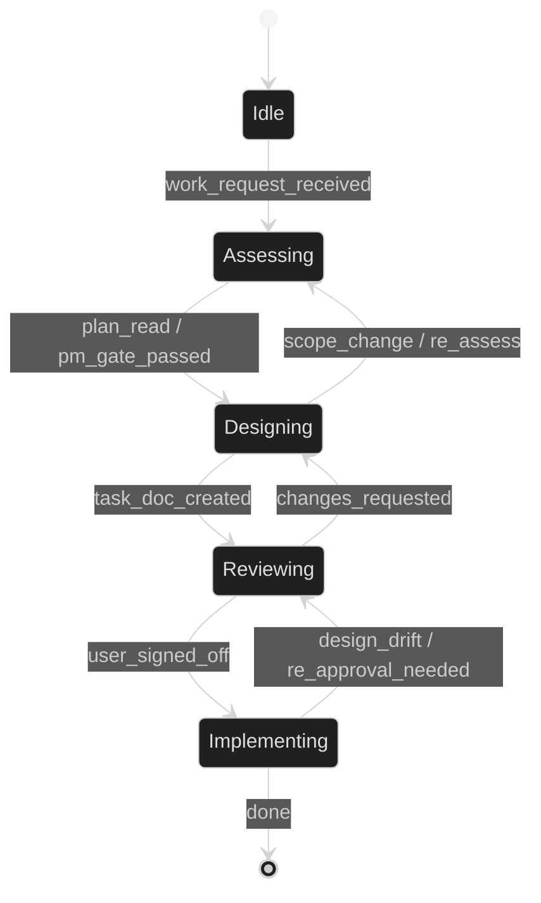

# SKILL: project_management — Working Process & Plan Sync

## Purpose

Defines the mandatory project management process for every task — from design
through delivery — and ensures design documents (`tasks/<module_name>.md`) and
`implementation_plan.md` stay in sync with each other and with the source code.

Two responsibilities:
1. **Process gatekeeper** — enforce that every task passes the required PM gates
   (design → approve → implement → verify → close).
2. **Plan synchroniser** — prevent doc drift by recording changes and updating
   `implementation_plan.md` as work progresses.

## When to use

Reach for this skill **before writing any code or making any change** to the
project. Also use it whenever:

- You start work on a task, fix, or feature
- You create, update, or review a task doc under `tasks/`
- You discover that source code has drifted from its task doc
- You complete or partially complete implementation of a module
- You change the architecture, dependencies, or API of any module
- You want to confirm the plan is current before proceeding

## Process overview

Every task follows this state machine. **Project management participation is
mandatory at every gate.** Never skip a PM gate or proceed without the
required sign-off.



## PM Gates

**The implementation plan is a live status board.** Every gate transition —
entering design, submitting for review, starting implementation, completing
work — must update the relevant module entry in `implementation_plan.md`
(status, date, brief note) and refresh the Recent updates table. No gate may
close with a stale plan.

Every agent **must** respect the following six gates:

### Gate 1 — Start (Assessing)
Before writing any code or making any change, the agent must read `AGENTS.md`,
`implementation_plan.md`, and the relevant task doc (if it exists). State which
module you are working on, referencing the implementation plan.

### Gate 2 — Design (Designing)

**Goal: brainstorm and converge.** This is the divergent phase — there are
many possible answers. Explore freely and discuss with me.

- **Why** — there can be several different reasons a feature is needed.
- **What** — a dozen interpretations may exist for the same request.
- **How** — many implementation paths are possible.

It is **okay to stay in ambiguity** during this stage. Ask clarifying
questions systematically, propose options, compare trade-offs. Push back on
unnecessary complexity by reframing against underlying goals.

We will **converge to a conclusion at the end** by choosing the best fit for
each question together.

Only after convergence, create or update the task doc (see "Process rule: task
doc must exist before implementation begins" in AGENTS.md). If one already
exists, read and follow it. 

**Update the implementation plan** — set the
module status to `designing` and add a note about the discussion.

### Gate 3 — Approval (Reviewing)
Present the design (new or updated task doc) to the user and **wait for sign-off**
before writing any code. 

**Update the implementation plan** — set the module
status to `reviewing` and add a note pointing to the task doc.

### Gate 4 — Implementation
Write code and tests. All tests must pass. Lint and typecheck must pass.

**Update the implementation plan** — set the module status to `done` and
record the outcome in the task doc's `## Discussion` section.

If during implementation the design needs to change, return to the Design
phase, update the task doc, and re-obtain user approval. No code may be
written against an unapproved design.

---

**`implementation_plan.md` is the single source of truth for project progress.**
If it conflicts with the agent's local state, reconcile through a PM gate before
proceeding.

---

## Plan synchronisation

Use this process after any design or implementation change:

### Step 1 — Update the task doc's Discussion section

Every task doc ends with a `## Discussion` section. If one doesn't exist, add it.
This section is a running log of design decisions, changes, and TODO actions.

Format:

```
## Discussion

### 2026-06-13 — [brief title of the change]

**What changed:**
- [bullet list of specific changes to the doc or understanding]

**Impact on implementation plan:**
- [how implementation_plan.md must be updated]

**TODO actions:**
- [ ] [actionable item, with file path if applicable]
- [ ] [e.g. "Refactor daglas/email_receiver.py to remove classification logic"]
```

Rules:
- Each entry gets its own date-stamped heading (`### YYYY-MM-DD`).
- Never delete old entries — append new ones. The section is a changelog.
- "What changed" describes the delta in the doc or the understanding.
- "Impact on implementation plan" summarises what needs updating in `implementation_plan.md`.
- "TODO actions" is a checklist of concrete follow-up work with file paths.
- If an action is completed, mark it `[x]` but keep the line — don't remove it.

### Step 2 — Update `implementation_plan.md`

After modifying any task doc, update the top-level plan:

1. Read the current `implementation_plan.md` to understand its structure.
2. Update the affected module entry — status, file paths, dependencies, notes.
3. Update the "Files checklist" section — mark new files, changed statuses (`✓` / `△` / `❏`).
4. If a new module was added, insert it in alphabetical position.
5. If a module's status changed (e.g. "to build" → "built"), reflect that.
6. If the architecture changed (new dependencies, new data flow), update the dependency graph.
7. **Refresh the "Recent updates" table** — keep the top 3 most recent changes by date.
   Every module-level update that affects status, architecture, or files must add a
   row here. This is the first thing readers see — it must never be stale.

### Step 3 — Flag source code drift

If the Discussion reveals that existing source code no longer matches the task doc,
ensure the TODO actions explicitly call out what refactoring is needed. Use this format:

```
- [ ] **Refactor `daglas/email_receiver.py`**:
  - Replace `store` param with `queue` param
  - Strip classification logic (`subscribe`/`unsubscribe` matching)
  - Change return type from `SubscriptionResult` to `int`
  - Update `tests/test_email_receiver.py` to mock `EmailQueue.push`
```

## Template (Discussion section)

Paste this at the bottom of any task doc that lacks it:

```
## Discussion

<!-- One entry per significant change. Append new entries, never delete old ones. -->

### YYYY-MM-DD — Initial design

**What changed:**
- [First version of this task doc created.]

**Impact on implementation plan:**
- [How this fits in the phases.]

**TODO actions:**
- [ ] [First actionable item]
```

## Verification

After running this skill, verify:

- [ ] You are in the correct process stage (Idle → Assessing → Designing → Reviewing → Implementing → Verifying → Updating_Plan)
- [ ] Every modified task doc has a `## Discussion` section
- [ ] The latest entry is date-stamped and describes what changed
- [ ] `implementation_plan.md` reflects the current state (statuses, paths, module entries)
- [ ] "Recent updates" table shows the 3 latest changes and is not stale
- [ ] Any source code drift is captured as a TODO action with file paths
- [ ] `ruff check .` and `ruff format --check .` pass (if files were modified)
