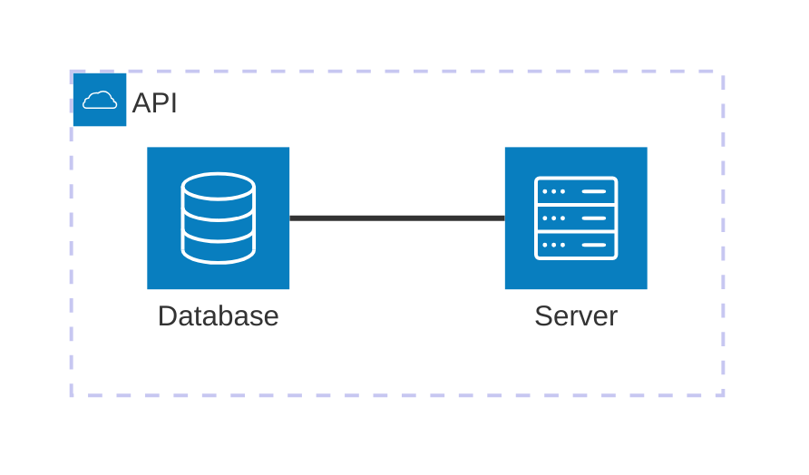
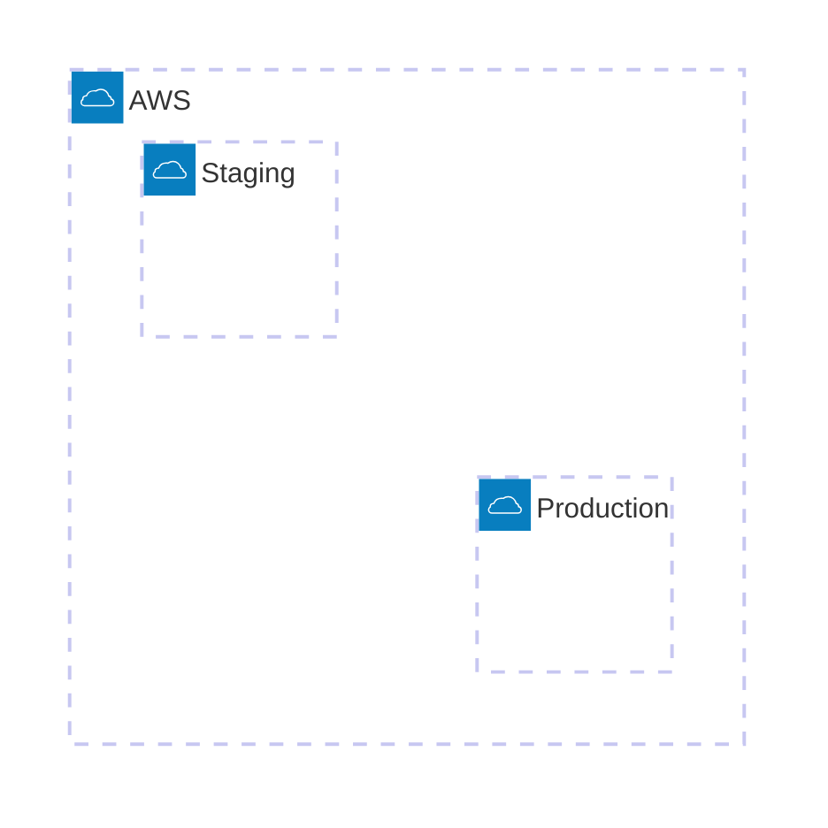
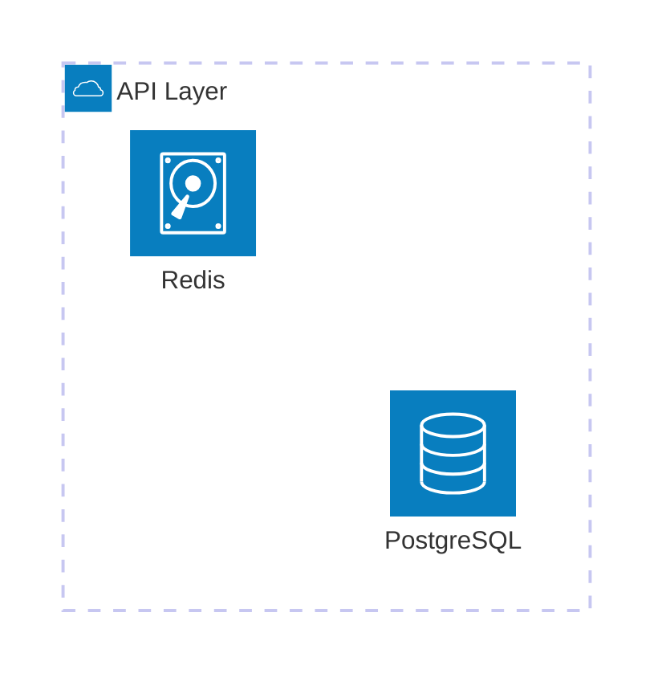
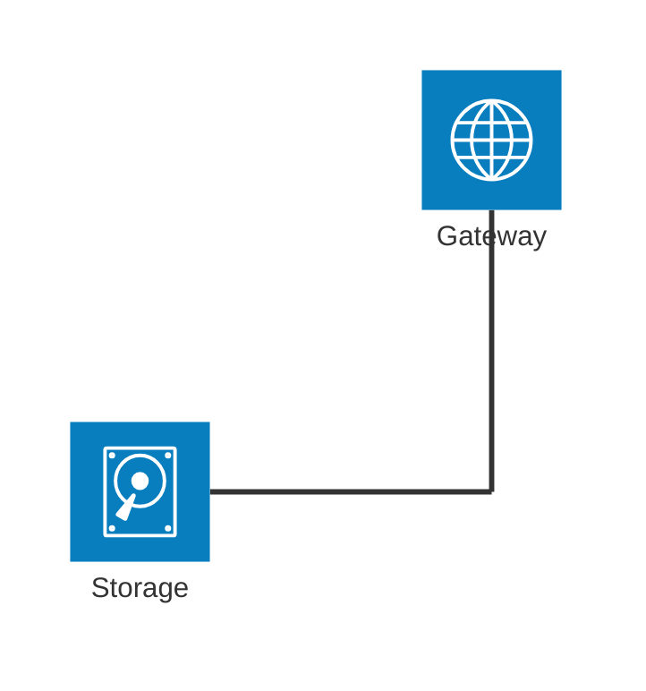

# SKILL: uml_architecture — Architecture Diagram (Mermaid)

## When to use this skill

Use an architecture diagram (`architecture-beta`) when the task is about **service topology, infrastructure, and resource relationships** — especially for cloud deployments, CI/CD pipelines, or any system where services live inside groups and connect via directional edges.

- The user asks "show me the deployment", "how are services connected", "what runs where"
- The focus is on **services, groups, and the directional edges between them**
- You need to show **containment** (service A lives inside group B) alongside **connectivity**
- The emphasis is on infrastructure and resource types (databases, servers, storage, gateways)

Do NOT use for: call order over time (→ `uml_sequence`), object contracts (→ `uml_class`), module-to-module data flow within one process (→ `uml_component`).

---

## MVP rule

> One deployment context, one diagram. Show containment and connectivity, not internal logic.

A good architecture diagram answers two questions:
1. What services exist, and what groups contain them?
2. How are services connected (direction, side, arrows)?

**Omit by default:**
- Internal implementation details of each service
- More than 2 levels of group nesting
- Edge labels that describe data content rather than connectivity

**Show by default:**
- Group hierarchy (what lives where)
- Edge directions with side annotations (L/R/T/B)
- Arrowheads to show request/response flow
- Icon annotations that reflect the real infrastructure

---

## Syntax

Begin every diagram with `architecture-beta`:



### Groups

```
group {group id}({icon})[{label}] (in {parent id})?
```

Groups contain services or other groups. Use the `in` keyword for nesting.



### Services

```
service {service id}({icon})[{label}] (in {parent id})?
```

Services are individual nodes. Place them inside groups with `in`.



### Edges

```
{src}:{side} {arrows} {side}:{dst}
```

Sides: `L` (left), `R` (right), `T` (top), `B` (bottom). Arrows: `<` (before side), `>` (after side).


**Edges out of groups** — use `{group}` modifier on a service inside a group to route the edge through the group boundary:

```
service server[Server] in groupOne
service subnet[Subnet] in groupTwo
server{group}:B --> T:subnet{group}
```

### Junctions

Junctions are 4-way split points (no icon, no label):

```
junction {junction id} (in {parent id})?
```



---

## Built-in icons

| Icon name    | Renders as      | Use for                        |
|--------------|-----------------|--------------------------------|
| `cloud`      | Cloud shape     | Groups, VPCs, environments     |
| `database`   | Cylinder        | Databases, caches              |
| `disk`       | Disk drive      | Storage, volumes, queues       |
| `internet`   | Globe           | External networks, gateways    |
| `server`     | Server rack     | Compute, application services  |

Any [Iconify](https://iconify.design) icon is available as `"set:name"` (e.g., `"mdi:github"`, `"logos:python"`).

---

## Configuration

Set via `%%{init}%%` frontmatter block (must be the first line):


| Option                   | Type    | Default | Description                                       |
|--------------------------|---------|---------|---------------------------------------------------|
| `randomize`              | boolean | false   | Randomize initial node positions before layout    |
| `nodeSeparation`         | number  | 75      | Min pixels between sibling nodes in same group    |
| `idealEdgeLengthMultiplier` | number | 1.5   | Multiplier on iconSize for same-group edge length |
| `edgeElasticity`         | number  | 0.45    | Spring elasticity (0-1) for same-group edges      |
| `numIter`                | number  | 2500    | Max fcose layout iterations                       |

---

## Dagläs examples

### Outbound lesson pipeline


### Inbound email pipeline


---

## Safety checklist (extends `mermaid_safety.md`)

- [ ] Diagram starts with `architecture-beta` — not `graph`, `flowchart`, or bare `architecture`
- [ ] Every group and service has a unique alphanumeric ID (no spaces, dots, or slashes)
- [ ] Service IDs used in edges are declared before the edge line
- [ ] Side annotations are single letters: `L`, `R`, `T`, `B` — not lowercase
- [ ] `{group}` modifier only used on services that are inside a group
- [ ] Arrow syntax uses `<` or `>` adjacent to the side letter, not on the dashes (e.g., `R --> L`, not `R -- > L`)
- [ ] `%%{init}%%` block is the absolute first line when used
- [ ] Junction IDs do not clash with service or group IDs
- [ ] Group IDs, service IDs, and junction IDs are all in distinct namespaces — no reuse
- [ ] Edge direction matches intended layout: connections between services in the same group route internally; `{group}` modifier routes through the group boundary
- [ ] Max 12 service nodes per diagram — split into multiple diagrams if more are needed
- [ ] Prefer the 5 built-in icons (`cloud`, `database`, `disk`, `internet`, `server`) over custom Iconify icons unless a specific third-party service is the point of the diagram
