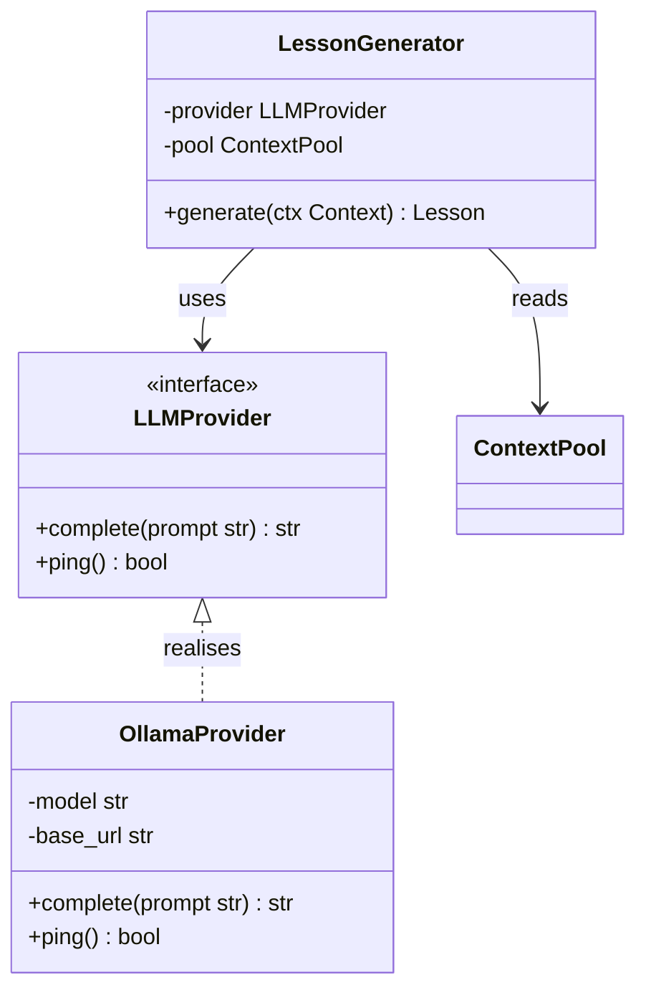
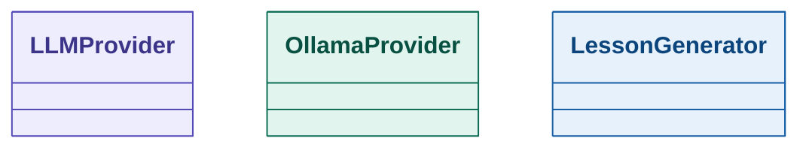
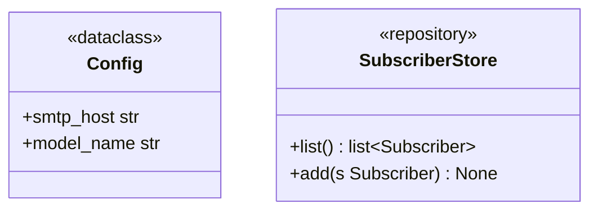
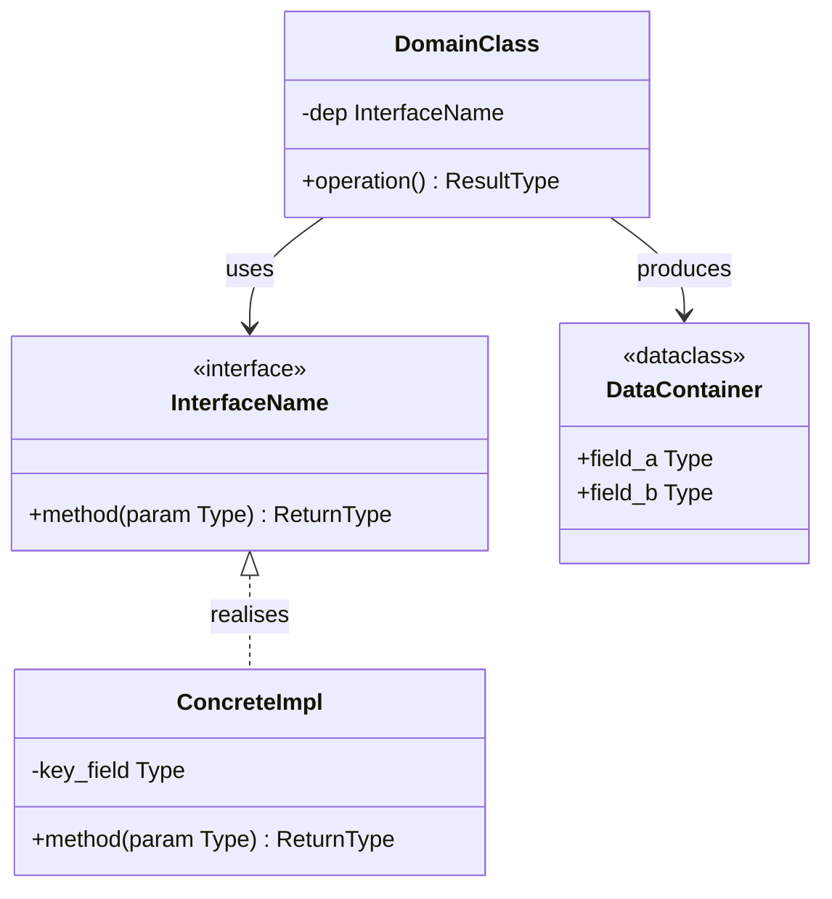

# SKILL: uml_class — Minimalist Class Diagram (Mermaid)

## When to use this skill

Use a class diagram when the task is about **object contracts, types, and relationships** — not runtime flow or system topology. Reach for this skill when:

- The user asks "what does X look like", "show me the data model", "what are the classes"
- The focus is on **attributes, method signatures, and inheritance/composition**
- You need to communicate an **API contract** or define interfaces before implementation
- Reviewing or documenting an existing module's structure

Do NOT use for: how data flows between modules (→ `uml_component`), call order over time (→ `uml_sequence`).

---

## MVP rule

> Show the public contract. Hide the implementation.

A good class diagram answers two questions and nothing else:
1. What does this object expose?
2. How does it relate to other objects?

**Omit by default:**
- Private methods (`-`) unless they are architecturally significant
- Method bodies, default values, decorators
- Getters and setters (implied)
- More than 5–6 classes per diagram — split by concern instead

**Show by default:**
- All `+` public methods with their return type
- Key `-` attributes that define object state
- Interfaces (`<<interface>>`) and their realisations
- Multiplicity on associations (e.g. `1..*`)

---

## Mermaid syntax



### Visibility markers

| Symbol | Meaning  | When to include            |
|--------|----------|----------------------------|
| `+`    | public   | Always                     |
| `-`    | private  | Only for key state fields  |
| `#`    | protected| Only for inheritance design|
| `~`    | package  | Rarely; Python has no pkg  |

### Relationship types

| Mermaid syntax        | Meaning           | Plain English                        |
|-----------------------|-------------------|--------------------------------------|
| `A <|-- B`            | Inheritance       | B extends A                          |
| `A <|.. B`            | Realisation       | B implements interface A             |
| `A --> B`             | Association/use   | A holds a reference to B             |
| `A *-- B`             | Composition       | B cannot exist without A             |
| `A o-- B`             | Aggregation       | B can exist independently            |

Label associations with a verb phrase when the relationship name is not obvious:
```
LessonGenerator --> LLMProvider : uses
```

---

## Color scheme

Use `style` directives to assign color by **object role**:



| Group      | Fill    | Stroke  | Text    | Represents                        |
|------------|---------|---------|---------|-----------------------------------|
| `iface`    | #EEEDFE | #534AB7 | #3C3489 | Interfaces and abstract classes   |
| `concrete` | #E1F5EE | #0F6E56 | #085041 | Concrete implementations          |
| `core`     | #E6F1FB | #185FA5 | #0C447C | Domain/business logic classes     |
| `data`     | #FAEEDA | #BA7517 | #633806 | Data containers, DTOs, configs    |

Rules:
- `iface` always gets the `<<interface>>` or `<<abstract>>` stereotype in the class body
- `data` is for passive containers — no behaviour beyond accessors
- Assign by role, never by position in the diagram

---

## Stereotype annotations

Add stereotypes inside the class body to communicate intent at a glance:



Common stereotypes: `<<interface>>`, `<<abstract>>`, `<<dataclass>>`, `<<repository>>`, `<<service>>`, `<<enum>>`

---

## Template (copy and adapt)



---

## Agent instructions

1. **List classes first** — identify the nouns before writing Mermaid
2. **Start with interfaces** — define the contract top-down, then concrete classes
3. **Public methods only** — include return types; omit bodies and decorators
4. **Key private attributes only** — those that define observable state; skip the rest
5. **Apply four-group color scheme** — `iface` / `concrete` / `core` / `data`
6. **Add stereotypes** — `<<interface>>`, `<<dataclass>>`, etc. in every class header
7. **Label non-obvious associations** — if the arrow direction alone explains the relationship, skip the label
8. **Max 6 classes per diagram** — if more are needed, produce: one overview + one zoom-in per cluster
9. **Never show method bodies** — a method signature is the entire entry
