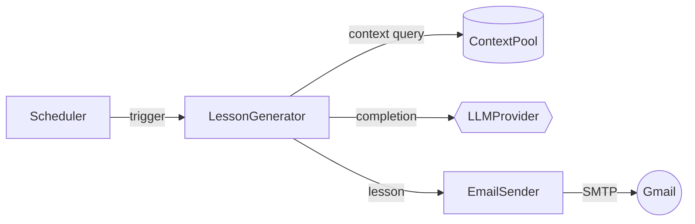
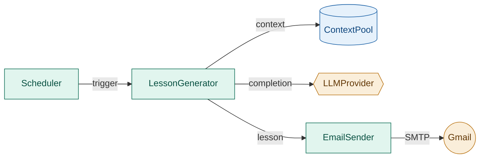
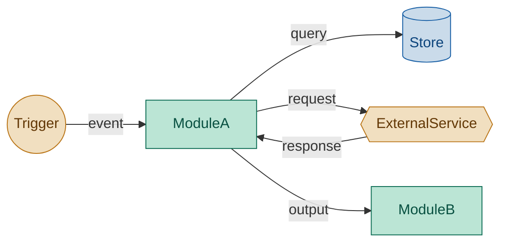

# SKILL: uml_component — Minimalist Component Diagram (Mermaid)

## When to use this skill

Always use a component diagram when the task is about **system boundaries and data flow** — without internal logic or object structure:

- At design or planning stage, before class/sequence details exist
- To show boundaries and focuses of the module, inputs and outputs
- Answers "how does X connect to Y", "what calls what", "show me the architecture"
- The focus is on **modules, services, or subsystems** and what passes between them
- Show **external dependencies** (APIs, databases, queues, third-party services)

Do NOT use for: call order over time (→ `uml_sequence`), object contracts or inheritance (→ `uml_class`).

---

## MVP rule

> Show only what crosses a boundary. If it lives entirely inside one box, hide it.

A good component diagram answers two questions and nothing else:
1. What are the related modules at the same level?
2. What data or signals flow between them?

**Omit by default:**
- Internal classes, fields, method signatures
- Implementation technology (unless it IS the point)
- Error paths (add only if they cross a boundary)
- More than 7 nodes in one diagram — split instead

---

## Mermaid syntax

Use `graph LR` (left-to-right) for pipelines; `graph TD` (top-down) for layered/hierarchical systems.



### Node shapes and their meaning

| Shape syntax  | Renders as       | Use for                        |
|---------------|------------------|--------------------------------|
| `[Label]`     | Rectangle        | Internal module / component    |
| `(Label)`     | Rounded rect     | User-facing entry point        |
| `[(Label)]`   | Cylinder         | Database / persistent store    |
| `{{Label}}`   | Hexagon          | External service / adapter     |
| `((Label))`   | Circle           | External actor / human / event |
| `>Label]`     | Asymmetric       | Message / queue / bus          |

Use shapes consistently — same shape = same role across the diagram.

### Edge labels

Label edges with the **payload or signal name**, not the action verb.

```
Good:  A -->|lesson| B
Avoid: A -->|sends the lesson to| B
```

One to four words maximum per edge label.

---

## Color scheme

Apply `classDef` to group nodes by role. Use exactly **three semantic groups** — no more:



| Group      | Fill    | Stroke  | Text    | Represents                        |
|------------|---------|---------|---------|-----------------------------------|
| `core`     | #bbe5d5 | #0F6E56 | #085041 | Internal modules you own          |
| `store`    | #cadbea | #185FA5 | #0C447C | Databases, caches, file stores    |
| `external` | #f1dfc0 | #BA7517 | #633806 | External services, APIs, adapters |

Rules:
- Never assign color by diagram position (e.g. "left nodes are green") — assign by **role**
- If all nodes are internal, use `core` only and drop the others
- Do not add a fourth group — split the diagram instead

---

## Template (copy and adapt)



---

## Agent instructions

1. **Identify the modules first** — list them as nouns before writing Mermaid syntax
2. **Assign shapes by role** — rectangle for internal, cylinder for store, hexagon for external
3. **Label every edge** — unlabelled arrows are ambiguous; one to four words only
4. **Apply the three-group color scheme** — `core` / `store` / `external`
5. **Stop at 7 nodes** — if more are needed, produce two diagrams: an overview and a zoom-in
6. **Do not add a legend box** — shapes and colors are self-explanatory with consistent use
7. **One diagram per concern** — if the user asks about auth AND data flow, draw two separate diagrams
