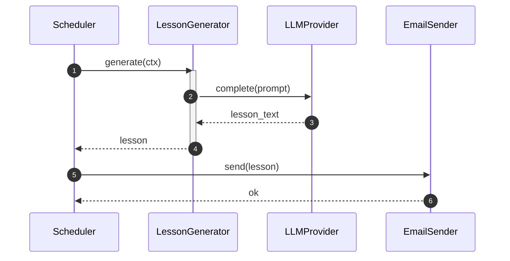
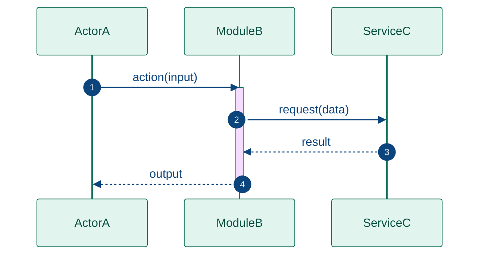

# SKILL: uml_sequence — Minimalist Sequence Diagram (Mermaid)

## When to use this skill

Use a sequence diagram when the task is about **call order and message passing over time** — not structure or topology. Reach for this skill when:

- The user asks "what happens when X is triggered", "walk me through the flow", "who calls what"
- The focus is on a **specific scenario or use case** unfolding step by step
- You need to show **synchronous vs asynchronous calls**, returns, or conditional branches
- Debugging a runtime interaction — "why does Y happen after Z?"

Do NOT use for: static structure or object contracts (→ `uml_class`), module topology (→ `uml_component`).

---

## MVP rule

> One scenario, one happy path. Add branches only if they are the whole point.

A good sequence diagram answers one question:
- What is the exact sequence of messages for **this specific use case**?

**Omit by default:**
- Error paths and retries (draw a separate diagram if critical)
- Internal implementation steps that don't cross object boundaries
- More than 5 participants — collapse internal collaborators behind one lifeline
- Argument types and full method signatures on arrows — use short labels

**Show by default:**
- Every message that crosses an object boundary
- Return values when the caller depends on them
- `loop`, `opt`, `alt` frames when they ARE the point of the diagram
- Activation bars to show when a participant is busy

---

## Mermaid syntax



### Arrow types

| Syntax   | Meaning                        | Use for                          |
|----------|--------------------------------|----------------------------------|
| `->>`    | Solid, open arrowhead          | Synchronous call                 |
| `-->>`   | Dashed, open arrowhead         | Return value                     |
| `->`     | Solid, no arrowhead            | Fire-and-forget / async signal   |
| `-->`    | Dashed, no arrowhead           | Async return / callback          |

Use `-->>` (dashed) for all return arrows — it visually separates calls from responses.

### Participant aliases

Always define short aliases with `as` — long names on every arrow clutter the diagram:

```
participant LG as LessonGenerator   ✓
LessonGenerator->>LLMProvider:      ✗  (full name repeated)
```

### Frames

Use frames sparingly — one per diagram maximum unless the interaction IS about branching:

```mermaid
loop Daily at 07:00
    S->>G: generate(ctx)
end

opt subscriber list not empty
    G->>E: send(lesson)
end

alt model available
    G->>L: complete(prompt)
else fallback
    G->>L: complete(prompt, model=fallback)
end
```

| Frame   | Use when                                        |
|---------|-------------------------------------------------|
| `loop`  | The scenario repeats on a schedule or condition |
| `opt`   | A step happens only if a condition is true      |
| `alt`   | There are two or more mutually exclusive paths  |
| `par`   | Two things happen concurrently                  |

---

## Color scheme

Mermaid sequence diagrams do not support `classDef`. Use `%%{init}%%` to set a consistent theme and actor background:

```mermaid
%%{init: {
  "theme": "base",
  "themeVariables": {
    "actorBkg":       "#E1F5EE",
    "actorBorder":    "#0F6E56",
    "actorTextColor": "#085041",
    "activationBkg":  "#9FE1CB",
    "activationBorderColor": "#0F6E56",
    "noteBkgColor":   "#EEEDFE",
    "noteTextColor":  "#3C3489",
    "signalColor":    "#0C447C",
    "signalTextColor":"#0C447C",
    "loopTextColor":  "#633806",
    "labelBoxBkgColor": "#FAEEDA",
    "labelBoxBorderColor": "#BA7517"
  }
}}%%
sequenceDiagram
    ...
```

| Variable              | Value   | Applies to                        |
|-----------------------|---------|-----------------------------------|
| `actorBkg`            | #E1F5EE | Lifeline header background        |
| `actorBorder`         | #0F6E56 | Lifeline header border            |
| `actorTextColor`      | #085041 | Lifeline header label             |
| `activationBkg`       | #9FE1CB | Activation bar fill               |
| `noteBkgColor`        | #EEEDFE | Note boxes                        |
| `signalColor`         | #0C447C | Arrow lines                       |
| `signalTextColor`     | #0C447C | Arrow labels                      |
| `labelBoxBkgColor`    | #FAEEDA | `loop`/`opt`/`alt` frame fills    |

Always include the full `%%{init}%%` block — never rely on the Mermaid default theme.

---

## Notes

Use `Note` sparingly — one or two maximum per diagram, for genuinely non-obvious context:

```mermaid
Note over G,L: LLMProvider may be Ollama or OpenAI
Note right of E: Retries handled internally — not shown
```

Prefer placing context in prose above/below the diagram rather than inside it.

---

## Template (copy and adapt)



---

## Agent instructions

1. **Name the scenario first** — one sentence describing what use case this diagram shows
2. **List participants** — identify actors and modules; collapse internal helpers behind one lifeline
3. **Define aliases** — always use short `as` aliases for readability
4. **Add `autonumber`** — makes steps referenceable in prose
5. **Apply the `%%{init}%%` color block** — paste it verbatim at the top of every diagram
6. **Use `-->>` for all returns** — dashed arrow = return value, solid = call
7. **Add `activate`/`deactivate`** for participants with significant processing time
8. **One frame maximum** unless the diagram is specifically about branching logic
9. **Happy path first** — if error paths are needed, draw them as a second diagram
10. **Add at most two `Note`s** — prefer prose outside the diagram over notes inside it
