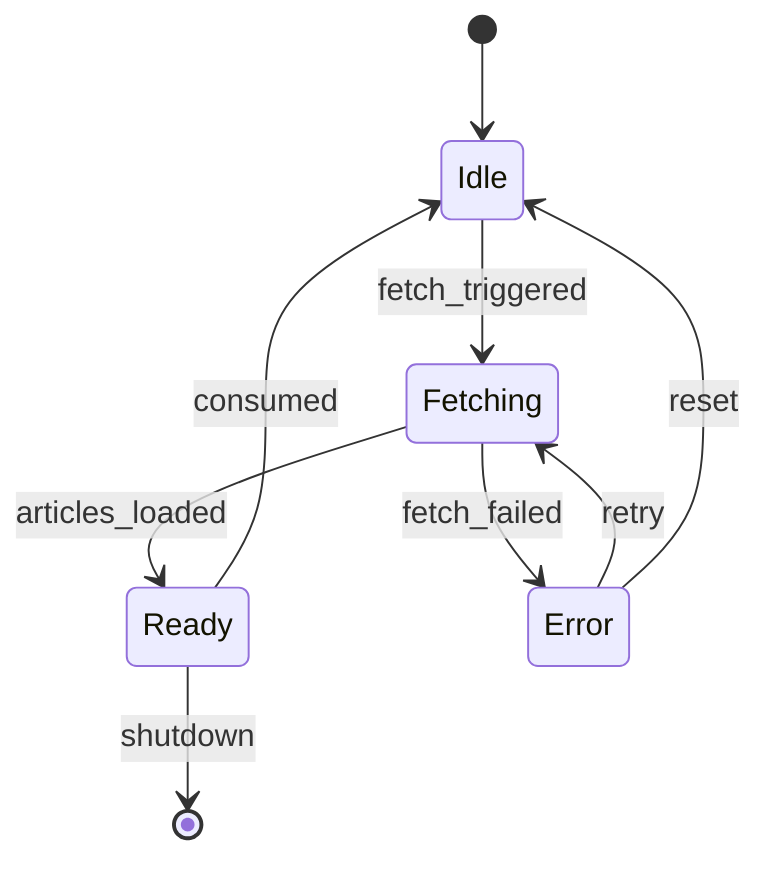
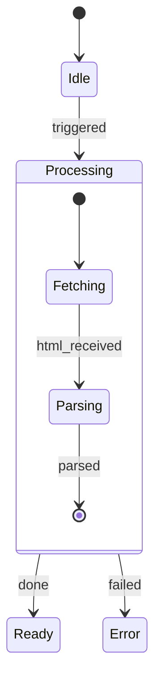
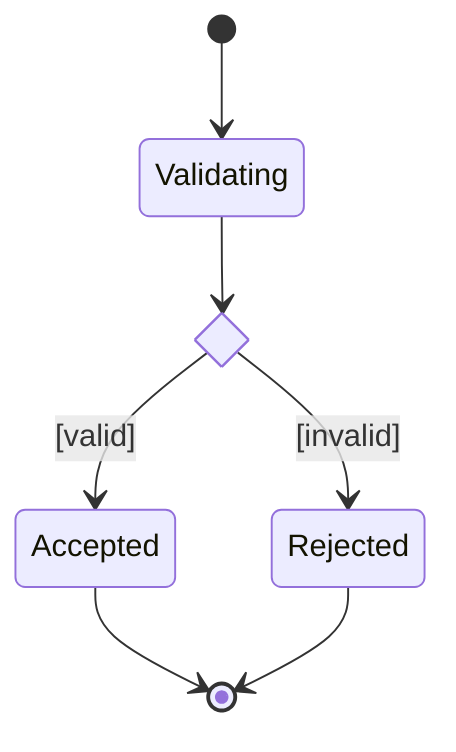
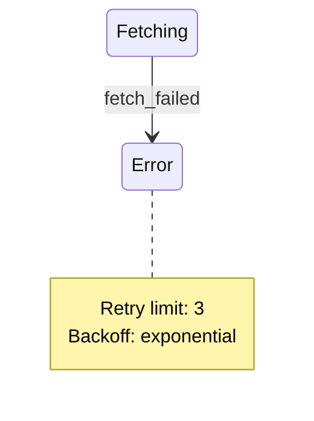
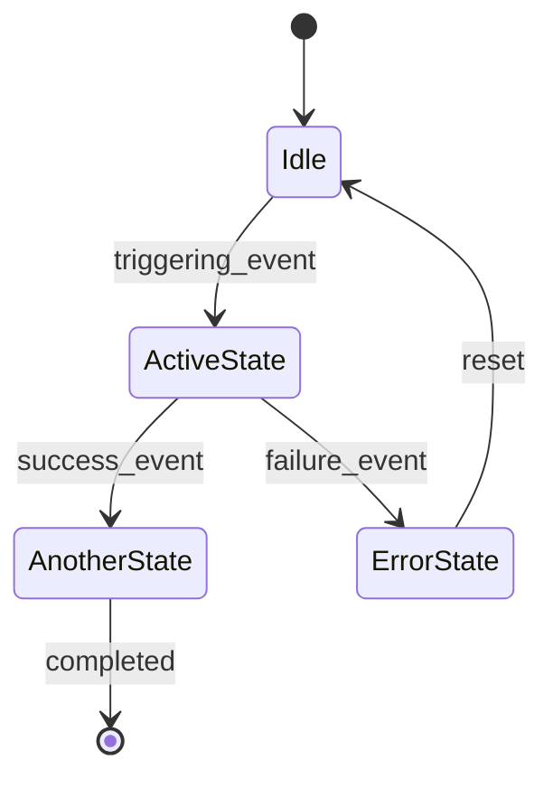

# SKILL: uml_state — Minimalist State Diagram (Mermaid)

## When to use this skill

Use a state diagram when the task is about **how an object or system changes over time** in response to events. Reach for this skill when:

- The user asks "what states can X be in", "what happens when Y occurs", "show me the lifecycle"
- The focus is on an **entity that has a well-defined set of modes** — orders, connections, tasks, sessions, devices
- You need to show **valid transitions** and what triggers them
- You are designing a state machine, parser, protocol, or workflow engine

Do NOT use for: which modules call each other (→ `uml_component`), call order in a scenario (→ `uml_sequence`), object structure (→ `uml_class`).

---

## MVP rule

> One entity, one lifecycle. Show only the states that matter to the outside world.

A good state diagram answers two questions and nothing else:
1. What states can this thing be in?
2. What event moves it from one state to another?

**Omit by default:**
- Internal sub-states unless the task is specifically about them
- Guard conditions unless they are the whole point of a transition
- Actions on entry/exit unless they are architecturally significant
- Self-transitions (a state reacting to an event and staying in the same state) — mention in prose instead
- More than 8 states in one diagram — split into overview + zoom-in

**Show by default:**
- Every externally visible state
- Every transition that a caller or user can trigger
- The initial state (`[*]`)
- Terminal states (`[*]` as target) if the entity can be destroyed or completed

---

## Mermaid syntax



Always use `stateDiagram-v2` — the v1 syntax is deprecated and has fewer features.

### Transition label format

```
StateA --> StateB : event_name
StateA --> StateB : event / action    (only when action is architecturally significant)
```

- Use `snake_case` for event names — it reads as a signal or method call
- One label per transition — do not stack multiple events on one arrow
- Omit the label only when the transition is unconditional (e.g. from a choice to a terminal)

### Composite states (nested)

Use sparingly — only when a group of states shares a common exit transition:



### Choice / fork / join



Use `<<choice>>` for a single branching decision. Use `<<fork>>` / `<<join>>` only for genuine concurrency — rare.

---

## Color scheme

### The core problem with `stateTextColor`

`stateTextColor` is **unreliable** — it is frequently ignored by Mermaid renderers. A pale `stateBkg` combined with a renderer that defaults text to a light color produces invisible labels. **Do not rely on `stateTextColor` to ensure readability.**

### The fix: dark fills, not light fills

Use a fill dark enough that the renderer's default white or near-white text is automatically legible — regardless of whether `stateTextColor` is honoured.

**Rule: `stateBkg` must be at color ramp stop 600 or darker. Never use stop 50, 100, or 200 as a fill.**

| Fill value | Stop | Readable? | Reason |
|---|---|---|---|
| `#E1F5EE` | teal 50  | ✗ | Near-white — text disappears if renderer defaults to light |
| `#9FE1CB` | teal 100 | ✗ | Too pale — mid-grey text has no contrast |
| `#1D9E75` | teal 400 | marginal | Depends on renderer |
| `#0F6E56` | teal 600 | ✓ | Dark enough that white text always passes WCAG AA |
| `#085041` | teal 800 | ✓ | Very safe — ensure border is still distinguishable |

### Recommended `%%{init}%%` block

```
%%{init: {
  "theme": "dark",
}}%%
```


Since all states share the same fill, use **naming conventions** to communicate role:

| State name pattern              | Meaning                    |
|---------------------------------|----------------------------|
| `Idle`, `Ready`                 | Stable waiting states      |
| `Fetching`, `Processing`, `Sending` | Active transient states |
| `Error`, `Failed`               | Fault states               |
| `Done`, `Completed`             | Terminal states            |

---

## Notes

Use `note` to annotate a single state with context that doesn't fit in the transition label:



Maximum two notes per diagram. If you need more, the diagram is too detailed — move the detail to prose.

---

## Safety checklist (extends mermaid_safety.md)

State diagrams have their own parse traps:

- [ ] Use `stateDiagram-v2` — never `stateDiagram`
- [ ] `[*]` must appear at least once as a source (initial) — diagrams without a start state are invalid
- [ ] State names must be single tokens — use `snake_case` or `CamelCase`, no spaces
- [ ] `note` blocks must be closed with `end note` — unclosed notes break the whole diagram
- [ ] `<<choice>>` nodes must have all branches labelled with `[condition]` syntax
- [ ] `%%{init}%%` must be the absolute first line — before `stateDiagram-v2`
- [ ] Transition labels must not contain `[]{}()<>` — same rule as edge labels in graph diagrams
- [ ] Do not use `classDef` — it is not supported in `stateDiagram-v2`
- [ ] `stateBkg` must be color ramp stop 600 or darker — pale fills cause invisible text because `stateTextColor` is unreliable

---

## Template (copy and adapt)



---

## Agent instructions

1. **Name the entity first** — one sentence: "This diagram shows the lifecycle of a `ContextPool` entry"
2. **List all states as nouns** before writing Mermaid — stable states, transient states, fault states, terminal states
3. **List all transitions as events** — `snake_case` signals or method names
4. **Always include `[*]` as source** — diagrams without an initial state are invalid
5. **Add terminal `[*]`** if the entity can be destroyed or reach a final state
6. **Paste the `%%{init}%%` block verbatim** as the first line
7. **Use `stateDiagram-v2`** — never the unversioned alias
8. **Use composite states** only when multiple states share a common exit — not for visual grouping
9. **Max 8 states** — if more are needed, produce an overview diagram then a zoom-in for the complex cluster
10. **Happy path readable top-to-bottom** — place fault/error states to the side so the main flow reads naturally