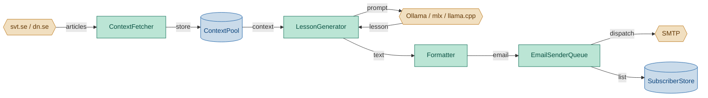
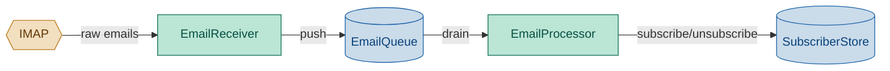

# Dagläs — Daily Swedish Lessons

Generate one structured Swedish lesson email every morning, grounded in
real-world, current context. Runs locally via a local LLM (ollama, mlx,
llama.cpp).

## Architecture

Each module is a standalone file with one clear responsibility.

**lessonGenerator** (daily lesson generation):



**emailReceiver** (email subscription management):



## Requirements

- Python 3.10+
- A local LLM server (e.g. [ollama](https://ollama.com), mlx, llama.cpp)

## Setup

```bash
# Install package and dependencies
pip install -e .

# Configure from template
cp daglas/config_default.yaml config.yaml
# Edit config.yaml with your LLM endpoint, SMTP settings, sources, etc.
```

## Usage

```bash
# One-shot: fetch, generate, queue, exit
daglas --generate

# Default: persistent daemon (IMAP polling + sender queue)
daglas

# Equivalent via module: python -m daglas.run
```

Runs in **persistent mode** by default (stays alive, polls IMAP, dispatches
queued emails). Pass `--generate` for a one-shot fetch-generate-queue cycle
that exits when done. Set `DAGLAS_LOG_LEVEL=DEBUG` to see per-article fetch
timing and date-tracing logs.

## launchd integration (macOS)

Install to run automatically on schedule:

```bash
python scripts/install_launchd.py
python scripts/uninstall_launchd.py
```

Two services:

| Service | Mode | Behaviour |
|---|---|---|
| `com.daglas.lessonGenerator` | `StartInterval` 1800s | Fires `daglas --generate` via `python -m daglas.run --generate` every 30 min |
| `com.daglas.runner` | `KeepAlive` + `RunAtLoad` | Runs `daglas` via `python -m daglas.run` persistently (IMAP, sender queue), restarts on crash |

launchd tracks wall time even across sleep/wake cycles, so the daily
lesson fires at the correct time even if the Mac was asleep.

## Configuration

All settings in `config.yaml` (copy from `daglas/config_default.yaml`).

### Core

| Key | Default | Description |
|---|---|---|---|
| `llm_endpoint` | `""` | LLM API endpoint (e.g. `http://localhost:11434/v1`) |
| `llm_model` | `""` | Model name (e.g. `gemma4:latest`) |
| `llm_api_key` | `""` | API key if required |
| `article_word_limit` | `100` | Word limit per article displayed in lesson |
| `lesson_level` | `beginner` | Target difficulty for generated lesson |
| `vocab_count` | `5` | Vocabulary words per lesson |

### Sources

| Key | Default | Description |
|---|---|---|
| `sources` | `[]` | List of sources: `name`, `sitemap`, `max_age_hours` |

Example:

```yaml
sources:
  - name: svt
    sitemap: https://www.svt.se/latest-articles-sitemap.xml
    max_age_hours: 48
```

### Scheduling

| Key | Default | Description |
|---|---|---|
| `fetch_time` | `06:00` | Time to fetch articles daily |
| `send_time` | `07:00` | Time to send the lesson |
| `context_fetcher_poll_interval` | `86400` | Daemon wake interval (seconds) for clock-skew safety |

### Email (SMTP)

| Key | Default | Description |
|---|---|---|
| `smtp_host` | `""` | SMTP server hostname |
| `smtp_port` | `587` | SMTP port |
| `smtp_user` | `""` | SMTP username |
| `smtp_password` | `""` | SMTP password |
| `from_address` | `""` | Sender email address |
| `to_addresses` | `[]` | Default recipient list |

### Email (IMAP)

| Key | Default | Description |
|---|---|---|
| `imap_host` | `""` | IMAP server hostname |
| `imap_port` | `993` | IMAP port |
| `imap_user` | `""` | IMAP username |
| `imap_password` | `""` | IMAP password |
| `email_receiver_poll_interval` | `300` | Seconds between IMAP polls |

### Sender queue

| Key | Default | Description |
|---|---|---|---|
| `email_sender_immediate_success_backoff` | `5` | Backoff (s) after successful immediate send |
| `email_sender_immediate_empty_interval` | `20` | Poll interval (s) when immediate queue is empty |
| `email_sender_scheduled_success_backoff` | `5` | Backoff (s) after successful scheduled send |
| `email_sender_scheduled_empty_interval` | `60` | Poll interval (s) when no scheduled items are due |

### Paths

| Key | Default | Description |
|---|---|---|
| `data_dir` | `data` | Runtime data directory (JSONL, subscribers) |
| `prompts_dir` | `prompts` | LLM prompt template directory |

## Project structure

```
daglas/
├── __init__.py                # Package version
├── run.py                     # CLI entry point (daglas command or python -m daglas.run)
├── config.py                  # Config loading from config.yaml
├── config_default.yaml        # Template with commented defaults
├── context_fetcher.py         # Sitemap parsing, article extraction, daemon
├── context_pool.py            # JSONL store for fetched articles
├── email_sender.py            # SMTP dispatch (internal, used by EmailSenderQueue)
├── email_sender_queue.py      # Background queue with immediate + scheduled dispatch
├── email_receiver.py          # IMAP polling, raw email push
├── email_queue.py             # Persistent namespaced JSONL queue
├── email_processor.py         # Blind notification hub for incoming emails
├── subscriber_store.py        # Flat-file subscription management
└── lesson/
    ├── generator.py           # Prompt assembly, context truncation
    ├── formatter.py           # Email dataclass, markdown→HTML
    └── llm.py                 # Provider abstraction (ollama, mlx, llama.cpp)
pyproject.toml                  # PEP 621 package config (version, deps, entry point)
prompts/                       # Versioned LLM prompt templates
scripts/
├── install_launchd.py         # Generate & load launchd plists
├── uninstall_launchd.py       # Unload & remove launchd plists
├── config_verify.py           # Smoke-test config loading
├── context_fetcher_verify.py  # Smoke-test article fetch
├── email_receiver_verify.py   # Smoke-test IMAP connection
└── subscriber_store_verify.py # Smoke-test subscribe flow
tests/                         # Mirrors daglas/ structure
tasks/                         # Module design docs (read before coding)
data/                          # Runtime data (JSONL, subscribers)
```

## Testing

```bash
pytest                           # all tests
pytest tests/test_context_fetcher.py -v  # single module
ruff check . && ruff format .    # lint and format
```

## Workflow conventions

See `AGENTS.md` for full process rules. Key points:

- **Task doc first** — read the module's spec in `tasks/` before writing code.
- **No cloud dependencies** — prefer ollama, mlx, llama.cpp over API services.
- **Secrets in `config.yaml`** only — never in source code.
- **Local-first** — all processing happens on your machine.
