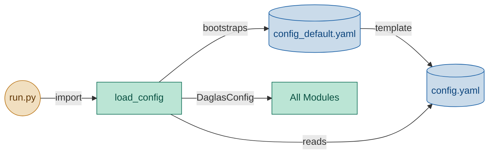

# Config Module — Engineering Design & Implementation Task

## 1. Purpose

Provide a single source of configuration consumed by every other module in the pipeline. Uses two files:

- `daglas/config_default.yaml` — bundled with the package, used only as a template for first-run bootstrap.
- `config.yaml` — project root, the sole runtime source of truth once it exists.

On first run `config.yaml` is created as a copy of `config_default.yaml`. After that, only `config.yaml` is ever read.

## 2. Component Diagram



## 3. Scope (MVP)

- Two YAML files: `daglas/config_default.yaml` (bundled template) and `config.yaml` (project root, user-editable).
- On first run, if `config.yaml` is absent, copy `config_default.yaml` → `config.yaml`.
- On subsequent runs, load only `config.yaml` — no merge, no double I/O.
- Expose a simple `Config` object so callers get typed attributes, not raw dicts.
- Module is a pure function of the file system — no I/O side effects after construction (except the one-time create-on-missing for `config.yaml`).

Non-goals: hot-reload, remote config, secrets vault, multi-env profiles, merging of multiple files at runtime.

## 3. Use Cases

| UC | Description |
|---|---|
| UC1 | First run — `config.yaml` absent → load `config_default.yaml`, write `config.yaml`, return result |
| UC2 | Normal run — `config.yaml` exists → load `config.yaml` directly (single read) |
| UC3 | Explicit path — `load_config(Path(...))` loads from custom location |
| UC4 | Consume — other modules import `config` singleton to access settings |

## 4. Python Libraries

| Library | Why |
|---|---|
| `PyYAML` | Parse YAML files (std choice; `toml` is not worth the deps for MVP) |
| Standard `pathlib` | Cross-platform path resolution for config file lookup |

Dependency spec (add to `pyproject.toml` / `requirements.txt`):

```
pyyaml>=6.0
```

## 5. Interface

### Location: `daglas/config.py`

```python
from dataclasses import dataclass, field


@dataclass
class DaglasConfig:
    # --- Core ---
    max_context_length: int = 500
    lesson_level: str = "beginner"
    vocab_count: int = 8

    # --- Context sources ---
    rss_feeds: list[str] = field(default_factory=list)
    scrape_urls: list[str] = field(default_factory=list)

    # --- LLM ---
    llm_model: str = ""
    llm_endpoint: str = ""         # e.g. http://localhost:11434/v1
    llm_api_key: str = ""          # may be empty for local

    # --- Email ---
    smtp_host: str = ""
    smtp_port: int = 587
    smtp_user: str = ""
    smtp_password: str = ""
    from_address: str = ""
    to_addresses: list[str] = field(default_factory=list)

    # --- Scheduling ---
    fetch_time: str = "06:00"
    send_time: str = "07:00"

    # --- Paths ---
    data_dir: str = "data"
    prompts_dir: str = "prompts"


def load_config(
    path: Path | None = None,
    default_path: Path | None = None,
    create_if_missing: bool = True,
) -> DaglasConfig:
    """Load config.yaml if it exists, otherwise bootstrap from config_default.yaml."""
    ...


# Singleton for import-time convenience (lazy init).
config: DaglasConfig | None = None  # populated by load_config() call in run.py
```

### `config_default.yaml` (bundled in `daglas/`)

```yaml
max_context_length: 500
lesson_level: beginner
vocab_count: 8
# rss_feeds:
#   - https://www.svt.se/rss
# llm_endpoint: http://localhost:11434/v1
# smtp_host: smtp.example.com
```

### `run.py` bootstrap

```python
from daglas import config as daglas_config
from daglas.config import load_config

def main():
    daglas_config.config = load_config()
    ...
```

Other modules import the singleton:

```python
from daglas.config import config
```

## 6. Implementation Plan

### Step 1 — Scaffold

Create `daglas/__init__.py` (empty) and `daglas/config.py` with the `DaglasConfig` model and `load_config`.

### Step 2 — `config_default.yaml`

Create `daglas/config_default.yaml` with beginner defaults and commented-out examples. This file ships with the package.

### Step 3 — `load_config` logic

1. If `config.yaml` exists → load it directly, construct `DaglasConfig`, return. (Single read — no merge.)
2. If `config.yaml` does not exist → read `config_default.yaml`, write it as `config.yaml`, construct `DaglasConfig`, return.
3. If neither file exists → return `DaglasConfig()` with hardcoded dataclass defaults as safety fallback.

### Step 4 — Wire at entry point

`run.py` calls `load_config()` before invoking any module.

## 7. Unit Test Strategy (`tests/test_config.py`)

Use `pytest`. No network or real file I/O — use `tmp_path` fixture.

Coverage categories: happy path, error path, edge cases, critical business logic.

| Category | Test | What it covers |
|---|---|---|
| Happy path | `test_loads_user_config_directly` | Existing `config.yaml` is loaded directly (no merge) |
| Happy path | `test_creates_user_config_from_default` | Missing `config.yaml` bootstraps from `config_default.yaml` |
| Error path | `test_empty_user_config_falls_back` | Empty `config.yaml` falls back to hardcoded defaults |
| Error path | `test_no_default_falls_back_to_hardcoded` | Neither file exists → hardcoded dataclass defaults |
| Edge case | `test_comments_only_user_config_falls_back` | Comment-only file falls back to hardcoded |
| Edge case | `test_creates_nested_dir_when_missing` | Parent dirs created during bootstrap |
| Critical logic | `test_explicit_path` | `load_config(Path(...))` loads from custom location |
| Critical logic | `test_create_if_missing_false_skips_creation` | No file created when flag is off |

## 8. Acceptance Criteria

- `pytest tests/test_config.py` passes all tests.
- `ruff check daglas/` and `ruff format --check daglas/` pass.
- Running `python3 -c "from daglas.config import load_config; c = load_config(); print(c.max_context_length)"` prints `500`.
