# ContextFetcher Module — Engineering Design & Implementation Task

## 1. Purpose

Fetch, crawl, and extract full-article content from pre-configured Swedish-language websites every morning. Store structured article data into `ContextPool` so the lesson module has current real-world material to work from.

The module provides a daemon lifecycle (`start()` / `stop()` / `_run()`) matching the pattern of `EmailReceiver` and `EmailSenderQueue`. The daemon thread sleeps until the configured `fetch_time`, executes the fetch pipeline, then sleeps until the next day's fetch_time.

## 2. Component Diagram

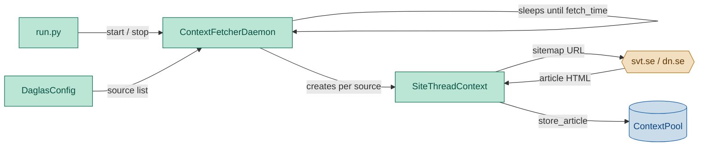

## 3. Pipeline

```
                         ┌── Deduplicate gate per entry: skip if URL already seen
                         v
Parse → Filter → [Crawl → Extract → Store] × N  (repeated per site thread,
                                                    each thread independent)
```
| Stage | Where | What it does |
|---|---|---|
| **Parse sitemap** | Per-site thread | Fetch the configured flat sitemap URL, extract each `<url>` entry: `<loc>` (required), best-available date (try `<news:publication_date>` → `<lastmod>` → `None`), and title if present. |
| **Filter by age** | Per-site thread | Drop entries whose date is older than `max_age_hours` per source. |
| **Deduplicate** | Per-site thread | For each entry, skip if URL already in the thread's local `seen` set (seeded from `pool.seen_urls(7)` for cross-session dedup). Gate before HTTP fetch — no bandwidth wasted on repeat content. |
| **Crawl & extract** | Per-site thread | HTTP-fetch article pages sequentially within the thread, extract structured fields via trafilatura. One failing article does not block others. |
| **Store** | Per-site thread | Write each extracted article immediately to `ContextPool` via `store_article()` — no batching, no accumulation. |

## 3. Scope (MVP)

- **Content channels**: flat sitemap parsing (config must point to a `<urlset>` sitemap, not a `<sitemapindex>`).
- **Extraction**: full-article content, title, publish date, author, language.
- **Age-based filtering**: configurable `max_age_hours` per source skips stale entries before HTTP fetch.
- **Deduplication**: by URL within a single run, plus cross-session dedup against previously stored URLs (configurable lookback window).
- **Parallel site threads**: each source runs in its own daemon-managed thread; `max_site_threads` (default 12) limits concurrency with queuing for excess sources.
- **Per-source max_daily_articles**: each source can limit its contribution (e.g., 2 articles/source) so no single source dominates the pool.
- **Article scoring**: lightweight recency + source-authority + length scoring to rank articles for downstream selection.
- **Error handling**: one failing source does not block others; per-article timeout.
- **Output**: structured `Article` objects serialized as JSON Lines to `ContextPool`.

Non-goals: API authentication, JavaScript rendering, screenshot capture, diff-based refetching, multi-language detection beyond what the article metadata provides. Full-text indexing and querying also out of scope — selection is downstream in the generator.

## 4. Use Cases

### UC1 — External actor: run.py

`run.py` is the sole external entry point to the ContextFetcher module. It interacts with the system through the `ContextFetcherDaemon` public API:

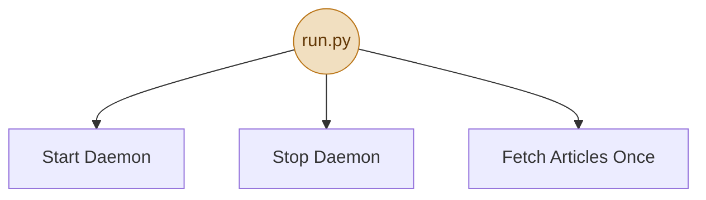

> `run.py` calls `fetcher = ContextFetcherDaemon(...)`, then `fetcher.start()` / `fetcher.fetch_once()` / `fetcher.stop()`. All internal orchestrating (thread pool, per-site contexts, article storage) is encapsulated by the daemon.

**Description:** `run.py` is the external actor. It can start the daemon (launches the scheduling thread), stop it (signals clean exit), or trigger a one-shot fetch (used by `--lesson` mode). All three are thin wrappers — the daemon owns the actual lifecycle internally (see UC2).

### UC2 — Daemon lifecycle

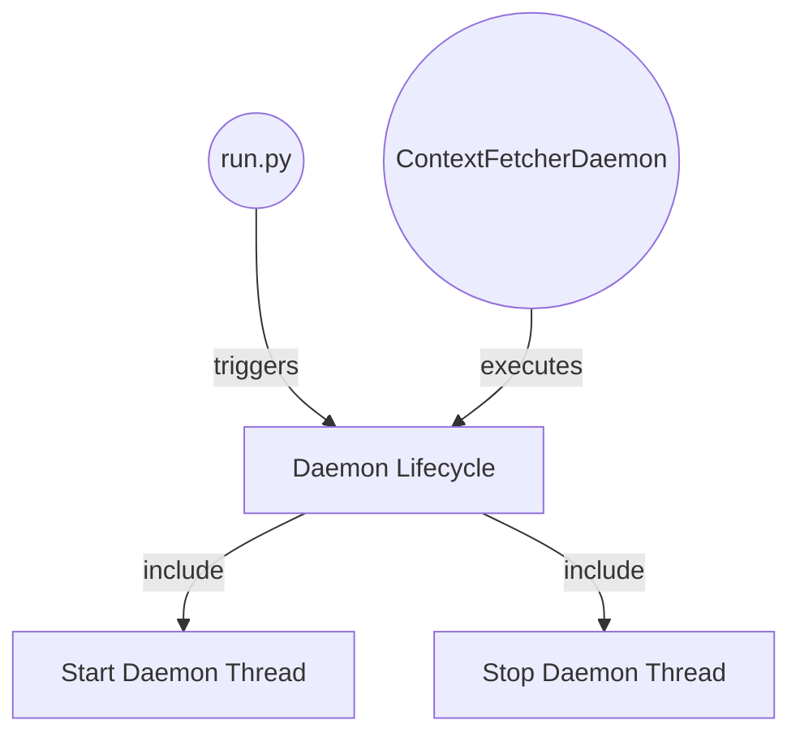

> **Notes**
> - `<<include>>`: Lifecycle management always includes both Start and Stop — they are mandatory paired operations.
> - `triggers`: `run.py` calls `start()` and later `stop()` on the daemon instance — it does not participate in the internal loop.
> - `executes`: the daemon owns its lifecycle — `start()` launches a daemon thread that runs a sleep-wait-fetch loop; `stop()` signals the thread to exit.

**Description:** `start()` launches a daemon thread that sleeps until `fetch_time`, runs the pipeline, then sleeps until the next day; `stop()` signals clean exit.
**Reasoning:** Operational control. `run.py` needs to start/stop the fetcher as a managed service. Without a clean lifecycle, the process can't be gracefully shut down.

### UC3 — Site thread manager

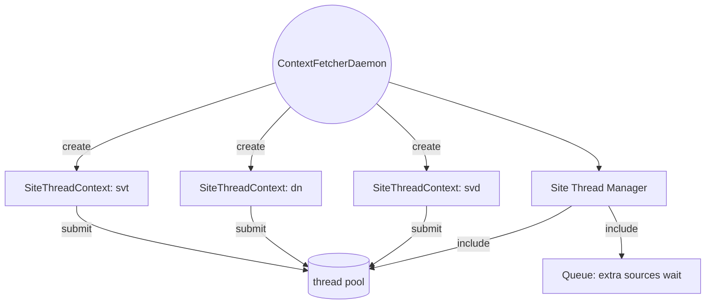

> **Notes**
> - `<<include>>`: The daemon maintains a thread pool (`max_site_threads`, default 12). Each configured source gets its own `SiteThreadContext`.
> - The daemon creates one `SiteThreadContext` per source, submits its `run()` method to the thread pool.
> - If more sources are configured than available threads, extra sources are queued and dispatched as threads free up.
> - Each site thread handles its own lifecycle — see UC6 for what happens inside a context.

**Description:** the site thread manager creates one `SiteThreadContext` per configured source, up to `max_site_threads` (default 12). Excess sources queue and are dispatched as threads become free. Each context runs independently — the manager does not collect results (see UC6 for per-context storage).
**Reasoning:** Concentrating multi-thread orchestration in one place keeps the pool bounded and the dispatch policy (queuing) consistent. Thread isolation means a slow or failing site only blocks its own thread, not the pool. The manager's only concern is creating contexts and submitting them — the context's internal result handling is owned by UC6.

### UC4 — No sources configured

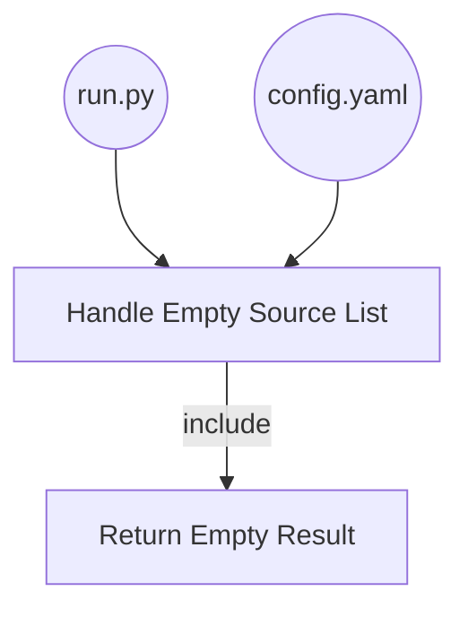

> **Notes**
> - `<<include>>`: When the source list is empty, the only action is to log a warning and return — no sitemaps are fetched, no errors raised.

**Description:** no-op, nothing stored.
**Reasoning:** Defensive. If config is misconfigured or sources are temporarily removed, the system should silently do nothing, not crash.

### UC5 — Pull articles from sitemap

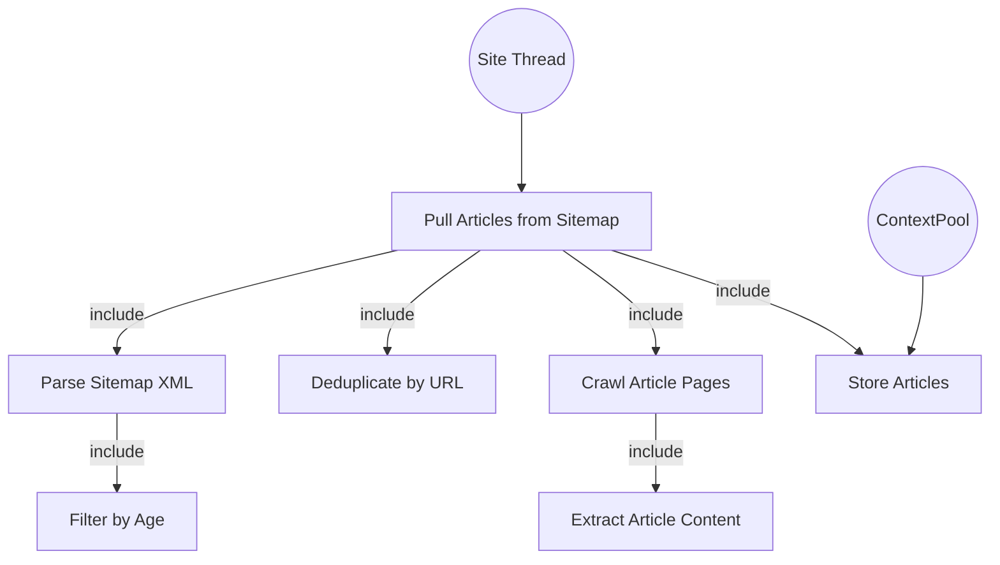

> **Notes**
> - `<<include>>`: Pull Articles from Sitemap is always composed of parsing the sitemap XML, filtering by age, deduplicating by URL, crawling each article page, extracting content, and storing — these are mandatory sub-steps, not optional extensions.

**Description:** fetch the pre-configured flat sitemap, parse its entries, filter by age, deduplicate by URL (within-run), crawl each article page, extract structured content, and store to ContextPool. Every pull runs in a `SiteThreadContext.run()` — see UC6 for the full per-thread lifecycle.
**Reasoning:** Core pipeline. Without this there is no content. Every other use case exists to make this reliable, fast, and scalable.

### UC6 — Per-site thread lifecycle

This use case zooms in on what happens inside a single `SiteThreadContext.run()` from UC3's parallel pool. Every site thread follows the same lifecycle: do its work, store articles one by one, and on failure log and exit.

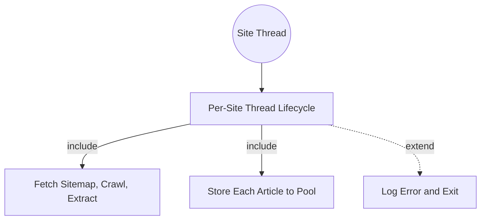

> **Notes**
> - `<<include>>`: Work and Store happen in every thread. The thread processes its sitemap, crawls articles, extracts content, and stores each article individually to ContextPool.
> - `<<extend>>`: Failure is optional — it only triggers when the thread encounters an unrecoverable error (sitemap unreachable, DNS timeout, connection reset). On failure, the thread logs the error context (source name, error type, URL) and exits gracefully. No retry, no cascading state.
>
> **Result collection details:**
> - **What:** each extracted article is an `Article` dataclass with fields ordered: `publish_date`, `updated_date`, `source`, `author`, `language`, `category`, `tags`, `title`, `body`, `url`. No batch — articles are stored one at a time as they are extracted.
> - **How (mechanism):** the daemon (as per-site thread manager) creates one `SiteThreadContext` per source and submits its `run()` method to the thread pool. Inside `run()`, immediately after each article is successfully extracted, it calls `self.store.store_article(article)`. The method returns `None` on success — the daemon has no batch to collect.
> - **Who (recipient):** the daemon instance (`ContextFetcherDaemon`) is the executor — it submits the thread and monitors completion or failure via `as_completed()`. The daemon calls `future.result()` only to detect exceptions; the return value is `None` and is discarded.
> - **Where:** each context owns its own scope — no shared list, no shared `seen` set across contexts. Articles go directly from the extraction loop into `ContextPool` one call at a time.
> - **When:** each article is stored immediately as it is extracted within the thread, via a synchronous `store_article()` call. No waiting for other articles or other threads — the write completes before the thread moves to the next URL.
>
> This is a sub-case of UC3's per-site thread model. Each site thread manages its own `httpx.Client` and lifecycle — a hang or crash never reaches other threads.

**Description:** each `SiteThreadContext.run()` runs independently: it seeds its `seen` set from `pool.seen_urls(7)`, fetches its sitemap, filters by age, applies `max_daily_articles`, deduplicates by URL, crawls article pages, and extracts content. For each extracted article, it immediately calls `self.store.store_article(article)` to persist it synchronously before moving to the next URL. On failure, it logs the error and exits — the exception propagates to the daemon's `as_completed()` loop where it is caught and logged.

**Reasoning:** The common lifecycle guarantees deterministic behavior across all sources. Storing each article immediately as it is extracted means no article is lost if the thread later crashes, and no shared state is needed between threads. The daemon's only role is submission and failure monitoring — it never touches the article data directly. This keeps each thread fully isolated: no shared list, no batch coordination, no global variables.

### UC7 — Per-source max daily articles

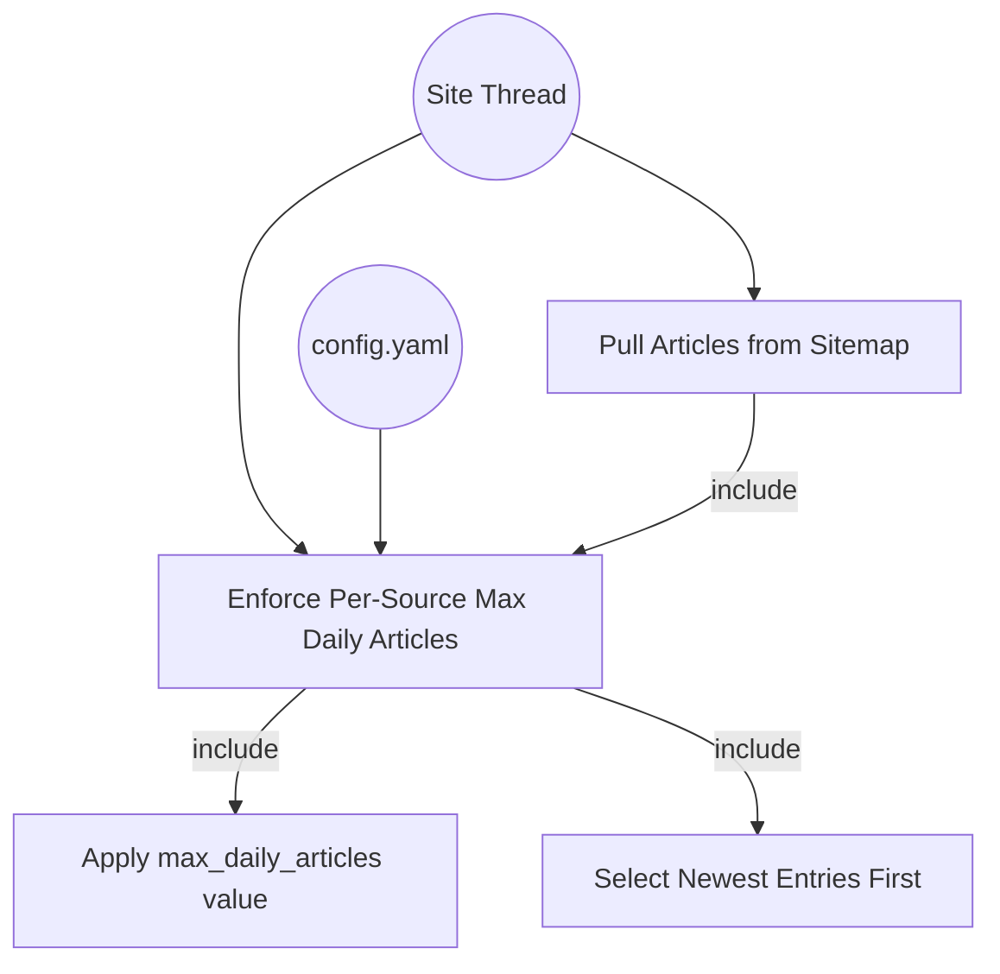

> **Notes**
> - `<<include>>`: Every sitemap pull enforces the per-source `max_daily_articles` value — entries beyond the limit are dropped before crawling.
> - Config provides the `max_daily_articles` value for each source, allowing per-source tuning.

**Description:** each source contributes at most N articles per day (configurable per source). After the site thread parses the sitemap and filters by age, it sorts entries by date and keeps only the N newest, where N = `max_daily_articles` for that source. Entries beyond N are dropped before any HTTP crawl — no bandwidth wasted.

**Why:** Without per-source limits, the largest sitemap (e.g., SVT with 200 entries) drowns out smaller sources (e.g., a local paper with 15 entries). The generator then sees only SVT articles and produces one-narrow-topic lessons. With limits of 2/source, 10 sources produce up to 20 diverse articles for the generator to select from. Per-source limits also make the daily article budget predictable — you know the upper bound of articles the generator will receive, which simplifies context window budgeting in the LLM prompt.

**Reasoning:** Diversity and predictability. The daily lesson benefits from mixing content across sources (national news, local news, culture, sports). Without a cap, the pool is dominated by whichever source has the largest sitemap. With caps, each source gets a fair share — the operator decides how many articles each source is worth.

### UC8 — Cross-session dedup

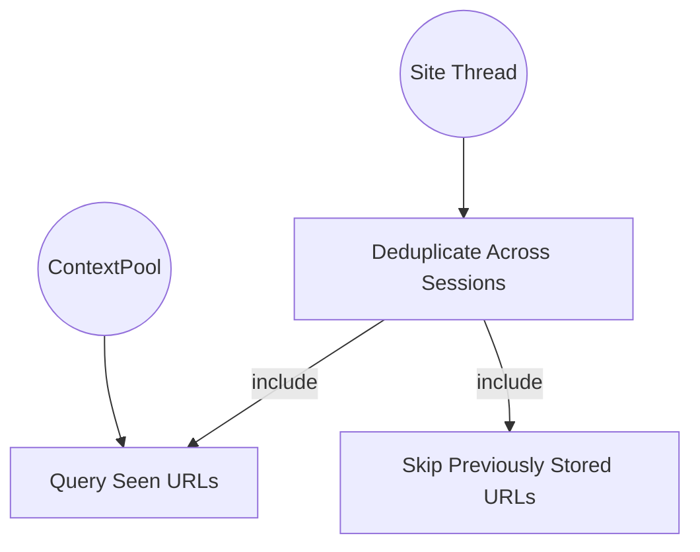

> **Notes**
> - `<<include>>`: Cross-session dedup always queries the pool for URLs from the last N days, then skips any matches during the current fetch.

**Description:** each `SiteThreadContext.run()` seeds its `seen` set from `pool.seen_urls(7)` at the start. URLs already stored in the last 7 days are skipped during article crawling.
**Reasoning:** Freshness. The same article can appear in consecutive days' sitemaps (e.g., a slow-moving news cycle). Without cross-session dedup, the generator would produce near-identical lessons.

### UC9 — Graceful degradation per article

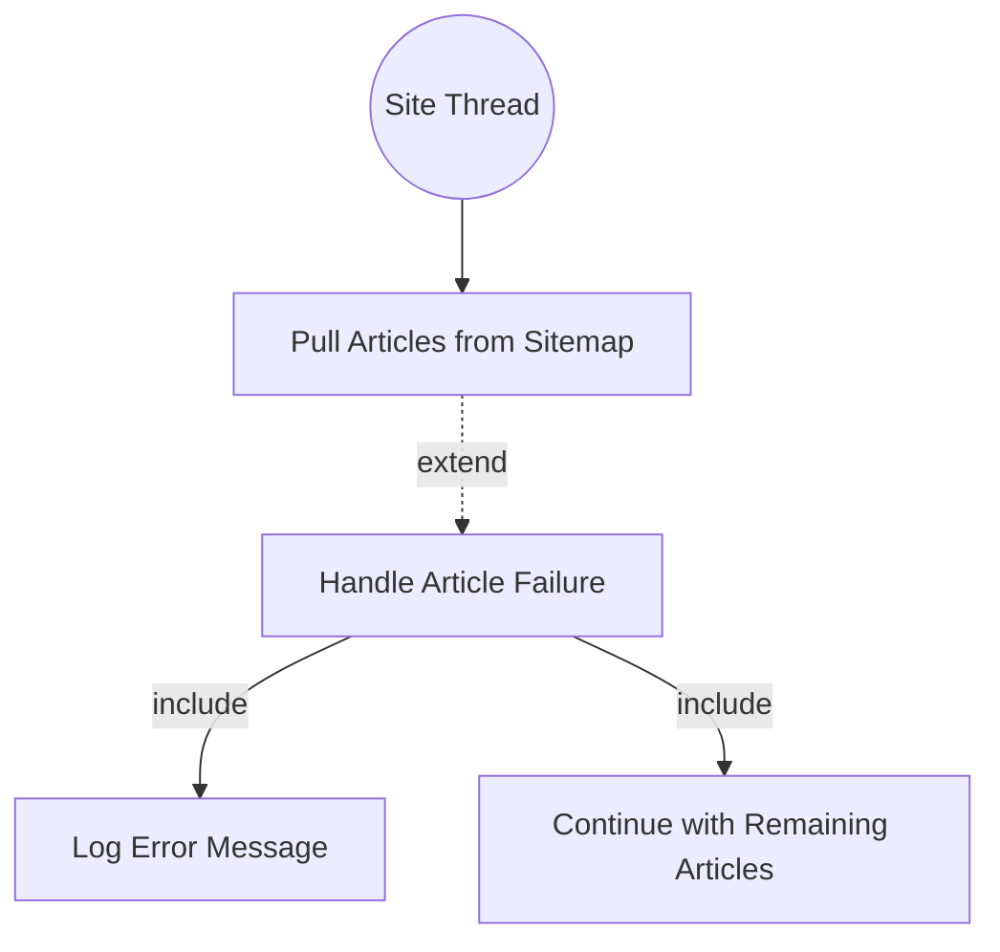

> **Notes**
> - `<<extend>>`: Article Failure is optional — it only triggers when an article returns a 404 or times out. The base Pull use case does not depend on it.
> - `<<include>>`: When a failure occurs, the system always logs it and resumes with the next article.

**Description:** one article URL fails (timeout, 404); remaining articles still processed.
**Reasoning:** Resilience. With 10+ sources x ~15 articles each, some URLs will inevitably be dead or slow. A single 404 must not tank the entire fetch.

## 5. Classes and Data Structures

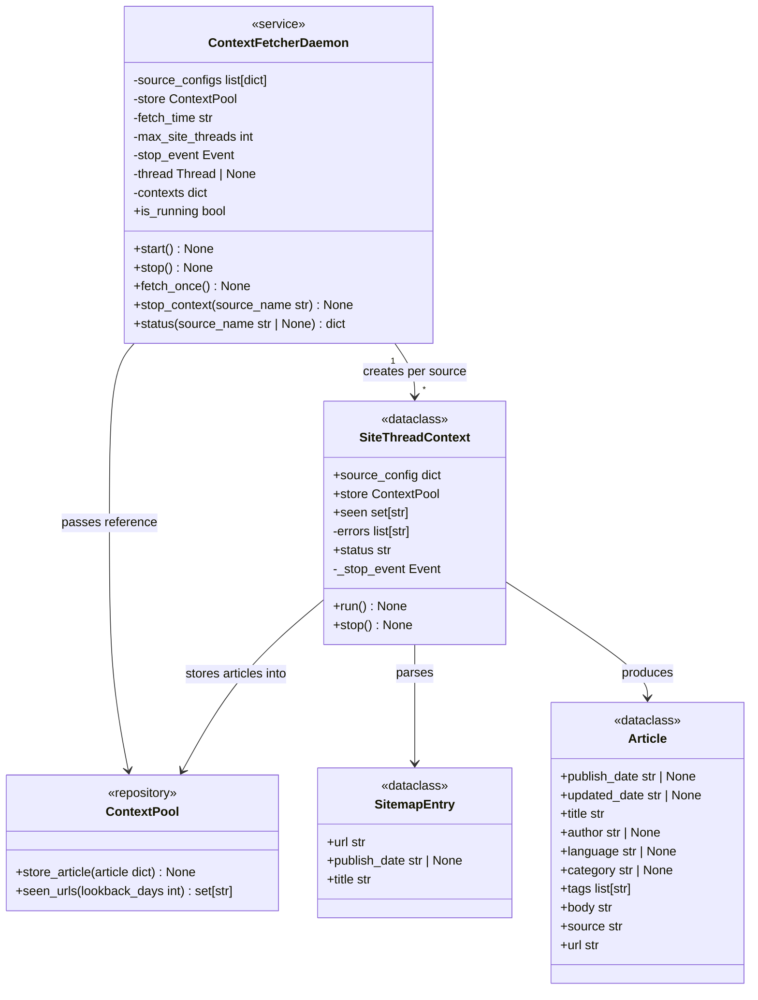

The four core classes in this module:

**`SitemapEntry`** and **`Article`** are passive dataclasses — data carriers with no behaviour.

**`SiteThreadContext`** is the per-site container that encapsulates all state for one source's pipeline. Each context holds:
- `source_config`: the source's sitemap URL, name, `max_age_hours`, `max_daily_articles`
- `store`: a reference to the shared `ContextPool` for persisting articles
- `seen`: a `set[str]` seeded from `pool.seen_urls(7)` at context creation (cross-session dedup), then populated with URLs as they are processed (within-run dedup within this site)
- `errors`: a per-site error list
- `status`: a lifecycle state string — `PENDING`, `RUNNING`, `COMPLETED`, `FAILED`, or `STOPPED`
- `_stop_event`: a `threading.Event` for cooperative cancellation; set by `stop()`, checked by `run()` between articles

Its `run()` method executes the full pipeline for one site: parse sitemap → age filter → dedup gate → crawl → extract → store each article immediately. After each article the method checks `_stop_event` — if set, it sets `status = "STOPPED"` and returns early.
Its `stop()` method sets `_stop_event`, signalling `run()` to stop after the current article completes.

**`ContextFetcherDaemon`** is the service managing thread pool orchestration. It owns the list of source configurations. In `fetch_once()`, it creates one `SiteThreadContext` per source, stores them in `_contexts` (keyed by source name), submits each to the thread pool, and monitors completion via `as_completed()`. The daemon **never touches article data directly** — it creates contexts, submits them, and logs per-site results.
- `stop_context(source_name)` looks up the context by source name and calls its `stop()` method, causing it to exit cooperatively at the next check point.
- `status(source_name=None)` returns a dict with `status`, `articles_count`, and `errors` for one context or all contexts.

**`ContextPool`** is the shared persistence backend. Each `SiteThreadContext` stores into it directly.

There is no `FetchResult` — `fetch_once()` returns `None`. Errors are logged per-site by the context and surfaced by the daemon. Each context owns its own `seen` set — no shared state between threads.

## 6. Implementation Plan

### Step 1 — Scaffold

Create `daglas/context_fetcher.py` with `SitemapEntry`, `Article`, `SiteThreadContext`, and stubs for `read_sitemap_entries`, `extract_article`, `_parse_date`, `_entry_sort_key`.

### Step 2 — Sitemap parsing

1. Fetch `sitemap_url` with `httpx`.
2. Parse XML.
3. Detect if response is a sitemap index (`<sitemapindex>`) → raise `ValueError` (config should point to a flat sitemap; use the discovery tool if unsure).
4. For flat sitemaps, iterate each `<url>` entry:
   - Extract `<loc>` (required).
   - Extract date: try `<news:publication_date>` (namespace-aware), fall back to `<lastmod>`, else `None`.
   - Extract title from `<news:title>` if present.
5. Return `list[SitemapEntry]`.

### Step 3 — Article extraction

1. For each discovered URL, fetch with `httpx` (with timeout and user-agent).
2. Pass HTML to `trafilatura.extract()` with `output_format="dict"` to get structured data.
3. Map trafilatura output keys → `Article` fields:
   - `title`, `description` → `title`
   - `raw_text` → `body`
   - `date` → `publish_date`
   - `author` → `author`
   - `categories` → `category` (first category)
   - `tags` → `tags`
   - `language` → `language`
   - `source` → derived from URL domain or config name
4. Fallback: if trafilatura returns nothing useful, try BeautifulSoup extraction of `<article>` or `<main>` content.

### Step 4 — Deduplication (intra-run)

- Each `SiteThreadContext` maintains its own `seen: set[str]`.
- Before fetching an article URL, check if it's in `seen`; if so, skip.
- After fetching, add the URL to `seen`.
- No global dedup pass — the `seen` set is per-context, seeded from `pool.seen_urls(7)`.

### Step 5 — Cross-session dedup

- Each `SiteThreadContext.run()` calls `self.store.seen_urls(7)` to seed its `seen` set at the start.
- This prevents re-fetching articles already stored in the past N days.
- No shared state — each context independently queries the pool.

### Step 6 — Parallel site threads

Each configured source runs in its own dedicated thread, managed by the daemon's thread pool:

- `max_site_threads` config parameter (default 12) caps concurrent site threads.
- If more sources are configured than available threads, excess sources queue up and wait for a free thread.
- The daemon creates one `SiteThreadContext` per source, submits each to the thread pool.
- Each context's `run()` method handles its own pipeline: parse sitemap → age filter → crawl articles → extract content → store each article to pool.
- Site threads share nothing — each context owns its own `seen` set, `errors` list, and creates its own `httpx.Client`.
- Each article is stored individually via `self.store.store_article(article.__dict__)` as it is extracted — no accumulation, no batch.
- The daemon monitors completion and failure only — it never touches article data.
- `_fetch_single_article()` helper wraps the fetch-and-extract for a single URL.

Pseudo-code:

```python
@dataclass
class SiteThreadContext:
    source_config: dict
    store: ContextPool
    seen: set[str] = field(default_factory=set)
    errors: list[str] = field(default_factory=list)
    status: str = "PENDING"
    _stop_event: threading.Event = field(default_factory=threading.Event)

    def stop(self) -> None:
        """Signal cooperative cancellation. run() checks between articles."""
        self._stop_event.set()

    def run(self) -> None:
        """Full pipeline for a single site. Stores each article to pool immediately."""
        self.status = "RUNNING"

        try:
            self.seen.update(self.store.seen_urls(7))
        except Exception:
            pass

        with httpx.Client(headers={"User-Agent": "daglas/1.0"}, timeout=30) as client:
            try:
                entries = read_sitemap_entries(self.source_config["sitemap"], client)
            except Exception as e:
                logging.error(f"{self.source_config.get('name', '?')}: {e}")
                self.status = "FAILED"
                return

            # Age filter
            source_max_age = self.source_config.get("max_age_hours", 0) or 0
            if source_max_age > 0:
                cutoff = datetime.now(timezone.utc) - timedelta(hours=source_max_age)
                entries = [
                    e for e in entries
                    if e.publish_date is None or _parse_date(e.publish_date) >= cutoff
                ]
            entries.sort(key=_entry_sort_key, reverse=True)

            source_name = self.source_config.get(
                "name", _domain_from_url(self.source_config["sitemap"])
            )
            max_daily = self.source_config.get("max_daily_articles", 0) or 0

            for i, entry in enumerate(entries):
                if self._stop_event.is_set():
                    self.status = "STOPPED"
                    return
                if max_daily and i >= max_daily:
                    break
                if entry.url in self.seen:
                    continue
                self.seen.add(entry.url)
                try:
                    resp = client.get(entry.url, timeout=30)
                    resp.raise_for_status()
                    article = extract_article(entry.url, resp.text)
                    if not article.title and entry.title:
                        article.title = entry.title
                    article.source = source_name
                    self.store.store_article(article.__dict__)
                except Exception as e:
                    self.errors.append(f"{entry.url}: {e}")

            if self.errors:
                logging.warning(f"{source_name}: {len(self.errors)} article(s) failed")

        self.status = "COMPLETED"


class ContextFetcherDaemon:
    def __init__(self, ...):
        self._contexts: dict[str, SiteThreadContext] = {}

    def stop_context(self, source_name: str) -> None:
        """Stop a specific site thread. No-op if already done or unknown."""
        ctx = self._contexts.get(source_name)
        if ctx:
            ctx.stop()

    def status(self, source_name: str | None = None) -> dict:
        """Return status dict for one or all contexts."""
        if source_name:
            ctx = self._contexts.get(source_name)
            if not ctx:
                return {"error": "source not found"}
            return {
                "status": ctx.status,
                "articles_count": len(ctx.seen),
                "errors": list(ctx.errors),
            }
        return {
            name: {
                "status": ctx.status,
                "articles_count": len(ctx.seen),
                "errors": list(ctx.errors),
            }
            for name, ctx in self._contexts.items()
        }

    def fetch_once(self) -> None:
        """Orchestrate per-site threads. Each context stores articles directly to pool."""
        self._contexts = {
            cfg.get("name", _domain_from_url(cfg["sitemap"])): SiteThreadContext(
                source_config=cfg, store=self._store
            )
            for cfg in self._source_configs
        }

        with ThreadPoolExecutor(max_workers=self._max_site_threads) as executor:
            futures = {executor.submit(ctx.run): name for name, ctx in self._contexts.items()}
            for future in as_completed(futures):
                name = futures[future]
                try:
                    future.result()
                except Exception as e:
                    logging.error(f"{name}: thread failed: {e}")
                    ctx = self._contexts.get(name)
                    if ctx:
                        ctx.status = "FAILED"
```

### Step 7 — Config integration

Add a `sources: list[dict]` field to `DaglasConfig` in `daglas/config.py`. The config module's `load_config` already reads arbitrary keys from YAML, so this just needs a dataclass field.

### Step 8 — Daemon lifecycle

Add `ContextFetcherDaemon` class to `daglas/context_fetcher.py`:

1. **`__init__`** — accept `ContextPool` instance, source configs list, and optional `poll_interval`. Read `cfg.fetch_time`, `cfg.max_site_threads` from config. Create `_stop_event = threading.Event()`.
2. **`start()`** — clear stop event, create daemon thread targeting `_run()`, start thread.
3. **`stop()`** — set stop event, join thread with 5s timeout.
4. **`fetch_once()`** — create one `SiteThreadContext` per source, submit to `ThreadPoolExecutor`, monitor via `as_completed()`. Returns `None` — errors are logged per-context.
5. **`_run()`** — loop until stop event:
   - Calculate seconds to next fetch_time (see `_resolve_send_time` pattern in `run.py`).
   - Sleep with `_stop_event.wait(timeout=seconds_to_fetch)` to allow early wake on stop.
   - When wake time arrives: call `fetch_once()` and log results.
   - After fetch: recalculate for next day (tomorrow's fetch_time).
   - If the calculated wait exceeds `poll_interval`, clamp to `poll_interval` and re-check (to handle clock changes gracefully).
6. **Config**: The `context_fetcher_poll_interval` field in `DaglasConfig` (default 3600). The `max_site_threads` field (default 12).

## 7. Unit Test Strategy (`tests/test_context_fetcher.py`)

Use `pytest`. No network — mock `httpx` responses with fixture HTML/XML. Use `tmp_path` for any file I/O.

Coverage categories: happy path, error path, edge cases, critical business logic.

| Category | Test | What it covers |
|---|---|---|
| Happy path | `test_read_sitemap_entries_news_metadata` | Flat sitemap with `<news:news>` → returns `SitemapEntry` with dates and titles |
| Happy path | `test_read_sitemap_entries_plain` | Flat sitemap without news namespace → entries with dates from `<lastmod>`, titles empty |
| Happy path | `test_extract_article` | Article HTML → populated `Article` |
| Happy path | `test_site_thread_context_single_sitemap` | One `SiteThreadContext.run()` → articles discovered, filtered, extracted, stored |
| Happy path | `test_site_thread_context_multiple_sources` | Two contexts run independently → articles from both stored to pool |
| Error path | `test_read_sitemap_entries_index_raises` | Sitemap index → raises `ValueError` |
| Error path | `test_site_thread_context_sitemap_unreachable` | Sitemap fetch fails → error logged, no articles stored |
| Error path | `test_site_thread_context_article_failure` | One article fails → others still processed and stored |
| Error path | `test_site_thread_context_all_fail` | All sitemaps fail → no articles stored |
| Edge case | `test_read_sitemap_entries_empty` | Sitemap with no entries → empty list |
| Edge case | `test_extract_article_fallback` | No clear article → fallback extraction |
| Edge case | `test_extract_article_empty_body` | Empty/short HTML → empty-styled Article |
| Edge case | `test_daemon_empty_sources` | Empty source list → daemon no-op |
| Critical logic | `test_deduplicate_helper` | Duplicate URLs → only first occurrence kept |
| Critical logic | `test_site_thread_context_dedup` | Same URL within one sitemap → fetched once |
| Critical logic | `test_site_thread_context_age_filter` | Entries older than `max_age_hours` are not fetched |
| Critical logic | `test_site_thread_context_max_daily` | Source with `max_daily_articles: 2` contributes at most 2 articles |
| Critical logic | `test_cross_session_dedup` | `pool.seen_urls()` URLs seeded into context → skipped during fetch |
| Daemon | `test_daemon_start_stop` | `start()` then `stop()` → thread exits cleanly |
| Daemon | `test_daemon_fetch_once` | `fetch_once()` runs the pipeline without error |
| Daemon | `test_daemon_skip_if_no_sources` | Daemon starts but no sources configured → no-op |
| Daemon | `test_daemon_is_running` | `is_running` reflects thread state |
| Daemon | `test_daemon_stop_context` | `stop_context()` signals context, `run()` returns early with `STOPPED` status |
| Daemon | `test_daemon_stop_context_unknown` | `stop_context("nonexistent")` is a no-op, no error raised |
| Daemon | `test_daemon_status_all` | `status()` returns dict with all contexts after `fetch_once()` |
| Daemon | `test_daemon_status_single` | `status("svt")` returns status for a named context |
| Daemon | `test_daemon_status_unknown` | `status("nonexistent")` returns error dict |

## 8. Acceptance Criteria

- `pytest tests/test_context_fetcher.py` passes all tests.
- `ruff check daglas/` and `ruff format --check daglas/` pass.
- Running `python3 -m daglas.context_fetcher --dry-run` with a configured sitemap URL prints discovered articles (manual smoke test).
- `ContextFetcherDaemon.start()` / `stop()` lifecycle works (tested via integration script or unit tests).
- Sitemap discovery tool (separate script) can identify the correct flat sitemap URL for a new source.

## Discussion

### 2026-06-16 — Flat sitemap only; metadata-aware parsing; age filtering

**What changed:**
- Replaced `discover_sitemap_urls` with `read_sitemap_entries` — no sitemap index recursion, only flat `<urlset>` parsing. Raises `ValueError` on index input.
- Added `SitemapEntry` dataclass returning `(url, publish_date, title)` from `<news:news>` / `<lastmod>` metadata.
- Added `max_age_hours` filter to skip stale entries before HTML fetch.
- Reordered `Article` fields so `publish_date` comes first.
- Sitemap discovery separated into a future AI-assisted tool; the fetcher assumes the sitemap URL is pre-configured.
- Pipeline stages now: Parse sitemap → Filter by age → Crawl → Extract → Deduplicate → Store.

**Why:**
- The general sitemap index includes video and other non-article sitemaps.
- Without date metadata in discovery, we can't filter old entries without fetching their HTML.
- Namespace-agnostic: works with `<news:news>`, other custom namespaces, or no metadata.
- Swedish language requirement is implicit in source selection, not tag inspection.
- Manual flat-sitemap config is more reliable than auto-discovery; the discovery tool is a convenience for adding new sources.

### 2026-06-14 — Added daemon lifecycle (start/stop/run)

### 2026-06-14 — Added daemon lifecycle (start/stop/run)

**What changed:**
- Added `ContextFetcherDaemon` class with `start()`/`stop()`/`_run()` pattern, matching `EmailReceiver` and `EmailSenderQueue`.
- Removed "scheduling" from non-goals — the daemon now handles daily scheduling internally.
- Updated component diagram: no separate Scheduler; `run.py` controls the daemon via `start()`/`stop()`.
- Added `fetch_once()` for one-shot immediate fetches (e.g., initial startup fetch).
- Added `context_fetcher_poll_interval` config field (default 3600s).

**Why:**
- Consistency: all I/O modules (EmailReceiver, EmailSenderQueue, ContextFetcher) follow the same daemon pattern.
- `run.py` should only assemble and control lifecycle — each module manages its own timing.
- The daemon sleeps until `fetch_time`, runs the pipeline, then sleeps until the next day — no busy-waiting.

**Impact on implementation plan:**
- `ContextFetcher` status changes from `done` to `designing` — daemon still needs to be built.
- `run.py` needs to call `fetcher.start()` instead of calling `fetch_context()` directly (or call `fetch_once()` at startup + `start()` for ongoing scheduling).
- `DaglasConfig` needs `context_fetcher_poll_interval` field.

**TODO actions:**
- [x] Add `context_fetcher_poll_interval` field to `DaglasConfig` (default 86400).
- [x] Implement `ContextFetcherDaemon` in `daglas/context_fetcher.py`.
- [x] Add `tests/test_context_fetcher.py` tests for daemon lifecycle.
- [x] Update `run.py` — `OutboundPipeline` uses `ContextFetcherDaemon.fetch_once()` internally.
- [x] Update `implementation_plan.md`.

### 2026-06-18 — Use case renumbering UC1–UC9 (big-to-small order)

**What changed:**
- Inserted new UC1 (External actor: `run.py`) before the former UC1 (Daemon lifecycle), bumping all subsequent UCs by +1.
- Renumbered all heading titles, Mermaid node IDs, and prose cross-references accordingly: UC1=External actor, UC2=Daemon lifecycle, UC3=Site thread manager, UC4=No sources, UC5=Pull articles, UC6=Per-site thread lifecycle, UC7=Per-source max daily, UC8=Cross-session dedup, UC9=Graceful degradation.
- Updated all Mermaid `graph` diagrams to use matching node IDs (`UC2[...]`, `UC3[...]`, etc.) so node IDs reflect section numbering.

**Why:**
- The `run.py` entry point is a higher-level concern than the daemon's internal lifecycle; UC order now reads from outermost actor inward.
- Consistent node IDs (`UC2[Daemon Lifecycle]` in the UC2 section) reduces confusion when reading the doc.

### 2026-06-18 — Per-site thread model, SiteThreadContext, per-source max_daily_articles, cross-session dedup

**What changed:**
- Replaced `ThreadPoolExecutor`-with-shared-client model with per-site thread model: each source runs in its own thread with its own `httpx.Client`.
- Introduced `SiteThreadContext` dataclass: explicit per-source container holding `source_config`, `store` (ContextPool ref), `seen` set, and `errors` list. Its `run()` method executes the full pipeline.
- `ContextFetcherDaemon` no longer calls `fetch_context()` — it creates N `SiteThreadContext` instances, submits them to `ThreadPoolExecutor`, and monitors via `as_completed()`.
- Added `max_site_threads` config (default 12) to limit concurrent site threads; excess sources queue.
- Added per-source `max_daily_articles` config field to limit each source's contribution.
- Added `pool.seen_urls(lookback_days=7)` cross-session dedup — each context seeds its own `seen` set independently.
- Removed `FetchResult` — `fetch_once()` returns `None`. Errors are logged per-context.
- Removed global `deduplicate()` pass — within-run dedup is per-context via each context's `seen` set.
- Pipeline stages now all "Per-site thread" — no global stages.
- Class diagram updated: `SiteThreadContext` added, wrong daemon→Article/SitemapEntry arrows removed.
- Article scoring moved to `ContextPool` UC7 — no longer part of the fetcher.
- Removed `fetch_context()` module-level function — orchestration lives in `ContextFetcherDaemon.fetch_once()`. No `Article.score` field in the fetcher.
- Component diagram updated: `Fetcher[fetch_context]` replaced by `Context[SiteThreadContext]`. Config feeds to daemon, daemon creates contexts, contexts talk to sites and pool.

**Why:**
- With 10+ sources, sequential fetching is too slow — the pipeline can stall for minutes.
- Global `max_daily_articles=3` caused most sources to contribute nothing; per-source `max_daily_articles` values distribute coverage.
- Without cross-session dedup, the same article could appear in lessons on consecutive days.
- Without explicit `SiteThreadContext`, per-site state (seen set, errors, source config) was scattered across function arguments and closures — the context encapsulates all per-site state in one place, making the threading model explicit and testable.
- The daemon only manages threads and monitors results — `SiteThreadContext` owns the pipeline, keeping responsibilities cleanly separated.

**Impact on implementation plan:**
- `ContextFetcher` status: `done` → `designing` (new features to implement).
- `daglas/context_fetcher.py` needs: `SiteThreadContext` with `run()` method, per-site thread orchestration in daemon, `_fetch_single_article()` helper, cross-session dedup per context.
- `daglas/context_pool.py` needs: `seen_urls()` method.
- `daglas/config.py` needs: `SourceConfig` with `max_daily_articles` field, `max_site_threads` on `DaglasConfig`.
- `config.yaml` examples updated with per-source `max_daily_articles: 2`.

**TODO actions:**
- [ ] Add `SiteThreadContext` dataclass with `run()` method, `stop()`, `status`, `_stop_event`.
- [ ] Rewrite `ContextFetcherDaemon.fetch_once()` to create N contexts and submit to `ThreadPoolExecutor`.
- [ ] Add `max_site_threads` to `DaglasConfig`.
- [ ] Add `_fetch_single_article()` helper.
- [ ] Update `daglas/config.py` to add `max_daily_articles` to `SourceConfig`.
- [ ] Update `run.py` if config structure changes.
- [ ] Add new tests for `SiteThreadContext.run()`, per-source limits, cross-session dedup, daemon orchestration.
- [ ] Add tests for `stop_context()` and `status()`.
- [ ] Update `config.yaml` with per-source `max_daily_articles` and global `max_site_threads`.
- [ ] Update `implementation_plan.md`.

### 2026-06-19 — Per-context stop() and status() methods

**What changed:**
- Added `status: str` field to `SiteThreadContext` — lifecycle state: `PENDING`, `RUNNING`, `COMPLETED`, `FAILED`, `STOPPED`.
- Added `_stop_event: threading.Event` field for cooperative cancellation.
- Added `stop()` method to `SiteThreadContext` — sets `_stop_event`; `run()` checks the event between articles and returns early with `status = "STOPPED"` if set.
- Added `_contexts: dict[str, SiteThreadContext]` to `ContextFetcherDaemon` — maps source name to context during `fetch_once()`.
- Added `stop_context(source_name: str)` to daemon — signals a specific context's `_stop_event`.
- Added `status(source_name: str | None = None)` to daemon — returns status, article count, and errors for one or all contexts.
- Updated class diagram with all new fields and methods.
- Updated pseudo-code in implementation plan.
- Added 6 new test entries to test strategy table.

**Why:**
- The daemon thread (e.g., from `run.py`'s keyboard loop) needs to stop a slow or hung site thread without shutting down the whole fetcher.
- No shared locks needed — `_stop_event` is thread-safe, and `run()` only checks it at natural iteration boundaries.
- No new state beyond existing fields (`seen` count, `errors` list) — `status()` reads what's already there.
- `stop()` is cooperative (not forceful) to avoid corrupting `httpx.Client` state or in-progress stores.

**Impact on implementation plan:**
- Two new TODO items: per-context stop/status, corresponding tests.
- No change to config, no new config fields.
