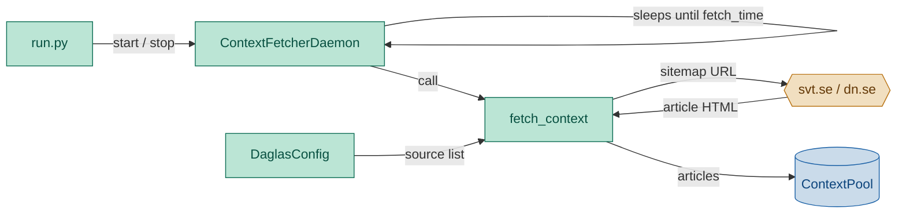
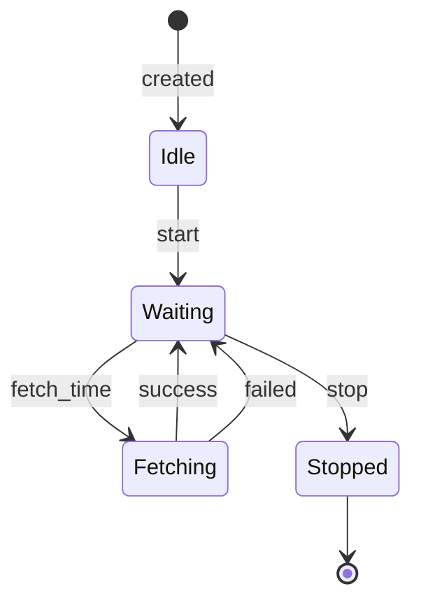

# ContextFetcher Module — Engineering Design & Implementation Task

## 1. Purpose

Discover, crawl, and extract full-article content from Swedish-language websites every morning. Store structured article data into `ContextPool` so the lesson module has current real-world material to work from.

The module provides a daemon lifecycle (`start()` / `stop()` / `_run()`) matching the pattern of `EmailReceiver` and `EmailSenderQueue`. The daemon thread sleeps until the configured `fetch_time`, executes the fetch pipeline, then sleeps until the next day's fetch_time.

## 2. Component Diagram



## 3. Pipeline

```
Discover → Crawl → Extract → Deduplicate → Store
```

| Stage | What it does |
|---|---|
| **Discover** | Resolve configured source entries into lists of article URLs (parse sitemaps, discover API endpoints) |
| **Crawl** | HTTP-fetch each discovered article page |
| **Extract** | Parse HTML into structured fields: title, body, dates, author, metadata |
| **Deduplicate** | Skip already-seen URLs (across the current run, and vs. previously stored) |
| **Store** | Write deduplicated articles as structured data to `ContextPool` |

## 3. Scope (MVP)

- **Content channels**: sitemap-based article discovery (parse `sitemap.xml` / `sitemap_index.xml` for `news:news` entries and general URLs).
- **Extraction**: full-article content, title, publish date, author, language.
- **Deduplication**: by URL within a single run.
- **Error handling**: one failing source does not block others; per-article timeout.
- **Output**: structured `Article` objects serialized as JSON Lines to `ContextPool`.

Non-goals: API authentication, JavaScript rendering, screenshot capture, diff-based refetching, multi-language detection beyond what the article metadata provides.

## 4. Use Cases

| UC | Description |
|---|---|
| UC1 | **Discover from sitemap** — fetch sitemap, extract article URLs, crawl and extract each |
| UC2 | **Graceful degradation** — one article URL fails (timeout, 404); remaining articles still processed |
| UC3 | **Deduplicate** — repeated URL within a run is skipped |
| UC4 | **No sources configured** — no-op, nothing stored |
| UC5 | **All sources fail** — no articles stored; pool retains previous day's content |
| UC6 | **Daemon lifecycle** — `start()` launches a daemon thread that sleeps until `fetch_time`, runs the fetch pipeline, then sleeps until the next day's `fetch_time`. `stop()` signals the thread to exit cleanly. |

## 5. Python Libraries

| Library | Why |
|---|---|
| `httpx` | Async-capable HTTP client with connection pooling and timeout support |
| `beautifulsoup4` | HTML/XML parsing for sitemaps and fallback content extraction |
| `lxml` | Fast XML/HTML parser backend for BeautifulSoup |
| `trafilatura` | Reliable article content extraction (title, body, date, author, language) |
| Standard `json` | Serialize articles as JSON Lines for storage |

Dependency spec (add to `requirements.txt`):

```
httpx>=0.28
beautifulsoup4>=4.12
lxml>=5.0
trafilatura>=2.0
```

## 6. Interface

### Location: `daglas/context_fetcher.py`

```python
from dataclasses import dataclass, field


@dataclass
class Article:
    url: str = ""
    title: str = ""
    body: str = ""
    publish_date: str | None = None
    updated_date: str | None = None
    source: str = ""
    category: str | None = None
    tags: list[str] = field(default_factory=list)
    author: str | None = None
    language: str | None = None


@dataclass
class FetchResult:
    articles: list[Article] = field(default_factory=list)
    errors: list[str] = field(default_factory=list)


def discover_sitemap_urls(sitemap_url: str, client: httpx.Client) -> set[str]:
    """Fetch a sitemap and return all discovered article URLs.

    Handles sitemap indexes (nested sitemaps) and standard sitemaps.
    Filters to plausible article paths (heuristically).
    """
    ...


def extract_article(url: str, html: str) -> Article:
    """Parse article HTML into a structured Article object using trafilatura."""
    ...


def fetch_context(
    sitemap_urls: list[str],
    pool: ContextPool,
    *,
    concurrency: int = 5,
    user_agent: str = "daglas/1.0",
) -> FetchResult:
    """Full pipeline: discover → crawl → extract → deduplicate → store.

    Parameters
    ----------
    sitemap_urls:
        List of sitemap URLs to discover articles from.
    pool:
        ContextPool instance to store results into.
    concurrency:
        Number of parallel article fetches (default 5).
    """
    ...


def deduplicate(articles: list[Article]) -> list[Article]:
    """Remove articles with duplicate URLs, keeping first occurrence."""
    ...
```

### `ContextPool` contract (provided by separate module)

```python
@dataclass
class Article:
    url: str
    title: str
    body: str
    publish_date: str | None
    updated_date: str | None
    source: str
    category: str | None
    tags: list[str]
    author: str | None
    language: str | None


class ContextPool:
    def store_articles(self, articles: list[Article]) -> None:
        """Append articles to the day's context store as JSON Lines."""
```

### Configuration (`config.yaml`)

```yaml
sources:
  - name: svt
    sitemap: https://www.svt.se/sitemap.xml
  - name: dn
    sitemap: https://www.dn.se/sitemap.xml
```

For MVP, the `load_config` function reads these into lists. The `DaglasConfig` dataclass will need a new field for structured sources.

### Daemon class

```python
class ContextFetcherDaemon:
    """Daemon thread that periodically fetches context at the configured fetch_time.

    Matches the start/stop/run pattern of EmailReceiver and EmailSenderQueue.
    The daemon sleeps until fetch_time, executes fetch_context(), then sleeps
    until the next day's fetch_time.
    """

    def __init__(self, pool: ContextPool, *, poll_interval: int = 3600):
        """pool: ContextPool instance to store fetched articles into.
        poll_interval: how often (seconds) the daemon checks whether it
            should fetch. Default 3600 (1 hour).
        """

    def start(self) -> None:
        """Start the daemon thread. Idempotent — safe to call multiple times."""

    def stop(self) -> None:
        """Signal the daemon thread to stop. Blocks up to 5s for join."""

    @property
    def is_running(self) -> bool:
        """True if the daemon thread is alive."""

    def _run(self) -> None:
        """Internal loop. Checks time, fetches when conditions are met, sleeps."""

    def fetch_once(self) -> FetchResult:
        """Immediate one-shot fetch, bypassing the timer. Returns fetch results.
        Useful for initial fetch at startup.
        """
```

The `_run()` method calculates seconds until the next `fetch_time` (using
`cfg.fetch_time` from config). When the time arrives, it calls `fetch_context()`
and logs the result. After fetching, it recalculates for the next day.

If `poll_interval` is short (e.g. 3600s), the daemon also falls back to the
interval-based check — waking every hour to verify the time rather than
sleeping for hours at a stretch (avoids clock-skew issues).

### Daemon state machine



| State | Meaning |
|---|---|
| `Idle` | Daemon exists but has not been started |
| `Waiting` | `start()` called — thread sleeping until next `fetch_time` |
| `Fetching` | `fetch_time` reached — actively fetching and storing articles |
| `Stopped` | `stop()` called — thread has exited its loop and been joined |

The two transitions from `Fetching` back to `Waiting`:

| Transition | Trigger | What happens |
|---|---|---|
| `success` | `fetch_context()` returned `FetchResult` with at least one article | Log summary: `Fetched N article(s), M warning(s)`. Articles stored in pool. Daemon sleeps until next cycle. |
| `failed` | `fetch_context()` returned `FetchResult` with zero articles, or an unexpected exception occurred | Log all errors. No articles stored. Daemon sleeps until next cycle (no crash, no retry — retries naturally on next `fetch_time`). |

Note: `fetch_context()` catches all per-URL and per-source errors internally.
An unexpected exception (the `failed` path) should be rare — the catch-all
prevents the daemon from crashing on transient infrastructure issues.

The `Stopped` state is terminal for the current thread. Calling `start()`
again creates a new thread and transitions back to `Waiting`.

## 7. Implementation Plan

### Step 1 — Scaffold

Create `daglas/context_fetcher.py` with `Article`, `FetchResult`, and stubs for `discover_sitemap_urls`, `extract_article`, `deduplicate`, `fetch_context`.

### Step 2 — Sitemap discovery

1. Fetch `sitemap_url` with `httpx`.
2. Parse XML with BeautifulSoup (`lxml-xml` parser).
3. If it's a sitemap index (<sitemapindex>), recursively fetch each child sitemap.
4. For standard sitemaps, extract all <loc> entries.
5. Return deduplicated set of discovered article URLs.

### Step 3 — Article extraction

1. For each discovered URL, fetch with `httpx` (with timeout and user-agent).
2. Pass HTML to `trafilatura.extract()` with `output_format="dict"` to get structured data.
3. Map trafilatura output keys → `Article` fields:
   - `title`, `description` → `title`
   - `raw_text` → `body`
   - `date` → `publish_date`
   - `author` → `author`
   - `categories` → `category` (first category)
   - `tags` → `tags`
   - `language` → `language`
   - `source` → derived from URL domain or config name
4. Fallback: if trafilatura returns nothing useful, try BeautifulSoup extraction of `<article>` or `<main>` content.

### Step 4 — Deduplication

- Maintain a `seen_urls: set[str]` across the run.
- Skip articles whose URL is already in the set.
- `deduplicate()` helper for testing.

### Step 5 — Pipeline integration

`fetch_context` orchestrates the stages:

```python
def fetch_context(sitemap_urls, pool, ...):
    seen: set[str] = set()
    articles: list[Article] = []
    errors: list[str] = []

    for sitemap_url in sitemap_urls:
        try:
            urls = discover_sitemap_urls(sitemap_url, client)
        except Exception as e:
            errors.append(f"{sitemap_url}: discovery failed: {e}")
            continue

        for url in urls:
            if url in seen:
                continue
            seen.add(url)
            try:
                response = client.get(url, ...)
                article = extract_article(url, response.text)
                articles.append(article)
            except Exception as e:
                errors.append(f"{url}: {e}")

    if articles:
        pool.store_articles(articles)

    return FetchResult(articles=articles, errors=errors)
```

### Step 6 — Config integration

Add a `sources: list[dict]` field to `DaglasConfig` in `daglas/config.py`. The config module's `load_config` already reads arbitrary keys from YAML, so this just needs a dataclass field.

### Step 7 — Daemon lifecycle

Add `ContextFetcherDaemon` class to `daglas/context_fetcher.py`:

1. **`__init__`** — accept `ContextPool` instance and optional `poll_interval`. Read `cfg.fetch_time` from config. Create `_stop_event = threading.Event()`.
2. **`start()`** — clear stop event, create daemon thread targeting `_run()`, start thread.
3. **`stop()`** — set stop event, join thread with 5s timeout.
4. **`fetch_once()`** — wrap `fetch_context()` call with the configured sources from config. Return `FetchResult`.
5. **`_run()`** — loop until stop event:
   - Calculate seconds to next fetch_time (see `_resolve_send_time` pattern in `run.py`).
   - Sleep with `_stop_event.wait(timeout=seconds_to_fetch)` to allow early wake on stop.
   - When wake time arrives: call `fetch_once()` and log results.
   - After fetch: recalculate for next day (tomorrow's fetch_time).
   - If the calculated wait exceeds `poll_interval`, clamp to `poll_interval` and re-check (to handle clock changes gracefully).
6. **Config**: The `context_fetcher_poll_interval` field in `DaglasConfig` (default 3600).

## 8. Unit Test Strategy (`tests/test_context_fetcher.py`)

Use `pytest`. No network — mock `httpx` responses with fixture HTML/XML. Use `tmp_path` for any file I/O.

Coverage categories: happy path, error path, edge cases, critical business logic.

| Category | Test | What it covers |
|---|---|---|
| Happy path | `test_discover_sitemap_flat` | Single sitemap → returns all `<loc>` URLs |
| Happy path | `test_discover_sitemap_index` | Sitemap index → recursively fetches child sitemaps |
| Happy path | `test_extract_article` | Article HTML → populated `Article` |
| Happy path | `test_fetch_context_single_sitemap` | One sitemap → articles discovered, extracted, stored |
| Error path | `test_fetch_context_sitemap_unreachable` | Sitemap fetch fails → error recorded, no articles |
| Error path | `test_fetch_context_article_failure` | One article fails → others still processed and stored |
| Error path | `test_fetch_context_all_fail` | All sitemaps fail → no articles stored |
| Edge case | `test_discover_sitemap_empty` | Sitemap with no entries → empty set |
| Edge case | `test_extract_article_fallback` | No clear article → fallback extraction |
| Edge case | `test_extract_article_empty_body` | Empty/short HTML → empty-styled Article |
| Edge case | `test_fetch_context_no_sources` | Empty sitemap list → no-op |
| Critical logic | `test_deduplicate` | Duplicate URLs → only first occurrence kept |
| Critical logic | `test_fetch_context_deduplicates_across_sitemaps` | Same URL in two sitemaps → stored once |
| Daemon | `test_daemon_start_stop` | `start()` then `stop()` → thread exits cleanly |
| Daemon | `test_daemon_fetch_once` | `fetch_once()` returns `FetchResult` with articles |
| Daemon | `test_daemon_skip_if_no_sources` | Daemon starts but no sources configured → no-op |
| Daemon | `test_daemon_is_running` | `is_running` reflects thread state |

## 9. Acceptance Criteria

- `pytest tests/test_context_fetcher.py` passes all tests.
- `ruff check daglas/` and `ruff format --check daglas/` pass.
- Running `python3 -m daglas.context_fetcher --dry-run` with a configured sitemap URL prints discovered articles (manual smoke test).
- `ContextFetcherDaemon.start()` / `stop()` lifecycle works (tested via integration script or unit tests).

## Discussion

### 2026-06-14 — Added daemon lifecycle (start/stop/run)

**What changed:**
- Added `ContextFetcherDaemon` class with `start()`/`stop()`/`_run()` pattern, matching `EmailReceiver` and `EmailSenderQueue`.
- Removed "scheduling" from non-goals — the daemon now handles daily scheduling internally.
- Updated component diagram: no separate Scheduler; `run.py` controls the daemon via `start()`/`stop()`.
- Added `fetch_once()` for one-shot immediate fetches (e.g., initial startup fetch).
- Added `context_fetcher_poll_interval` config field (default 3600s).

**Why:**
- Consistency: all I/O modules (EmailReceiver, EmailSenderQueue, ContextFetcher) follow the same daemon pattern.
- `run.py` should only assemble and control lifecycle — each module manages its own timing.
- The daemon sleeps until `fetch_time`, runs the pipeline, then sleeps until the next day — no busy-waiting.

**Impact on implementation plan:**
- `ContextFetcher` status changes from `done` to `designing` — daemon still needs to be built.
- `run.py` needs to call `fetcher.start()` instead of calling `fetch_context()` directly (or call `fetch_once()` at startup + `start()` for ongoing scheduling).
- `DaglasConfig` needs `context_fetcher_poll_interval` field.

**TODO actions:**
- [x] Add `context_fetcher_poll_interval` field to `DaglasConfig` (default 86400).
- [x] Implement `ContextFetcherDaemon` in `daglas/context_fetcher.py`.
- [ ] Add `tests/test_context_fetcher.py` tests for daemon lifecycle.
- [x] Update `run.py` — `OutboundPipeline` uses `ContextFetcherDaemon.fetch_once()` internally.
- [x] Update `implementation_plan.md`.
