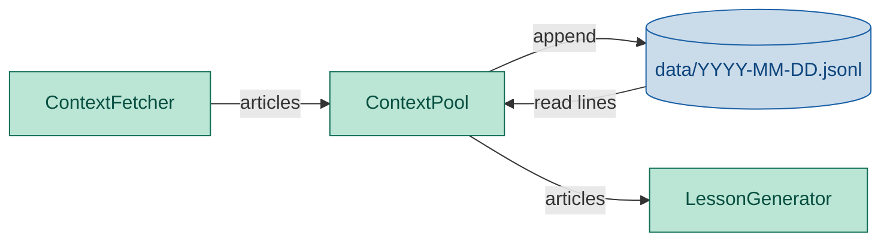

# ContextPool Module — Engineering Design & Implementation Task

## 1. Purpose

Store fetched article content as JSON Lines files partitioned by date, so the lesson generator can retrieve today's context without re-fetching.

## 2. Component Diagram



## 3. Scope (MVP)

- **Storage**: one JSON Lines file per day (`data/<YYYY-MM-DD>.jsonl`)
- **Write**: append articles to the day's file (idempotent — caller deduplicates)
- **Read**: return all articles from today's file as a list of dicts
- **Clear**: remove today's file
- **No database** — flat files only

Non-goals: indexing, querying, cross-day merging, compression, encryption.

## 3. Use Cases

| UC | Description |
|---|---|
| UC1 | **Store** — write articles to today's JSON Lines file, creating parent dirs if needed |
| UC2 | **Retrieve** — read all articles from today's file; return empty list if file doesn't exist |
| UC3 | **Clear** — delete today's file if it exists |
| UC4 | **Append** — subsequent stores append to the same file, not overwrite |

## 4. Python Libraries

| Library | Why |
|---|---|
| Standard `json` | Serialize/deserialize article dicts as JSON Lines |
| Standard `pathlib` | Filesystem path resolution |
| Standard `datetime.date` | Compute today's date for file naming |

No new third-party dependencies.

## 5. Interface

### Location: `daglas/context_pool.py`

```python
import daglas.config


class ContextPool:
    def __init__(self, data_dir: str | None = None):
        """If data_dir given, use it; else read from daglas.config.config.data_dir;
        if config is None, fall back to 'data'."""
        ...

    def store_articles(self, articles: list[dict]) -> None:
        """Append articles to today's jsonl file, creating dirs as needed."""

    def retrieve_articles(self) -> list[dict]:
        """Read all articles from today's jsonl file; return [] if absent."""

    def clear(self) -> None:
        """Delete today's jsonl file if it exists."""
```

### File naming

```
data/2026-06-11.jsonl
```

One JSON object per line, no trailing comma, no wrapping array:
```json
{"url": "https://...", "title": "...", "body": "..."}
```

## 6. Implementation Plan

### Step 1 — Scaffold

Create `daglas/context_pool.py` with `ContextPool` class.

### Step 2 — `__init__`

Accept optional `data_dir` str. If absent, read from `daglas.config.config.data_dir` (module reference, not import-time snapshot). If config is also None, hardcode `"data"`.

### Step 3 — `_today_path`

Return `Path(self._data_dir) / f"{date.today().isoformat()}.jsonl"`.

### Step 4 — `store_articles`

Open today's path in append mode (`"a"`). For each article dict, write `json.dumps(article, ensure_ascii=False) + "\n"`. Create parent dirs with `path.parent.mkdir(parents=True, exist_ok=True)`.

### Step 5 — `retrieve_articles`

If today's file doesn't exist, return `[]`. Otherwise read line by line, parse JSON, collect into list.

### Step 6 — `clear`

Unlink today's file if it exists.

## 7. Unit Test Strategy (`tests/test_context_pool.py`)

Use `pytest` with `tmp_path` for isolated filesystem.

| Category | Test | What it covers |
|---|---|---|
| Happy path | `test_store_and_retrieve` | Two articles stored → both returned |
| Edge case | `test_retrieve_empty` | No file → empty list |
| Happy path | `test_clear` | Store then clear → empty |
| Happy path | `test_append_to_existing` | Two sequential stores → both articles present |

## 8. Acceptance Criteria

- `pytest tests/test_context_pool.py` passes all tests.
- `ruff check daglas/` and `ruff format --check daglas/` pass.
