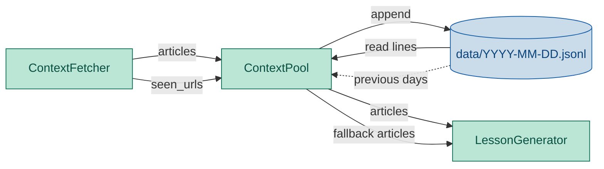
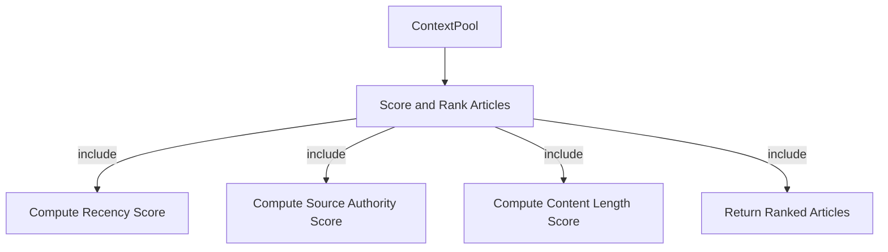

# ContextPool Module — Engineering Design & Implementation Task

## 1. Purpose

Store fetched article content as JSON Lines files partitioned by date, so the lesson generator can retrieve today's context without re-fetching.

## 2. Component Diagram



## 3. Scope (MVP)

- **Storage**: one JSON Lines file per day (`data/<YYYY-MM-DD>.jsonl`)
- **Write**: append articles to the day's file (idempotent — caller deduplicates)
- **Read**: return all articles from today's file as a list of dicts
- **Read from previous days**: fallback when today's file is empty — scan back up to N days and return the newest non-empty file
- **Seen URL tracking**: query URLs stored in the last N days for cross-session dedup
- **Clear**: remove today's file
- **No database** — flat files only

Non-goals: full-text indexing, complex querying (by topic/author), cross-day merging, compression, encryption, real-time notifications.

## 3. Use Cases

| UC | Description |
|---|---|
| UC1 | **Store** — write articles to today's JSON Lines file, creating parent dirs if needed |
| UC2 | **Retrieve (today)** — read all articles from today's file; return empty list if file doesn't exist |
| UC3 | **Retrieve (fallback)** — when today is empty, scan back up to N days, return the newest non-empty file's articles |
| UC4 | **Seen URLs** — return set of all URLs stored in the last N days for dedup |
| UC5 | **Clear** — delete today's file if it exists |
| UC6 | **Append** — subsequent stores append to the same file, not overwrite |
| UC7 | **Score and rank** — articles are scored by recency, source authority, and content length, then returned in descending score order |

## 4. Python Libraries

| Library | Why |
|---|---|
| Standard `json` | Serialize/deserialize article dicts as JSON Lines |
| Standard `pathlib` | Filesystem path resolution |
| Standard `datetime.date` | Compute today's date for file naming |

No new third-party dependencies.

## 5. Interface

### Location: `daglas/context_pool.py`

```python
import daglas.config


class ContextPool:
    def __init__(self, data_dir: str | None = None):
        """If data_dir given, use it; else read from daglas.config.config.data_dir;
        if config is None, fall back to 'data'."""
        ...

    def store_article(self, article: dict) -> None:
        """Append one article to today's jsonl file, creating dirs as needed.
        Called by ContextFetcher site threads — each article is stored
        immediately upon successful extraction.
        """

    def retrieve_articles(self, days: int = 0) -> list[dict]:
        """Read articles from a JSON Lines file.
        If days=0 (default), read today's file only.
        If days > 0 and today's file is empty/missing, scan back up
        to `days` days and return the newest non-empty file's contents.
        Returns [] if no file found.
        """

    def seen_urls(self, lookback_days: int = 7) -> set[str]:
        """Return the set of all article URLs stored in the last N days.
        Used by ContextFetcher for cross-session dedup."""

    def clear(self) -> None:
        """Delete today's jsonl file if it exists."""
```

### File naming

```
data/2026-06-11.jsonl
```

One JSON object per line, no trailing comma, no wrapping array:
```json
{"url": "https://...", "title": "...", "body": "..."}
```

### 5a. Use Case Details

#### UC7 — Score and rank



> **Notes**
> - `include`: Scoring produces an aggregate score from three sub-scores (recency, source authority, content length), and articles are returned in descending score order.

**Description:** articles in the pool are scored by recency (hours since publish_date), source authority (pre-configured per-source weight), and content length (longer = higher). `retrieve_articles()` returns articles sorted by score descending.

**Reasoning:** The generator selects the best articles within its context budget. Ranking ensures the most relevant, recent, and substantial articles are picked first. Pool-level scoring is uniform regardless of which source contributed the article — fetcher, fallback from prior days, or future imports.

**Why this moved from ContextFetcher:**
- Scoring is a post-fetch concern — it applies to all articles in the pool, including fallback articles from previous days.
- The fetcher's job ends at extraction and storage. The pool owns article quality for consumption.
- Pool-level scoring is testable independently and keeps the fetcher focused on I/O only.

## 6. Implementation Plan

### Step 1 — Scaffold

Create `daglas/context_pool.py` with `ContextPool` class.

### Step 2 — `__init__`

Accept optional `data_dir` str. If absent, read from `daglas.config.config.data_dir` (module reference, not import-time snapshot). If config is also None, hardcode `"data"`.

### Step 3 — `_today_path`

Return `Path(self._data_dir) / f"{date.today().isoformat()}.jsonl"`.

### Step 4 — `store_article`

Open today's path in append mode (`"a"`). Write `json.dumps(article, ensure_ascii=False) + "\n"`. Create parent dirs with `path.parent.mkdir(parents=True, exist_ok=True)`.

The caller (a site thread) passes one article dict at a time. Each call persists immediately — no batching, no buffering.

### Step 5 — `retrieve_articles`

If today's file doesn't exist, return `[]`. Otherwise read line by line, parse JSON, collect into list.

### Step 5b — `retrieve_articles` with fallback

When `days > 0`:
1. If today's file exists and is non-empty, return its contents.
2. Otherwise scan back up to `days` days: check `YYYY-MM-DD.jsonl` for yesterday, day before, etc.
3. Return the newest non-empty file's articles, or `[]` if none found.

Implementation: compute candidate dates by subtracting `timedelta(days=n)` for n in range(1, days+1), check `_path_for(date).is_file()`, read first found.

### Step 6 — `seen_urls`

1. Compute all dates in the lookback window (today back to `today - lookback_days + 1`).
2. For each date, if the corresponding JSONL file exists, read it line by line.
3. Extract the `"url"` key from each JSON object.
4. Return as a `set[str]`.

Optimisation: cache the result per instance so repeated calls don't re-read files. Invalidate cache after `store_article()`.

### Step 7 — `clear`

Unlink today's file if it exists.

## 7. Unit Test Strategy (`tests/test_context_pool.py`)

Use `pytest` with `tmp_path` for isolated filesystem.

| Category | Test | What it covers |
|---|---|---|
| Happy path | `test_store_and_retrieve` | Two articles stored → both returned |
| Edge case | `test_retrieve_empty` | No file → empty list |
| Happy path | `test_clear` | Store then clear → empty |
| Happy path | `test_append_to_existing` | Two sequential stores → both articles present |
| Happy path | `test_retrieve_with_fallback` | Today empty, yesterday has articles → returns yesterday's |
| Edge case | `test_retrieve_fallback_no_files` | Fallback with no prior files → empty list |
| Edge case | `test_retrieve_fallback_limit_days` | Only scans up to N days back, stops at first found |
| Happy path | `test_seen_urls` | Articles from multiple days → correct URL set |
| Edge case | `test_seen_urls_empty` | No files in lookback window → empty set |
| Edge case | `test_seen_urls_skip_missing_dates` | Gaps in dates are skipped, remaining URLs still returned |

## 8. Acceptance Criteria

- `pytest tests/test_context_pool.py` passes all tests.
- `ruff check daglas/` and `ruff format --check daglas/` pass.

## Discussion

### 2026-06-18 — Cross-day fallback, seen_urls tracking

**What changed:**
- `retrieve_articles(days=N)` now supports fallback to previous days when today's file is empty.
- Added `seen_urls(lookback_days=7)` method for cross-session dedup by ContextFetcher.
- Updated component diagram to show `seen_urls` query and fallback data flow.
- Added 6 new test cases for fallback and seen_urls behaviour.
- Implementation plan extended with steps for fallback scanning and URL cache.

**Why:**
- With 10+ sources, a single source failure can leave the pool empty. Cross-day fallback ensures the generator always has content to work with.
- Without cross-session dedup, the same article URL could appear in the pool on consecutive days, causing the generator to produce near-identical lessons.

**Impact on implementation plan:**
- `ContextPool` status: `done` → `designing` (new methods to implement).
- `daglas/context_pool.py` needs: `retrieve_articles(days=N)`, `seen_urls()`.

**TODO actions:**
- [ ] Implement `retrieve_articles(days=N)` with fallback scanning.
- [ ] Implement `seen_urls(lookback_days=7)` with cache.
- [ ] Add tests for fallback and seen_urls.
- [ ] Update `implementation_plan.md`.
