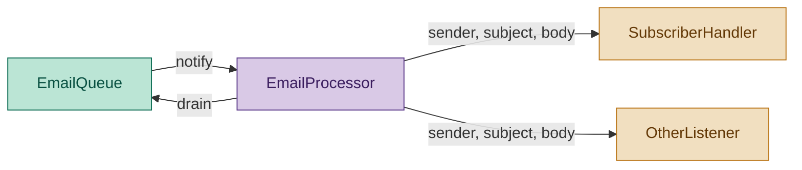
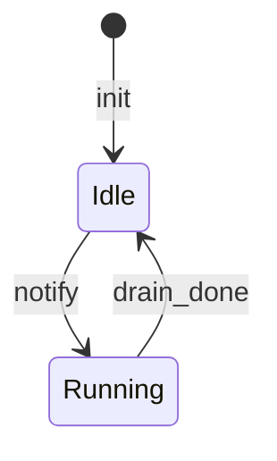

# EmailProcessor Module — Engineering Design & Implementation Task

## 1. Purpose

Receive notification from `EmailQueue` that new emails have arrived, drain the queue, and notify every registered listener with `(sender, subject, body)`. The processor is a blind notification hub — it does **no classification, no pattern matching, and no action dispatch**. Listeners own all interpretation.

This keeps the processor extension-ready: any module can subscribe to incoming emails without modifying the processor.

## 2. Component Diagram



## 3. Internal Process Model

### 3.1 Running-state guard

`EmailProcessor` maintains a boolean `_running` flag. When a queue notification arrives via the push callback, the callback checks this flag before doing anything else:

```
notify arrives
  ├── running == true  → return (no-op)
  └── running == false → set running = true
                         call process()
                         set running = false
                         return
```

This prevents concurrent drain loops while still accepting notifications.



### 3.2 Drain loop

When `process()` is called, it drains all emails from the queue and notifies every listener sequentially:

```
drain queue
for each email:
  for each listener:
    listener(sender, subject, body)
```

One failing listener does not prevent other listeners from receiving the same email (try/except per listener).

## 4. Scope (MVP)

- **Queue listener**: registers itself as a listener on `EmailQueue.on_push("incoming", ...)`
- **Listener registry**: `add_listener(callback)` appends a callable to an internal list
- **Blind notification**: each listener receives `(sender, subject, body)` — no classification, no filtering
- **Running-state guard**: concurrent notify calls are collapsed (notify while running = no-op)
- **Error isolation**: one broken listener does not prevent other listeners from receiving the same email
- **Return value**: `process()` returns an `int` count of emails processed, not a result bag

Non-goals: classification, pattern matching, actor registration, subscriber management, reply sending, content inspection of any kind.

## 5. Use Cases

| UC | Description |
|---|---|
| UC1 | **Process on notify** — queue fires callback → processor drains and notifies all listeners |
| UC2 | **Multiple listeners** — two or more listeners registered; both receive every email |
| UC3 | **Listener error** — listener raises exception → logged, other listeners and other emails unaffected |
| UC4 | **Empty drain** — queue has no emails → process returns 0, no listeners called |
| UC5 | **No-op on concurrent notify** — second notify during processing is dropped (running guard) |
| UC6 | **Listener registration** — `add_listener(fn)` appends to listener list |

## 6. Python Libraries

| Library | Why |
|---|---|
| Standard `logging` | Log listener errors |

No new third-party dependencies.

## 7. Interface

### Location: `daglas/email_processor.py`

```python
from collections.abc import Callable


Listener = Callable[[str, str, str], None]  # (sender, subject, body) -> None


class EmailProcessor:
    def __init__(self, queue):
        """queue is an EmailQueue instance.
        Automatically registers self.process as a listener on queue.on_push("incoming").
        """

    def add_listener(self, callback: Listener) -> None:
        """Register a listener that receives (sender, subject, body)
        for every email drained from the queue.
        """

    def process(self, namespace: str = "incoming") -> int:
        """Drain all emails from the namespace and notify every listener.
        Returns the number of emails processed.
        """
```

### Listener signature

```python
def my_listener(sender: str, subject: str, body: str) -> None:
    """Handle an email. Raise to log the error — other listeners
    and other emails are unaffected.
    """
```

Listeners receive three strings and return nothing. Raising an exception is caught and logged by the processor; other listeners and other emails are not affected.

## 8. Implementation Plan

### Step 1 — Scaffold

Create `daglas/email_processor.py` with `Listener` type alias and `EmailProcessor` class.

### Step 2 — `__init__`

1. Store reference to `EmailQueue`.
2. Initialize `self._listeners: list[Listener] = []`.
3. Set `self._running = False`.
4. Call `queue.on_push("incoming", self._on_notify)` to start listening.

### Step 3 — `add_listener(callback)`

Append callback to `self._listeners`. Return `self` for chaining.

### Step 4 — `_on_notify(namespace)`

Running-state guard:

```python
def _on_notify(self, namespace: str) -> None:
    if self._running:
        return
    self._running = True
    try:
        self.process(namespace)
    finally:
        self._running = False
```

### Step 5 — `process(namespace="incoming") -> int`

Blind drain + notify:

```python
def process(self, namespace="incoming") -> int:
    count = 0
    emails = self._queue.drain(namespace)
    for email in emails:
        for listener in self._listeners:
            try:
                listener(email.sender, email.subject, email.body)
            except Exception:
                logger.exception("Listener failed for %s", email.sender)
        count += 1
    return count
```

No classification. No dispatch. No default actors.

## 9. Unit Test Strategy (`tests/test_email_processor.py`)

Use `pytest`. Mock `EmailQueue` to control what emails are returned from `drain`.

| Category | Test | What it covers |
|---|---|---|
| Happy path | `test_listener_called` | Single email → listener receives (sender, subject, body) |
| Happy path | `test_multiple_listeners` | Two listeners, one email → both called once |
| Happy path | `test_multiple_emails` | Three emails → listener called three times |
| Edge case | `test_empty_drain` | Queue empty → no listeners called, returns 0 |
| Error path | `test_listener_exception_isolated` | Listener raises → other listeners still receive the email |
| Critical logic | `test_running_guard` | Notify while processing → no-op (no double drain) |
| Integration | `test_listener_registered_on_init` | `queue.on_push` called with "incoming" and `self._on_notify` |
| Critical logic | `test_process_returns_count` | Two emails processed → returns 2 |

## 10. Acceptance Criteria

- `pytest tests/test_email_processor.py` passes all tests.
- `ruff check daglas/` and `ruff format --check daglas/` pass.
- `EmailProcessor(queue)` registers itself as a listener on `queue.on_push("incoming")`.
- `processor.add_listener(fn)` makes `fn` receive `(sender, subject, body)` for every email.
- The processor never imports or references `SubscriberStore`.
- `process()` returns an `int` count (not a result object).
- Concurrent `on_push` notifications during processing are silently dropped.

## Discussion

### 2026-06-14 — Redesigned as blind notification hub

**What changed:**
- Complete rewrite from actor/classification model to listener model.
- Removed `Actor` type alias and `ClassificationResult` dataclass.
- Removed `register(action, actor, patterns?)` — replaced with `add_listener(callback)`.
- Removed `_classify()` and `_dispatch()` methods.
- Removed all default actors (`_subscribe_default`, `_unsubscribe_default`, `_unknown_default`).
- Removed `SubscriberStore` import entirely.
- `process()` now returns `int` (count of emails) instead of `ClassificationResult`.
- Listeners are simple `(sender, subject, body) -> None` callables; no action names, no patterns.
- Running-state guard preserved, worker thread scheduling removed (process runs synchronously in notify callback).
- Component diagram updated to show listeners instead of actors/store.
- All classification/subscription logic is moved to the wiring layer (`run.py`).

**Impact on implementation plan:**
- Phase 4c EmailProcessor subtask becomes a simplification task.
- The subscriber handler that was baked into the processor now lives in `run.py`.
- New task doc needed: `tasks/run.md` for the wiring layer.

**TODO actions:**
- [x] Rewrite `tasks/email_processor.md` with listener model.
- [x] Rewrite `daglas/email_processor.py` (remove classification, actors, SubscriberStore).
- [x] Rewrite `tests/test_email_processor.py` (remove classification tests, add listener tests).
- [x] Create `tasks/run.md` — pipeline wiring doc.
- [x] Update `daglas/run.py` — wire subscriber handler at initialization.
