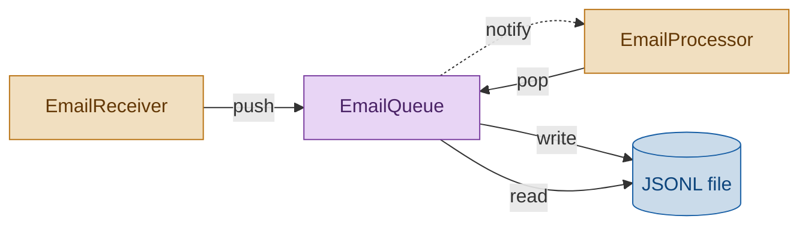
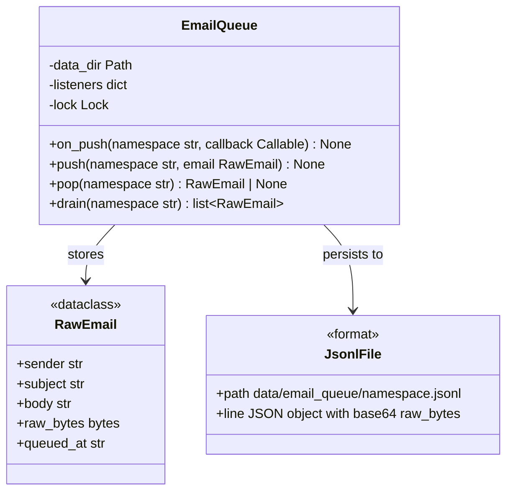

# EmailQueue Module — Engineering Design & Implementation Task

## 1. Purpose

Provide a persistent, namespaced, FIFO queue for raw email data. Acts as the sole shared interface between `EmailReceiver` (producer) and `EmailProcessor` (consumer). Calls `EmailProcessor.on_new_mail()` when new data arrives, so the consumer can react.

## 2. Component Diagram



## 3. Scope (MVP)

- **Namespaced queues**: each queue is identified by a string namespace (e.g. `"incoming"`)
- **Persistent storage**: JSONL file per namespace (`data/email_queue/{namespace}.jsonl`)
- **Push**: append one email record to the namespace's file
- **Pop**: read and remove the oldest record from a namespace (FIFO — returns first line, rewrites remaining)
- **Notify**: after a push, `EmailProcessor.on_new_mail(namespace)` is called
- **Thread-safe**: basic file-level locking so concurrent pushes/pops don't corrupt

Non-goals: ordering across namespaces, TTL/expiry, fan-out to multiple consumers, ACK/re-delivery protocol, in-memory-only mode, database backend.

## 3. Use Cases

| UC | Description |
|---|---|
| UC1 | **Push** — append one email to a namespace; triggers notify |
| UC2 | **Pop** — read and remove the oldest record from a namespace |
| UC3 | **Notify** — push calls `EmailProcessor.on_new_mail(namespace)` |
| UC4 | **Persistence across restarts** — data survives process restart via JSONL |
| UC5 | **Empty queue** — pop on empty namespace returns None |

## 4. Python Libraries

| Library | Why |
|---|---|
| Standard `json` | Serialize/deserialize email records |
| Standard `pathlib` | File path resolution |
| Standard `datetime` | Timestamp each enqueued email (`queued_at`) |
| Standard `json` | JSON Lines format |

No new third-party dependencies.

## 5. Interface

### Location: `daglas/email_queue.py`

```python
from dataclasses import dataclass
from pathlib import Path

from daglas.email_processor import EmailProcessor


@dataclass
class RawEmail:
    sender: str
    subject: str
    body: str
    raw_bytes: bytes
    queued_at: str = ""  # ISO-8601, auto-filled on push if empty


class EmailQueue:
    def __init__(self, data_dir: str | None = None):
        """If data_dir is given, use it; else read from daglas.config.config."""

    def push(self, namespace: str, email: RawEmail) -> None:
        """Append email to <data_dir>/email_queue/<namespace>.jsonl.
        Auto-fills email.queued_at if empty.
        Calls EmailProcessor.on_new_mail(namespace) after write.
        """

    def pop(self, namespace: str) -> RawEmail | None:
        """Read and remove the oldest record from the namespace.
        Returns None if queue is empty.
        """

```

### Data structure



### Storage format

```
data/email_queue/
  incoming.jsonl   ← one JSON object per line
  archive.jsonl
```

Each line is a JSON object with the `RawEmail` fields (including `queued_at`):

```json
{"sender": "user@example.com", "subject": "hej", "body": "...", "raw_bytes": "<base64>", "queued_at": "2026-06-13T07:00:00+00:00"}
```

`raw_bytes` is base64-encoded when serialized and decoded back to bytes on read.

### Pop semantics

Pop is implemented as read-all + rewrite (minus one). For small queues this is sufficient. If queue sizes grow beyond ~10k records, consider switching to a line-offset pointer file, but not in MVP.

## 6. Implementation Plan

### Step 1 — Scaffold

Create `daglas/email_queue.py` with `RawEmail` dataclass and `EmailQueue` class.

### Step 2 — `__init__`

If `data_dir` is given, use it. Otherwise read from `daglas.config.config.data_dir`. Create the parent directory if it doesn't exist.

### Step 3 — `_namespace_path(namespace) -> Path`

Return `data_dir / "email_queue" / f"{namespace}.jsonl"`.

### Step 4 — `_serialize(email: RawEmail) -> str`

Serialize `RawEmail` to a JSON line. Encode `raw_bytes` as base64 string.

### Step 5 — `_deserialize(line: str) -> RawEmail`

Parse a JSON line back to `RawEmail`. Decode `raw_bytes` from base64.

### Step 6 — `push(namespace, email)`

1. Get the namespace path (create parent dirs).
2. Append serialized email as a new line.
3. Call `EmailProcessor.on_new_mail(namespace)`.

### Step 7 — `pop(namespace)`

1. Read all lines from the namespace file.
2. If empty, return None.
3. Deserialize and return the first line.
4. Rewrite the file with remaining lines.

## 7. Unit Test Strategy (`tests/test_email_queue.py`)

Use `pytest` with `tmp_path` for isolated filesystem.

| Category | Test | What it covers |
|---|---|---|
| Happy path | `test_push_and_pop` | Push one → pop returns same email |
| Happy path | `test_empty_pop` | Pop on empty → None |
| Edge case | `test_fifo_order` | Push A, B, C → pop returns A, then B, then C |
| Critical logic | `test_notify_called_on_push` | Push calls `EmailProcessor.on_new_mail` with namespace |
| Error path | `test_notify_exception_does_not_block` | `EmailProcessor.on_new_mail` raises → push still succeeds |
| Data fidelity | `test_raw_bytes_roundtrip` | RawEmail with binary raw_bytes survives push → pop |
| Edge case | `test_namespace_isolation` | Push to "a" → pop from "b" returns None |

## 8. Acceptance Criteria

- `pytest tests/test_email_queue.py` passes all tests.
- `ruff check daglas/` and `ruff format --check daglas/` pass.
- `EmailQueue.push("incoming", email)` persists to `<data_dir>/email_queue/incoming.jsonl`.
- `push` calls `EmailProcessor.on_new_mail(namespace)` after writing.
- `pop` is FIFO and removes the returned record.

## Discussion

### 2026-06-13 — Initial design

**What changed:**
- First version of this task doc created.
- Used listener pattern (`on_push` callback registration) instead of a direct call to
  `EmailProcessor.on_new_mail` — avoids circular import and keeps modules decoupled.
- Storage: JSONL per namespace per date under `data/email_queue/`.
- Pop is read-all + rewrite (sufficient for small queues; not intended for high throughput).
- `RawEmail.raw_bytes` stored as base64 in JSON.
- Added `drain()` method for bulk pop (used by EmailProcessor).

**Impact on implementation plan:**
- Added to Phase 4c as a new module (to build).
- EmailQueue uses listener pattern (`on_push`) instead of direct EmailProcessor import.

**TODO actions:**
- [x] Implement `daglas/email_queue.py` with `RawEmail` dataclass and `EmailQueue` class
- [x] Write `tests/test_email_queue.py` (7 tests: push/pop, empty, FIFO, notify, isolation, bytes roundtrip, error isolation)

### 2026-06-14 — Flat file storage, queued_at field

**What changed:**
- Storage switched from date-partitioned directories (`data/email_queue/<namespace>/<date>.jsonl`)
  to flat files per namespace (`data/email_queue/<namespace>.jsonl`).
- Added `queued_at: str` field to `RawEmail` — ISO-8601 timestamp, auto-filled by `push()`
  if left empty. This preserves the timestamp without splitting storage into daily files.
- Updated `_serialize` / `_deserialize` to include `queued_at`.
- Removed `date` import (no longer needed for path generation).

**Impact on implementation plan:**
- No phase-level change — the module is already built.
- Acceptance criterion path updated.

**TODO actions:**
- [ ] Update `tasks/email_receiver.md` and `tasks/email_processor.md` if they reference
      the old date-partitioned path (they don't — they only use the `EmailQueue` API).
