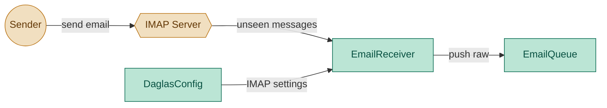
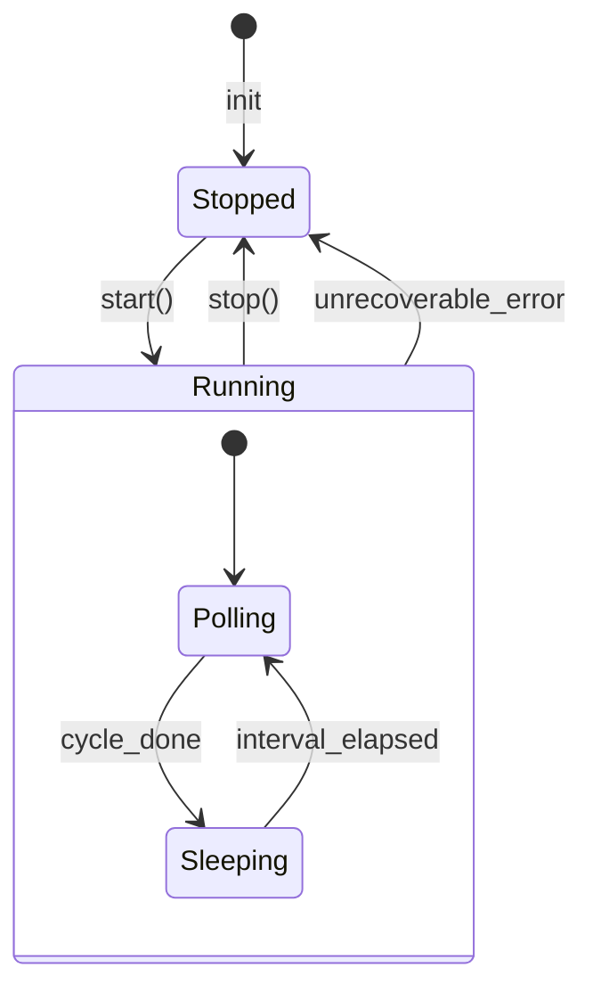

# EmailReceiver Module — Engineering Design & Implementation Task

## 1. Purpose

Poll an IMAP inbox on a recurring schedule, fetch unseen messages, and push raw email data into an `EmailQueue` — without inspecting or classifying the content. Classification and routing belong to `EmailProcessor`.

The receiver is a pure sensor: fetch and store, nothing more.

## 2. Component Diagram



## 3. Lifecycle

The `EmailReceiver` has a well-defined lifecycle with two stable states: `Stopped` (idle) and `Running` (actively polling IMAP). Control is via `start()` and `stop()` methods.



- **Stopped** — initial state after construction. No IMAP connection, no thread.
- **Running** — background thread is alive and running the poll cycle.
  - `Polling` — one iteration of the IMAP poll cycle: connect, search UNSEEN, parse and push raw emails to `EmailQueue`, disconnect.
  - `Sleeping` — waiting for the remaining poll interval before the next cycle. Sleeps in short increments so `stop()` is responsive.
- **`is_running`** — a read-only property that checks whether the background thread is alive, returning `True` when in the `Running` state.

The `is_running` property is the external contract for checking the receiver's state. The polling sub-states (`Polling`, `Sleeping`) are internal; callers only see `Stopped` vs `Running` via `is_running`.

## 4. Scope (MVP)

- **IMAP polling**: connect to IMAP inbox over SSL, search for UNSEEN messages
- **Push to queue**: each unseen message is parsed minimally (sender, subject, body, raw bytes) and pushed to `EmailQueue` under the `"incoming"` namespace — no content inspection
- **Mark as seen**: processed messages are flagged `\Seen`
- **Poll loop**: configurable interval (default 300s); next interval starts counting *after* the previous poll finishes (no overlapping polls)
- **Start/stop control**: `start()` spawns a daemon thread; `stop()` signals the loop and joins the thread
- **State query**: `is_running` property reflects whether the receiver is actively polling
- **Error isolation**: one broken message does not block others; IMAP connection failure is logged and retried on next interval

Non-goals: content classification, pattern matching, subscriber management, reply sending, multi-mailbox, IMAP IDLE/PUSH, double opt-in, spam filtering, DKIM/SPF verification.

## 5. Use Cases

| UC | Description |
|---|---|
| UC1 | **Check once** — connect, push unseen to EmailQueue, return count |
| UC2 | **Run loop** — blocking loop with configurable interval between polls |
| UC3 | **Start** — `start()` spawns background thread; `is_running` returns True |
| UC4 | **Stop** — `stop()` signals thread to exit and waits for it to finish |
| UC5 | **IMAP unreachable** — error logged, retry on next interval (no crash) |
| UC6 | **Interval clock** — interval counts from end of previous poll, not start |

## 4. Python Libraries

| Library | Why |
|---|---|
| Standard `imaplib` | IMAP client for polling subscription requests |
| Standard `email` | Parse incoming email headers and body minimally |
| Standard `time` | Sleep between poll intervals |

No new third-party dependencies.

## 6. Interface

### Location: `daglas/email_receiver.py`

```python
from dataclasses import dataclass, field

import daglas.config


@dataclass
class RawEmail:
    sender: str
    subject: str
    body: str
    raw_bytes: bytes


class EmailReceiver:
    def __init__(
        self,
        queue,
        *,
        imap_host: str = "",
        imap_port: int = 993,
        imap_user: str = "",
        imap_password: str = "",
        poll_interval: int = 300,
    ):
        """queue is an EmailQueue instance.
        IMAP params default to daglas.config.config if empty.
        Initialises a threading.Event for stop signalling.
        """

    @property
    def is_running(self) -> bool:
        """True when the background thread is alive (Running state)."""

    def start(self) -> None:
        """Spawn a daemon thread running the poll loop.
        No-op if already running. Sets is_running to True.
        """

    def stop(self) -> None:
        """Signal the loop to stop and wait for thread exit.
        Blocks until the thread finishes (timeout 5s).
        Sets is_running to False.
        """

    def check_once(self) -> int:
        """Single poll cycle: connect IMAP, parse unseen, push to queue.
        Returns the number of emails pushed.
        """

    def run_loop(self, max_iterations: int | None = None) -> None:
        """Blocking poll loop for direct use (e.g. tests or sync contexts).

        Checks _stop_event between iterations so stop() is responsive.
        Interval is measured from the moment check_once finishes,
        not from when it started.
        """
```

### Raw email extraction

For each unseen message, extract enough to reconstruct context later:

| Field | Source |
|---|---|
| `sender` | `email.utils.parseaddr(msg["From"])[1]` |
| `subject` | `msg["Subject"]` or `""` |
| `body` | Walk parts, collect `get_payload(decode=True)` for `text/plain`, decode to str |
| `raw_bytes` | The full RFC822 bytes (for reprocessing or forwarding) |

The `RawEmail` is pushed to `EmailQueue.push("incoming", raw_email)`.

## 7. Implementation Plan

### Step 1 — Scaffold

Create `daglas/email_receiver.py` with `RawEmail` dataclass and `EmailReceiver` class.

### Step 2 — `__init__`

Accept an `EmailQueue` instance and explicit IMAP params with empty defaults. If a param is empty, read from `daglas.config.config` (imap_host, imap_port, imap_user, imap_password, email_receiver_poll_interval). Store the queue reference.

### Step 3 — `_connect`

1. Open `IMAP4_SSL(host, port)`.
2. `login(user, password)`.
3. `select("INBOX")`.
4. Return connection. On failure, raise with a descriptive message.

### Step 4 — `_parse_and_push(conn, msg_id)`

1. `fetch(msg_id, "(RFC822)")` → raw bytes.
2. Parse with `email.message_from_bytes`.
3. Extract sender via `parseaddr(msg["From"])[1]`.
4. Extract subject (default `""`).
5. Extract body: walk parts, collect `get_payload(decode=True)` for `text/plain` parts, decode to str (fallback `errors="replace"`).
6. Build `RawEmail(sender, subject, body, raw_bytes)`.
7. Call `self._queue.push("incoming", raw_email)`.
8. `conn.store(msg_id, "+FLAGS", "\\Seen")`.

No classification logic here. No pattern matching. No subscriber store calls.

### Step 5 — `check_once`

1. Try to connect. On failure, log and return 0.
2. `search(None, "UNSEEN")` → list of message IDs.
3. For each message ID, call `_parse_and_push` in try/except; catch failures per message.
4. Logout and close IMAP.
5. Return the count of successfully pushed emails.

### Step 6 — `run_loop`

```python
def run_loop(self, max_iterations=None):
    iterations = 0
    while (max_iterations is None or iterations < max_iterations) and not self._stop_event.is_set():
        start = time.monotonic()
        count = self.check_once()
        logger.info("Pushed %d email(s) to queue", count)
        elapsed = time.monotonic() - start
        iterations += 1
        if (max_iterations is None or iterations < max_iterations) and not self._stop_event.is_set():
            sleep_time = max(0, self._poll_interval - elapsed)
            time.sleep(sleep_time)
```

The `_stop_event` check is added so that `stop()` is responsive even during a blocking `run_loop()` call. The loop exits at the next iteration boundary when `stop()` is called.

### Step 7 — `start`, `stop`, `is_running`

Add thread management and a stop event to `__init__`:

```python
import threading

# In __init__:
self._stop_event = threading.Event()
self._thread: threading.Thread | None = None
```

**`is_running` property** — delegates to the thread's alive status:

```python
@property
def is_running(self) -> bool:
    return self._thread is not None and self._thread.is_alive()
```

**`start()` method** — clears the stop event, spawns a daemon thread, returns immediately:

```python
def start(self) -> None:
    if self.is_running:
        logger.warning("EmailReceiver is already running")
        return
    self._stop_event.clear()
    self._thread = threading.Thread(target=self._run, daemon=True)
    self._thread.start()
    logger.info("EmailReceiver started")
```

**`_run()` method** — internal thread target. Uses `Event.wait(timeout=...)` for responsive sleep (returns immediately when event is set):

```python
def _run(self) -> None:
    while not self._stop_event.is_set():
        start = time.monotonic()
        count = self.check_once()
        if count:
            logger.info("Pushed %d email(s) to queue", count)
        elapsed = time.monotonic() - start
        if not self._stop_event.is_set():
            sleep_time = max(0, self._poll_interval - elapsed)
            self._stop_event.wait(timeout=sleep_time)
```

**`stop()` method** — signals the event, joins the thread with a 5-second timeout:

```python
def stop(self) -> None:
    self._stop_event.set()
    if self._thread and self._thread.is_alive():
        self._thread.join(timeout=5)
    logger.info("EmailReceiver stopped")
```

The daemon thread ensures the receiver does not block process exit even if `stop()` is never explicitly called.

## 8. Unit Test Strategy (`tests/test_email_receiver.py`)

Use `pytest`. Mock `imaplib.IMAP4_SSL` for IMAP tests. Mock `EmailQueue` to verify push calls.

| Category | Test | What it covers |
|---|---|---|---|
| Happy path | `test_check_once_pushes_to_queue` | IMAP unseen → `EmailQueue.push` called with `RawEmail` |
| Happy path | `test_check_once_marks_seen` | After push, `conn.store` called with `\Seen` |
| Edge case | `test_check_once_no_unseen` | No unseen messages → push never called, count=0 |
| Error path | `test_check_once_imap_unreachable` | Connection fails → logged, count=0 |
| Error path | `test_check_once_bad_message` | Parse error on one message → others still processed |
| Critical logic | `test_run_loop_interval_timing` | Loop sleeps (interval - elapsed) seconds |
| Edge case | `test_run_loop_poll_exceeds_interval` | Poll longer than interval → no sleep |
| Data fidelity | `test_raw_email_has_all_fields` | `RawEmail` carries sender, subject, body, raw_bytes |
| Happy path | `test_is_running_after_start` | `start()` → `is_running` is True |
| Critical logic | `test_stop_clears_is_running` | `stop()` → `is_running` returns to False |
| Edge case | `test_start_idempotent` | `start()` while running → log warning, no crash |

## 9. Acceptance Criteria

- `pytest tests/test_email_receiver.py` passes all tests.
- `ruff check daglas/` and `ruff format --check daglas/` pass.
- `EmailReceiver()` without arguments reads IMAP settings and poll_interval from config.
- `EmailReceiver` never calls `SubscriberStore` or performs content classification.
- Every unseen message is pushed to `EmailQueue` under `"incoming"` namespace.
- `EmailReceiver.start()` spawns a daemon thread and makes `is_running` return True.
- `EmailReceiver.stop()` signals the loop to exit and makes `is_running` return False.
- Calling `start()` when already running is a no-op (logged warning, no crash).

## Discussion

### 2026-06-13 — Redesigned as pure sensor

**What changed:**
- This doc was rewritten from the original "receives email + classifies inline" design
  to a pure sensor that only pushes raw emails to `EmailQueue`.
- Removed `SubscriptionResult` return type — now returns `int` (count of pushed emails).
- Removed `SubscriberStore` dependency — now depends only on `EmailQueue`.
- Removed all classification logic (subscribe/unsubscribe substring matching).
- Removed `_get_body` helper detail (still needed but not architecturally significant).
- Added `RawEmail` dataclass that mirrors `EmailQueue.RawEmail`.
- Updated UML component diagram to show `EmailQueue` instead of `SubscriberStore`.
- Added notification step: emails are marked `\Seen` after successful push.

**Impact on implementation plan:**
- `implementation_plan.md` Phase 4c now includes an EmailReceiver refactor subtask.
- The existing `daglas/email_receiver.py` no longer matches this doc — must be refactored.
- Existing `tests/test_email_receiver.py` tests verify subscriber side effects — must be
  rewritten to mock `EmailQueue.push` instead.

**TODO actions:**
- [x] **Refactor `daglas/email_receiver.py`**:
  - Replaced `store` param with `queue` param (EmailQueue instance)
  - Stripped classification logic (`subscribe`/`unsubscribe` matching)
  - Dropped `SubscriptionResult` dataclass; returns `int` from `check_once`
  - Updated `_parse_and_push` to push `RawEmail` to queue, mark `\Seen`
- [x] **Rewrite `tests/test_email_receiver.py`**:
  - Mock `EmailQueue.push` and verify push calls with correct `RawEmail` data
  - Removed tests that verify subscriber list side effects
  - Kept tests for IMAP unreachable, bad message isolation, loop timing

### 2026-06-14 — Start/stop lifecycle with state machine

**What changed:**
- Added lifecycle section with Mermaid state diagram showing `Stopped` and `Running` states.
- `Running` is a composite state with `Polling` and `Sleeping` sub-states.
- Added `is_running` property — read-only, checks thread liveness.
- Added `start()` method — spawns daemon thread running the poll loop.
- Added `stop()` method — signals `_stop_event` and joins the thread.
- Introduced `_run()` internal method as the thread target, using `Event.wait(timeout=...)` for responsive sleep.
- Updated `run_loop()` to check `_stop_event` between iterations for backward-compatible responsiveness.
- Renumbered sections (Scope → 4, Use Cases → 5, Interface → 6, Implementation → 7, Tests → 8, Acceptance → 9).
- Added three new use cases (UC3 start, UC4 stop, UC5 IMAP unchanged, UC6 interval clock).
- Added three new test cases (is_running after start, stop clears is_running, start idempotent).

**Impact on implementation plan:**
- Phase 4c EmailReceiver subtask updated to include start/stop thread management.
- Existing `run_loop()` remains backward-compatible — `_stop_event` defaults to unset, tests with `max_iterations` are unaffected.

**TODO actions:**
- [x] Add lifecycle section with state machine diagram to `tasks/email_receiver.md`.
- [x] Add `is_running`, `start()`, `stop()`, `_run()` to `daglas/email_receiver.py`.
- [x] Add tests for `start()` / `stop()` / `is_running` in `tests/test_email_receiver.py`.
