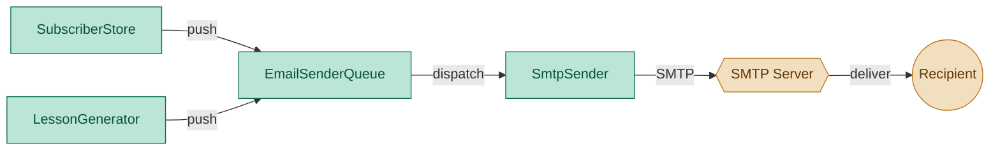

# SmtpSender — Internal SMTP Transport (not imported directly)

## 1. Purpose

Low-level SMTP transport used exclusively by `EmailSenderQueue`. No module
should import `SmtpSender` directly — all outbound email dispatch goes
through `EmailSenderQueue.push()`.

## 2. Component Diagram



## 3. Scope (MVP)

- **Transport**: `smtplib` (stdlib) — TLS on port 587 by default
- **Auth**: LOGIN with `smtp_user` + `smtp_password` (both optional; skip if empty)
- **Content**: multipart email with plain text and HTML alternatives
- **Recipients**: supplied as `list[str]` (typically from `SubscriberStore.list()`)
- **Sender**: configured via `from_address` in config
- **Error handling**: one failing recipient does not block others
- **Dry-run**: optionally skip actual send

Non-goals: SendGrid/Mailgun API, DKIM/SPF signing, queueing, retry with backoff, bounce handling, unsubscribe headers.

## 3. Use Cases

| UC | Description |
|---|---|
| UC1 | **Send to all** — send lesson to every recipient in the list |
| UC2 | **Partial failure** — one recipient bounces; others still receive |
| UC3 | **No auth** — skip LOGIN if user/password are empty |
| UC4 | **Dry-run** — print what would be sent without connecting |
| UC5 | **No recipients** — no-op, return success |

## 4. Python Libraries

| Library | Why |
|---|---|
| Standard `smtplib` | SMTP client (stdlib — no dependency) |
| Standard `email.mime` | Build multipart message (text + HTML) |

No new third-party dependencies.

## 5. Interface

### Location: `daglas/email_sender.py`

```python
from collections.abc import Callable
from dataclasses import dataclass, field

from daglas.lesson.formatter import Email


@dataclass
class SendResult:
    success_count: int = 0
    failure_count: int = 0
    errors: list[str] = field(default_factory=list)


class SmtpSender:
    def __init__(
        self,
        host: str = "",
        port: int = 587,
        user: str = "",
        password: str = "",
        from_address: str = "",
    ):
        """Read defaults from daglas.config.config if args are empty."""
        ...

    def send(
        self,
        email: Email,
        recipients: list[str],
        *,
        dry_run: bool = False,
    ) -> SendResult:
        """Send email to all recipients.

        If dry_run is True, log what would be sent and return SendResult
        without connecting to SMTP.
        """
        ...
```

### Message structure

```
From: <from_address>
To: <recipient>
Subject: <email.subject>
MIME-Version: 1.0
Content-Type: multipart/alternative

--boundary
Content-Type: text/plain; charset=utf-8

<email.text_body>

--boundary
Content-Type: text/html; charset=utf-8

<email.html_body>
```

## 6. Implementation Plan

### Step 1 — Scaffold

Create `daglas/email_sender.py` with `SendResult`, `SmtpSender`.

### Step 2 — `__init__`

Accept explicit params with empty defaults. If a param is empty, read from `daglas.config.config` (host, port, user, password, from_address). If config is None, use hardcoded defaults (host="").

### Step 3 — `_build_message`

Create `MIMEMultipart("alternative")`. Attach `MIMEText(text_body, "plain")` and `MIMEText(html_body, "html")`. Set From, Subject headers.

### Step 4 — `send` logic

1. If no recipients or no from_address, return `SendResult()` (no-op).
2. If dry_run, log details and return `SendResult()`.
3. Connect to `smtp_host:smtp_port` with `smtplib.SMTP`.
4. Start TLS (`starttls()`).
5. If user is non-empty, `login(user, password)`.
6. For each recipient, build message with `To` header set, call `sendmail(from_address, [recipient], msg.as_string())`. Catch exceptions per recipient.

### Step 5 — Error handling

Wrap each `sendmail` in try/except. On failure, append to `errors` and increment `failure_count`. Continue to next recipient.

## 7. Unit Test Strategy (`tests/test_email_sender.py`)

Use `pytest` with mocked `smtplib.SMTP`.

| Category | Test | What it covers |
|---|---|---|
| Happy path | `test_send_to_one` | One recipient → success_count=1 |
| Happy path | `test_send_to_multiple` | Two recipients → success_count=2 |
| Error path | `test_partial_failure` | One recipient fails → failure_count=1, others sent |
| Edge case | `test_no_recipients` | Empty list → no-op |
| Edge case | `test_dry_run` | Dry run → no SMTP connection, success_count=0 |
| Edge case | `test_no_from_address` | Missing from_address → no-op |
| Happy path | `test_message_structure` | Built message has From/Subject/Content-Type headers |

## 8. Acceptance Criteria

- `pytest tests/test_email_sender.py` passes all tests.
- `ruff check daglas/` and `ruff format --check daglas/` pass.
- `SmtpSender()` without arguments reads SMTP settings from `daglas/config.py:35-39`.
