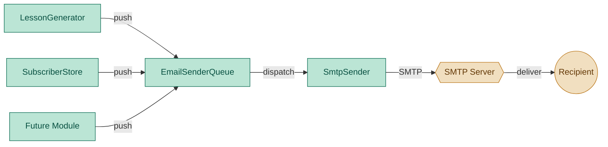

# EmailSenderQueue — Universal Outbound Email Dispatch

## 1. Purpose

Unified outbound email interface for all modules. Any module that needs to
send an email — lesson dispatch, subscriber confirmations, future error
reports — pushes a request to the EmailSenderQueue instead of calling SMTP
directly. The queue dispatches on two schedules: immediate (20s poll) and
scheduled (5min poll).

No module imports `SmtpSender` or touches SMTP directly. `SmtpSender` becomes
an internal implementation detail of `EmailSenderQueue`.

## 2. Component Diagram



## 3. Data Structure

### 3.1 `SendRequest` (in-memory)

```python
@dataclass
class SendRequest:
    to: list[str]          # recipient email addresses
    subject: str           # email subject line
    body: str              # plain text body
    html_body: str         # HTML body (optional, default "")
    send_at: str | None    # "immediate" | ISO datetime | None → error
```

### 3.2 Queue file format (JSONL persistent storage)

Requests are persisted in JSONL files at `<data_dir>/email_sender_queue/`,
partitioned by poll type:

| File | Poll loop | Contents |
|---|---|---|
| `data/email_sender_queue/immediate.jsonl` | 20s | Immediate-send requests |
| `data/email_sender_queue/scheduled.jsonl` | 5min | Scheduled requests, one per line |

Each line is a JSON object with the same fields as `SendRequest`:

```jsonl
{"to": ["alice@example.com"], "subject": "Welcome!", "body": "Hej Alice!", "html_body": "<p>Hej Alice!</p>", "send_at": "immediate"}
{"to": ["bob@example.com"], "subject": "Daily Lesson", "body": "...", "html_body": "...", "send_at": "2026-06-15T07:00"}
```

The `queued_at` field (ISO datetime) is added on write for traceability:

```jsonl
{"to": [...], "subject": "...", "body": "...", "html_body": "...", "send_at": "immediate", "queued_at": "2026-06-14T14:30:00+00:00"}
```

### 3.3 `send_at` semantics

| Value | Behaviour |
|---|---|
| `"immediate"` | Written to `immediate.jsonl`, dispatched on next 20s poll cycle |
| ISO datetime string (e.g. `"2026-06-15T07:00"`) | Written to `scheduled.jsonl`, dispatched at or after the specified time |
| `None` | Logged as error, not written to any file — callers must be explicit |
| Any other string | Logged as error, not written |

## 4. Scope (MVP)

- **Single queue** with two poll loops in background threads:
  - 20s loop: dispatches `send_at="immediate"` requests
  - 5min loop: dispatches `send_at=<ISO datetime>` or `send_at=None` requests
- **`unspecified` / missing `send_at`**: print error, do not queue
- **Persistence**: JSONL file per day, one request per line
- **Transport**: reuses `SmtpSender` internally
- **Lifecycle**: start/stop via `start()` / `stop()`, daemon threads

Non-goals: retry with backoff, bounce handling, delivery receipts.

## 5. Use Cases

| UC | Description |
|---|---|
| UC1 | **Immediate dispatch** — push with `send_at="immediate"`, sent within 20s |
| UC2 | **Scheduled dispatch** — push with `send_at="2026-06-14T07:00"`, sent at or after that time |
| UC3 | **Unspecified** — push with `send_at=None`, error logged, skipped |
| UC4 | **Empty queue** — no-op poll |
| UC5 | **Start/stop** — lifecycle control |

## 6. Interface

### Location: `daglas/email_sender_queue.py`

```python
from dataclasses import dataclass, field
from datetime import datetime


@dataclass
class SendRequest:
    to: list[str]
    subject: str
    body: str
    html_body: str = ""
    send_at: str | None = None
    """'immediate' | ISO datetime string | None"""


class EmailSenderQueue:
    def __init__(self):
        """Creates its own SmtpSender internally from daglas.config.config.
        No module needs to import SmtpSender."""

    def push(self, request: SendRequest) -> None:
        """Queue a send request.

        If send_at is None, log error and skip.
        If send_at is 'immediate', queue for 20s poll.
        If send_at is an ISO datetime, queue for 5min poll.
        """

    def start(self) -> None:
        """Start background poll threads."""

    def stop(self) -> None:
        """Stop background threads gracefully."""
```

## 7. Implementation Plan

### Step 1 — Scaffold

Create `daglas/email_sender_queue.py` with `SendRequest` dataclass and
`EmailSenderQueue` class.

### Step 2 — `__init__`

Read SMTP config from `daglas.config.config`. Create an internal `SmtpSender`
instance. Initialize data structures for two queues (immediate + scheduled).
Set up stop event and thread references. No parameters needed — all config
comes from the global config singleton.

### Step 3 — `push`

Validate `send_at`:
- `None`: log error, return immediately
- `"immediate"`: write to immediate JSONL, notify immediate poll
- ISO datetime: write to scheduled JSONL (keyed by date), notify scheduled poll

### Step 4 — Poll loops

Two background threads, both daemon:

**Immediate loop (20s)**:
1. Wake every 20s
2. Pop all entries from immediate JSONL
3. For each, call `SmtpSender.send()`

**Scheduled loop (5min)**:
1. Wake every 5min
2. Read scheduled JSONL for today (or past)
3. Dispatch any requests whose `send_at` is at or before now
4. Leave future-dated entries in the file

### Step 5 — Start/stop

`start()` creates and starts both threads. `stop()` sets stop event and joins
threads.

## 8. Unit Test Strategy (`tests/test_email_sender_queue.py`)

Use `pytest` with `tmp_path` and mocked `SmtpSender`.

| Test | What it covers |
|---|---|
| `test_push_immediate` | Queue file has entry, ready for poll |
| `test_push_scheduled` | Entry with future datetime is stored |
| `test_push_unspecified_error` | `send_at=None` logs error, no file written |
| `test_immediate_loop_dispatches` | Mock sender called for queued immediate request |
| `test_scheduled_loop_skips_future` | Future-dated entry not dispatched |
| `test_scheduled_loop_dispatches_past` | Past-dated entry dispatched on next poll |
| `test_empty_immediate_queue` | No-op when no immediate entries |
| `test_empty_scheduled_queue` | No-op when no scheduled entries |
| `test_start_stop_lifecycle` | Threads start and stop cleanly |

## 9. Acceptance Criteria

- `SendRequest` with `send_at=None` logs an error and is not queued.
- Immediate requests are dispatched within 20s of the next poll cycle.
- Scheduled requests are dispatched at or after their `send_at` time.
- `SmtpSender` is only used internally by `EmailSenderQueue` — no module
  imports it directly.

## Discussion

### 2026-06-14 — Initial design

**What changed:**
- New module created as universal email dispatch interface.
- `SmtpSender` becomes internal transport, no longer imported by other modules.
- Two poll loops (20s immediate, 5min scheduled) in background daemon threads.
- `send_at=None` is treated as an error, not queued — forces sender to be explicit.

**Impact on implementation plan:**
- New entry in Phase 4c: `tasks/email_sender_queue.md` + `daglas/email_sender_queue.py`.
- `SubscriberStore` constructor changes: `sender: SmtpSender | None` → `sender_queue: EmailSenderQueue | None`.
- `run.py` wiring: instantiate `EmailSenderQueue()` once, share between all modules.

**TODO actions:**
- [ ] Create `daglas/email_sender_queue.py` with `SendRequest` + `EmailSenderQueue`.
- [ ] Create `tests/test_email_sender_queue.py` with 9 tests.
- [ ] Update `SubscriberStore` to accept `EmailSenderQueue` instead of `SmtpSender`.
- [ ] Update `run.py` wiring to instantiate `EmailSenderQueue()` once, pass to submodules.
- [ ] Update `tasks/email_sender.md` to mark `SmtpSender` as internal.
- [ ] Update `tasks/subscriber_store.md` constructor signature.
- [ ] Update `tasks/run.md` architecture diagram and wiring.
- [ ] Update `implementation_plan.md` with new task entry.
