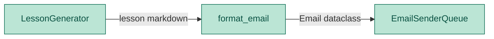

# Lesson Formatter Module — Engineering Design & Implementation Task

## 1. Purpose

Wrap the raw lesson markdown text into an `Email` dataclass with a subject line, plain text body, and optional HTML body.

## 2. Component Diagram



## 3. Scope (MVP)

- **Input**: raw markdown string from the generator
- **Output**: `Email` dataclass with `subject`, `html_body`, `text_body`
- **Subject**: derived from the first line of the lesson text (stripped of leading `#`)
- **HTML**: simple markdown-to-HTML conversion (headers, lists, bold)
- **Empty input**: return Email with fallback subject and empty bodies

Non-goals: full markdown parser, CSS frameworks, responsive layout, image embedding.

## 3. Use Cases

| UC | Description |
|---|---|
| UC1 | **Format lesson** — convert markdown → Email with subject, text, HTML |
| UC2 | **Empty lesson** — return Email with fallback subject, empty bodies |
| UC3 | **HTML output** — markdown lines converted to basic HTML tags |

## 4. Python Libraries

| Library | Why |
|---|---|
| Standard `dataclasses` | `Email` dataclass |

No new third-party dependencies.

## 5. Interface

### Location: `daglas/lesson/formatter.py`

```python
from dataclasses import dataclass


@dataclass
class Email:
    subject: str = ""
    html_body: str = ""
    text_body: str = ""


DEFAULT_SUBJECT = "Dagläsa — Daily Swedish Lesson"


def format_email(lesson_text: str) -> Email:
    """Parse lesson markdown into Email struct.

    Subject is the first line (stripped of leading #).
    text_body is the raw markdown, stripped.
    html_body is a simple HTML conversion.
    """
```

### HTML conversion rules

| Markdown | HTML |
|---|---|
| `# text` | `<h2>text</h2>` |
| `## text` | `<h3>text</h3>` |
| `- text` | `<li>text</li>` |
| `**text**` | `<p><strong>text</strong></p>` |
| blank line | `<br>` |
| anything else | `<p>text</p>` |

Wrapped in a full HTML document with inline styles:
```html
<!DOCTYPE html>
<html>
<head><meta charset="utf-8"></head>
<body style="font-family:sans-serif;max-width:600px;margin:0 auto;padding:20px;">
<div style="background:#f9f9f9;border-radius:8px;padding:24px;">
...converted content...
</div></body></html>
```

## 6. Implementation Plan

### Step 1 — Scaffold

Create `daglas/lesson/formatter.py` with `Email` dataclass and `format_email`.

### Step 2 — Empty handling

If `lesson_text.strip()` is empty, return `Email(subject=DEFAULT_SUBJECT, html_body="", text_body="")`.

### Step 3 — Subject extraction

Split on newlines. Take first non-empty line as subject. Strip leading `#` and whitespace.

### Step 4 — Text body

Raw markdown, stripped.

### Step 5 — HTML body

Iterate lines, apply conversion rules, wrap in HTML document.

## 7. Unit Test Strategy (`tests/lesson/test_formatter.py`)

| Category | Test | What it covers |
|---|---|---|
| Happy path | `test_format_basic_lesson` | Markdown → Email with subject, HTML, text |
| Happy path | `test_subject_from_first_line` | First line becomes subject |
| Happy path | `test_html_structure` | Output has valid HTML wrapper |
| Edge case | `test_empty_lesson` | Empty input → fallback subject, empty bodies |

## 8. Acceptance Criteria

- `pytest tests/lesson/test_formatter.py` passes all tests.
- `ruff check daglas/` and `ruff format --check daglas/` pass.
