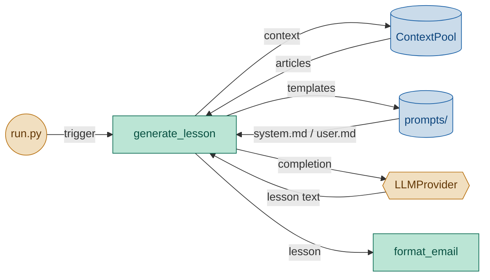

# Lesson Generator Module — Engineering Design & Implementation Task

## 1. Purpose

Read today's context from ContextPool, build prompt from templates, call the LLM provider, and return the raw lesson text.

## 2. Component Diagram



## 3. Scope (MVP)

- **Prompt assembly**: read `system.md` and `user.md` from `prompts/` directory
- **Context injection**: insert article titles and bodies into the user prompt
- **Truncation**: if combined context exceeds `max_context_length`, truncate by characters with `...` suffix
- **Config injection**: pass `lesson_level`, `vocab_count`, `article_word_limit` into the user template via `.format()`
- **Dry-run**: skip LLM call, return None
- **No validation** of LLM output — raw string returned as-is

## 3. Use Cases

| UC | Description |
|---|---|
| UC1 | **Generate lesson** — read context, build prompt, call LLM, return text |
| UC2 | **Dry run** — skip LLM call, return None (for debugging) |
| UC3 | **Context truncation** — context longer than `max_context_length` gets truncated |

## 4. Python Libraries

| Library | Why |
|---|---|
| Standard `pathlib` | Read prompt template files |

No new third-party dependencies.

## 5. Interface

### Location: `daglas/lesson/generator.py`

```python
import daglas.config


def generate_lesson(
    provider,
    context_articles: list[dict],
    *,
    dry_run: bool = False,
) -> str | None:
    """Read prompts from config.prompts_dir, build prompt with context,
    call provider.prompt(), return the lesson text.

    If dry_run is True, return None without calling the LLM.
    """
```

### Private helpers

```python
def _read_prompt(name: str) -> str:
    """Read a prompt template file from config.prompts_dir."""

def _truncate_context(context: str, max_length: int) -> str:
    """Truncate to max_length chars with '...' suffix if over."""
```

### Prompt injection contract

The user prompt template (`prompts/user.md`) receives these format keys:

| Key | Source |
|---|---|
| `{context}` | Combined article titles+bodies, truncated to `max_context_length` chars |
| `{level}` | `config.lesson_level` |
| `{vocab_count}` | `config.vocab_count` |
| `{article_word_limit}` | `config.article_word_limit` |

## 6. Implementation Plan

### Step 1 — Scaffold

Create `daglas/lesson/generator.py` with `generate_lesson`, `_read_prompt`, `_truncate_context`.

### Step 2 — `_read_prompt`

Read `daglas.config.config.prompts_dir / name`. If config is None, use `Path("prompts")`. Return stripped content, or `""` if file missing.

### Step 3 — `_truncate_context`

If `len(context) <= max_length`, return as-is. Otherwise `context[:max_length] + "..."`.

### Step 4 — Context assembly

Iterate `context_articles`, build `"Title: {title}\n{body}"` for each, join with `"\n\n---\n\n"`.

### Step 5 — `generate_lesson`

1. Read system and user templates
2. Assemble and truncate context
3. Read config values with fallbacks (max_len=500, level="beginner", vcount=5, word_limit=100)
4. Format user prompt via `.format()`
5. If dry_run, return None
6. Call `provider.prompt(system=system_prompt, user=user_prompt)`, return result

## 7. Unit Test Strategy (`tests/lesson/test_generator.py`)

Use `pytest` with `tmp_path` for prompt files. Patch `daglas.config.config`.

| Category | Test | What it covers |
|---|---|---|
| Edge case | `test_truncates_when_over_limit` | Long text truncated to limit+3 (for "...") |
| Edge case | `test_does_not_truncate_when_under_limit` | Short text unchanged |
| Edge case | `test_handles_empty_string` | Empty string → empty string |
| Happy path | `test_dry_run_returns_none` | Dry run skips LLM call, returns None |
| Happy path | `test_generate_lesson_calls_provider` | Provider called with formatted prompt |

## 8. Acceptance Criteria

- `pytest tests/lesson/test_generator.py` passes all tests.
- `ruff check daglas/` and `ruff format --check daglas/` pass.
- Generator correctly passes `{article_word_limit}` into the user prompt template.
