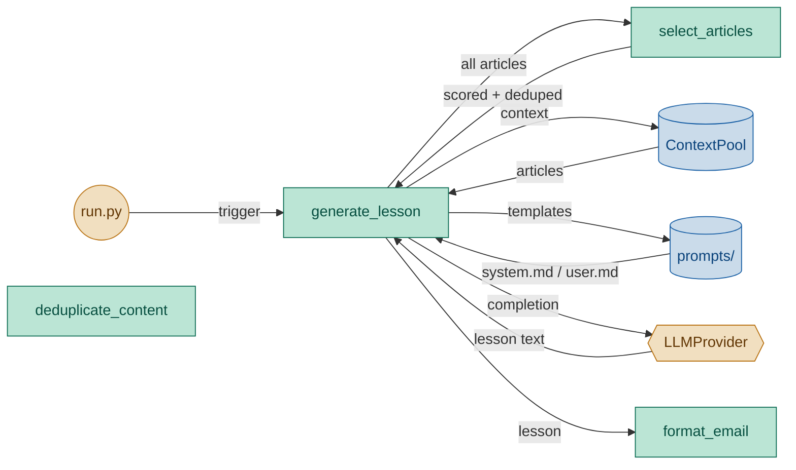

# Lesson Generator Module — Engineering Design & Implementation Task

## 1. Purpose

Read today's context from ContextPool, build prompt from templates, call the LLM provider, and return the raw lesson text.

## 2. Component Diagram



## 3. Scope (MVP)

- **Prompt assembly**: read `system.md` and `user.md` from `prompts/` directory
- **Budget-aware selection**: from all available articles, select the best subset that fits within `max_context_length` characters, using article `score` field (set by ContextFetcher) as the priority signal
- **Content dedup**: skip near-duplicate articles (same story from different sources) before selection by comparing title similarity
- **Context injection**: insert selected article titles and bodies into the user prompt
- **Fallback truncation**: if even a single article exceeds `max_context_length`, truncate as last resort
- **Config injection**: pass `lesson_level`, `vocab_count`, `article_word_limit` into the user template via `.format()`
- **Dry-run**: skip LLM call, return None
- **No validation** of LLM output — raw string returned as-is

## 3. Use Cases

| UC | Description |
|---|---|
| UC1 | **Generate lesson** — read context, build prompt, call LLM, return text |
| UC2 | **Dry run** — skip LLM call, return None (for debugging) |
| UC3 | **Budget-aware selection** — from N articles, pick M that fit within `max_context_length`, prioritising by score |
| UC4 | **Content dedup** — two articles with near-identical titles from different sources → only the higher-scored one is kept |
| UC5 | **Fallback truncation** — single article longer than budget → truncated with `...` |

## 4. Python Libraries

| Library | Why |
|---|---|
| Standard `pathlib` | Read prompt template files |

No new third-party dependencies.

## 5. Interface

### Location: `daglas/lesson/generator.py`

```python
import daglas.config


def generate_lesson(
    provider,
    context_articles: list[dict],
    *,
    dry_run: bool = False,
) -> str | None:
    """Read prompts from config.prompts_dir, build prompt with context,
    call provider.prompt(), return the lesson text.

    If dry_run is True, return None without calling the LLM.
    """
```

### Private helpers

```python
def _read_prompt(name: str) -> str:
    """Read a prompt template file from config.prompts_dir."""

def _truncate_context(context: str, max_length: int) -> str:
    """Truncate to max_length chars with '...' suffix if over. Last resort — called only
    after budget-aware selection failed to fit even a single article."""

def _title_similarity(t1: str, t2: str) -> float:
    """Ratio-based similarity between two title strings (0.0–1.0).
    Uses difflib.SequenceMatcher. Threshold for dedup: >0.75."""

def _deduplicate_articles(articles: list[dict]) -> list[dict]:
    """Remove near-duplicate articles by title similarity.
    Keeps the higher-scored article when two titles match above threshold.
    Articles without titles are kept as-is."""

def _select_articles_for_budget(
    articles: list[dict],
    max_length: int,
    *,
    separator: str = "\n\n---\n\n",
) -> str:
    """Select the best subset of articles that fits within max_length chars.

    1. Sort articles by score descending (score field set by ContextFetcher).
    2. Deduplicate by title similarity.
    3. Greedily add articles while total assembled length <= max_length.
    4. If no single article fits, fall back to _truncate_context on the highest-scored.
    5. Build and return the assembled context string.
    """
```

### Prompt injection contract

The user prompt template (`prompts/user.md`) receives these format keys:

| Key | Source |
|---|---|
| `{context}` | Combined article titles+bodies, selected and assembled by `_select_articles_for_budget` |
| `{level}` | `config.lesson_level` |
| `{vocab_count}` | `config.vocab_count` |
| `{article_word_limit}` | `config.article_word_limit` |

## 6. Implementation Plan

### Step 1 — Scaffold

Create `daglas/lesson/generator.py` with `generate_lesson`, `_read_prompt`, `_truncate_context`.

### Step 2 — `_read_prompt`

Read `daglas.config.config.prompts_dir / name`. If config is None, use `Path("prompts")`. Return stripped content, or `""` if file missing.

### Step 3 — `_truncate_context`

If `len(context) <= max_length`, return as-is. Otherwise `context[:max_length] + "..."`.

### Step 4 — `_title_similarity`

Use `difflib.SequenceMatcher(None, t1.lower(), t2.lower()).ratio()`. Return float 0.0–1.0.

### Step 5 — `_deduplicate_articles`

1. Sort articles by score descending.
2. For each article, compare its title against all kept articles.
3. If any similarity > 0.75, skip (the higher-scored article was already seen first due to sort order).
4. Articles without titles or with empty titles are always kept.

### Step 6 — `_select_articles_for_budget`

1. Call `_deduplicate_articles(articles)` first.
2. Iterate deduped articles in score order.
3. For each article, compute assembled length: `f"Title: {title}\n{body}"` + separator.
4. If total accumulated length + article length <= max_length, add it.
5. Otherwise skip (a lower-scored but shorter article might fit — greedy is acceptable for MVP).
6. If no article fits, fall back to `_truncate_context(assembled_first_article, max_length)`.
7. Return the assembled context string (articles joined by separator).

### Step 7 — `generate_lesson`

1. Read system and user templates.
2. Call `_select_articles_for_budget(articles, max_length)` to build context.
3. Read config values with fallbacks (max_len=500, level="beginner", vcount=5, word_limit=100).
4. Format user prompt via `.format()`.
5. If dry_run, return None.
6. Call `provider.prompt(system=system_prompt, user=user_prompt)`, return result.

## 7. Unit Test Strategy (`tests/lesson/test_generator.py`)

Use `pytest` with `tmp_path` for prompt files. Patch `daglas.config.config`.

| Category | Test | What it covers |
|---|---|---|
| Edge case | `test_truncates_when_over_limit` | Long text truncated to limit+3 (for "...") |
| Edge case | `test_does_not_truncate_when_under_limit` | Short text unchanged |
| Edge case | `test_handles_empty_string` | Empty string → empty string |
| Happy path | `test_dry_run_returns_none` | Dry run skips LLM call, returns None |
| Happy path | `test_generate_lesson_calls_provider` | Provider called with formatted prompt |
| Critical logic | `test_title_similarity_exact` | Identical titles → 1.0 |
| Critical logic | `test_title_similarity_different` | Different titles → low ratio |
| Critical logic | `test_deduplicate_articles` | Two articles with same title → only higher-scored kept |
| Critical logic | `test_deduplicate_no_dup` | Different titles → all kept |
| Critical logic | `test_select_articles_fits_all` | Total under budget → all articles included |
| Critical logic | `test_select_articles_fits_partial` | Only 2 of 4 articles fit budget → best 2 selected |
| Critical logic | `test_select_articles_none_fits` | Single article exceeds budget → fallback truncation |
| Critical logic | `test_select_articles_empty` | Empty list → empty string |
| Critical logic | `test_select_articles_score_order` | Higher-scored articles selected before lower |

## 8. Acceptance Criteria

- `pytest tests/lesson/test_generator.py` passes all tests.
- `ruff check daglas/` and `ruff format --check daglas/` pass.
- Generator correctly passes `{article_word_limit}` into the user prompt template.
- Generator respects `max_context_length` by selecting a subset of articles, not by blindly truncating.

## Discussion

### 2026-06-18 — Budget-aware article selection, content dedup

**What changed:**
- Replaced naive concatenate-and-truncate with `_select_articles_for_budget()` — a greedy budget-fill algorithm that selects the highest-scored articles fitting within `max_context_length`.
- Added `_deduplicate_articles()` to remove near-duplicate stories from different sources, using `_title_similarity()` (difflib ratio > 0.75 threshold).
- Added `_title_similarity()` helper for cross-source dedup.
- Updated component diagram to show Selector and Deduper sub-components.
- Updated `generate_lesson()` to call `_select_articles_for_budget()` instead of raw truncation.

**Why:**
- With 10+ sources, concatenating all articles and truncating at 500 chars meant most content was lost, and often mid-sentence.
- Multiple sources often cover the same story with different titles feeding the LLM redundant content.
- Scoring from ContextFetcher provides a quality signal for article selection.

**Impact on implementation plan:**
- `Generator` status: `done` → `designing` (new selection + dedup logic).
- `daglas/lesson/generator.py` needs: `_title_similarity()`, `_deduplicate_articles()`, `_select_articles_for_budget()`, updated `generate_lesson()`.
- New tests required for selection, dedup, and similarity logic.

**TODO actions:**
- [ ] Implement `_title_similarity()` using `difflib.SequenceMatcher`.
- [ ] Implement `_deduplicate_articles()` with score-ordered dedup.
- [ ] Implement `_select_articles_for_budget()` with greedy budget fill.
- [ ] Update `generate_lesson()` to use `_select_articles_for_budget()`.
- [ ] Keep `_truncate_context()` as last-resort fallback.
- [ ] Add tests for all new functions (14 new tests).
- [ ] Update `implementation_plan.md`.
