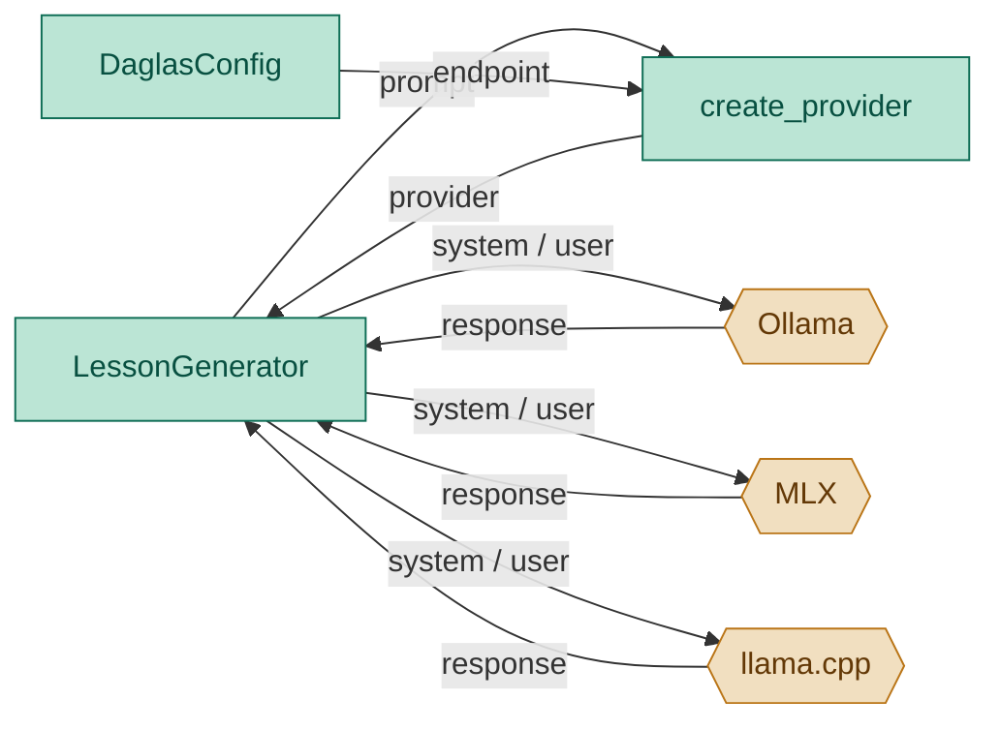

# LLM Abstraction Module — Engineering Design & Implementation Task

## 1. Purpose

Provide a uniform interface for prompting local LLM backends (ollama, mlx, llama.cpp) so the generator can call any provider without switching code.

## 2. Component Diagram



## 3. Scope (MVP)

- **Protocol**: define `LlmProvider` with a single `prompt(system, user) -> str` method
- **Backends**: OllamaProvider (default), MlxProvider, LlamaCppProvider
- **Factory**: `create_provider()` picks backend based on endpoint string heuristics
- **Error handling**: HTTP errors propagate to caller; no retry logic

Non-goals: streaming, tool calling, embedding, multi-turn conversation, model downloading.

## 3. Use Cases

| UC | Description |
|---|---|
| UC1 | **Ollama** — endpoint contains `11434` → use OllamaProvider |
| UC2 | **MLX** — endpoint contains `mlx` → use MlxProvider |
| UC3 | **llama.cpp** — anything else → use LlamaCppProvider |
| UC4 | **Default** — empty endpoint → localhost Ollama |

## 4. Python Libraries

| Library | Why |
|---|---|
| `httpx` | HTTP client for chat completion API calls |
| Standard `typing.Protocol` | Structural typing for provider interface |

Dependency already in `requirements.txt` via context_fetcher.

## 5. Interface

### Location: `daglas/lesson/llm.py`

```python
from typing import Protocol


class LlmProvider(Protocol):
    def prompt(self, system: str, user: str) -> str:
        """Send system+user messages, return assistant response text."""


class OllamaProvider:
    def __init__(
        self,
        endpoint: str = "http://localhost:11434/v1",
        model: str = "",
        api_key: str = "",
    ): ...

    def prompt(self, system: str, user: str) -> str:
        """POST /v1/chat/completions with ollama-compatible schema."""


class MlxProvider:
    def __init__(
        self,
        endpoint: str = "http://localhost:8080",
        model: str = "",
        api_key: str = "",
    ): ...

    def prompt(self, system: str, user: str) -> str:
        """POST /v1/chat/completions (mlx serve endpoint)."""


class LlamaCppProvider:
    def __init__(
        self,
        endpoint: str = "http://localhost:8080/v1",
        model: str = "",
        api_key: str = "",
    ): ...

    def prompt(self, system: str, user: str) -> str:
        """POST /v1/chat/completions (llama.cpp server endpoint)."""


def create_provider(
    endpoint: str = "",
    model: str = "",
    api_key: str = "",
) -> LlmProvider:
    """Factory: pick backend by endpoint string."""
```

### Request format (all providers)

```json
{
  "model": "...",
  "messages": [
    {"role": "system", "content": "..."},
    {"role": "user", "content": "..."}
  ],
  "stream": false
}
```

### Response parsing (all providers)

```python
data["choices"][0]["message"]["content"]
```

## 6. Implementation Plan

### Step 1 — Scaffold

Create `daglas/lesson/llm.py` with `LlmProvider` protocol and three provider classes.

### Step 2 — OllamaProvider

Default model `"llama3.2"`. POST to `{endpoint}/chat/completions` with `model` in body. Strip trailing `/` from endpoint in constructor.

### Step 3 — MlxProvider

Default model `"mlx-community/llama-3.2-3b"`. POST to `{endpoint}/v1/chat/completions`. Default endpoint is `http://localhost:8080`.

### Step 4 — LlamaCppProvider

No default model. POST to `{endpoint}/chat/completions`. Default endpoint is `http://localhost:8080/v1`.

### Step 5 — Factory

- Empty endpoint → `OllamaProvider(model=model)`
- `"11434"` in endpoint → `OllamaProvider(endpoint, model, api_key)`
- `"mlx"` in endpoint.lower() → `MlxProvider(endpoint, model, api_key)`
- otherwise → `LlamaCppProvider(endpoint, model, api_key)`

## 7. Unit Test Strategy (`tests/lesson/test_llm.py`)

Use `pytest` with mocked `httpx.post`.

| Category | Test | What it covers |
|---|---|---|
| Happy path | `test_ollama_provider_prompt` | OllamaProvider returns expected text |
| Happy path | `test_mlx_provider_prompt` | MlxProvider returns expected text |
| Happy path | `test_llamacpp_provider_prompt` | LlamaCppProvider returns expected text |
| Critical logic | `test_create_provider_default` | Empty endpoint returns OllamaProvider |
| Critical logic | `test_create_provider_ollama` | 11434 endpoint returns OllamaProvider |
| Error path | `test_provider_raises_on_http_error` | HTTP error propagates |

## 8. Acceptance Criteria

- `pytest tests/lesson/test_llm.py` passes all tests.
- `ruff check daglas/` and `ruff format --check daglas/` pass.
