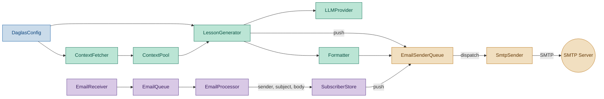
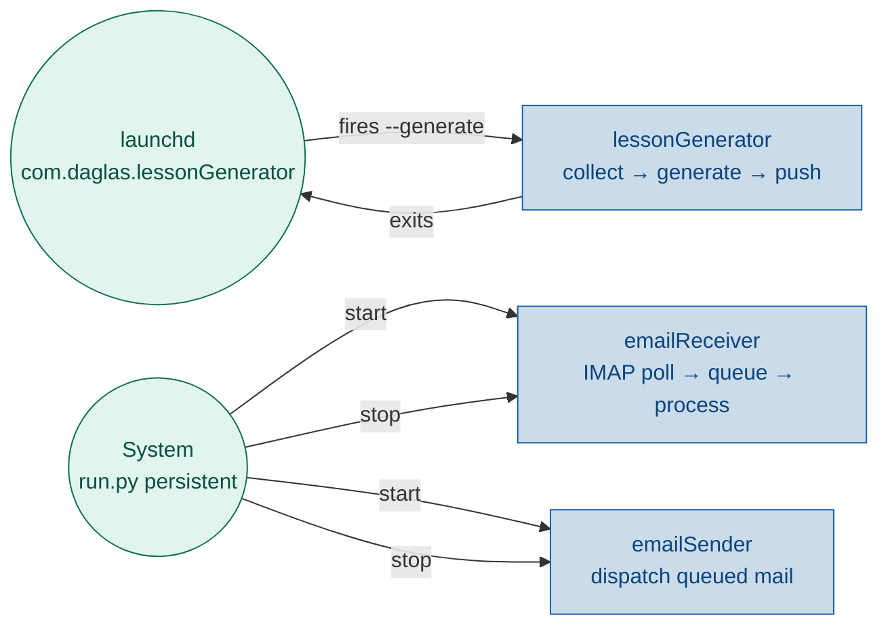

# Run Module — Pipeline Wiring

## 1. Purpose

`run.py` is the **pipeline assembly point** — it loads config, instantiates every module, wires their dependencies together, and provides the CLI entry point. It is the only file that knows about all modules at once.

No module imports another module's concrete classes except through their public interfaces. `run.py` is where the concrete wiring happens. It contains no business logic — no classification, no handler definitions, no subscription rules.

## 2. Architecture

Colour-coded by service:

- **emailReceiver** (purple) — polls IMAP, processes subscription emails
- **lessonGenerator** (teal) — collects articles from the web, generates lessons via LLM, pushes into send queue
- **emailSender** (amber) — dispatches queued emails on immediate and scheduled schedules
- **Config** (blue) — shared by all



### 2.1 Actors — who owns which lifecycle

Two distinct launchd services control the daglas processes:

| launchd service | Runs | Owner of |
|---|---|---|
| `com.daglas.lessonGenerator` | `python run.py --generate` | **lessonGenerator** — fetch, generate, queue, exit |
| `com.daglas.runner` | `python run.py` (persistent) | **emailReceiver** + **emailSender** — stays alive |



`lessonGenerator` is not managed by the persistent process. It runs as a
separate `--lesson` invocation, fired by launchd on a 30-minute schedule.
The persistent `run.py` (System) only owns `emailReceiver` and `emailSender`
— it starts them at boot and stops them on shutdown.

### 2.3 lessonGenerator

Collects articles from the web, generates a lesson via LLM, and queues it for
sending.

```
Config → ContextFetcher → ContextPool → LessonGenerator → LLM → Formatter
                                                                    │
                                                                    ▼ push
                                                              EmailSenderQueue
```

### 2.4 emailReceiver

Polls IMAP for incoming emails, processes subscription and unsubscribe
requests, sends confirmation replies through the shared sender queue.

```
Config → EmailReceiver → EmailQueue → EmailProcessor → SubscriberStore
                                                              │
                                                              ▼ push
                                                        EmailSenderQueue
```

### 2.5 emailSender

Dispatches queued emails on two schedules: immediate (every 20 s) and
scheduled (every 5 min). `SmtpSender` is an internal transport — no module
imports it directly.

Both `lessonGenerator` and `emailReceiver` push to the same
`EmailSenderQueue` instance. `emailSender` owns that queue and its dispatch
threads.

## 3. Responsibilities

- **Config loading**: call `load_config()` at startup and set `daglas.config.config`
- **Module assembly**: instantiate all modules and pass dependencies
- **Pipeline glue**: wire `EmailProcessor.add_listener(subscriber_store.handle_email)`
- **Lifecycle**: start `emailSender` and `emailReceiver`, then enter a persistent main loop that keeps the process alive. On exit: stop `emailReceiver`, stop `emailSender`. `lessonGenerator` is not managed here — it runs as a separate `--lesson` process fired by launchd (see `tasks/macos_launchd.md`).
- **Exit**: Ctrl+C or type `q` + Enter. No `--daemon` flag needed — persistent is the default.
- **CLI interface**: `--generate` to run the full lesson lifecycle (fetch → generate → queue) and exit

Non-responsibilities: classification logic, subscription rules, handler functions, content inspection, SMTP dispatch.

## 4. Pipeline Wiring

### 4.1 Shared emailSender

A single `EmailSenderQueue` is instantiated once in `main()` and shared
across `lessonGenerator` and `emailReceiver`:

```python
from daglas.email_sender_queue import EmailSenderQueue

sender_queue = EmailSenderQueue(sender=smtp_sender)
sender_queue.start()
# ... run pipeline ...
sender_queue.stop()
```

### 4.2 emailReceiver wiring

```python
def _wire_email_receiver(cfg, sender_queue):
    from daglas.email_queue import EmailQueue
    from daglas.email_receiver import EmailReceiver
    from daglas.email_processor import EmailProcessor
    from daglas.subscriber_store import SubscriberStore

    queue = EmailQueue()
    processor = EmailProcessor(queue)
    store = SubscriberStore(sender_queue=sender_queue)
    processor.add_listener(store.handle_email)

    receiver = EmailReceiver(
        queue,
        imap_host=cfg.imap_host,
        imap_port=cfg.imap_port,
        imap_user=cfg.imap_user,
        imap_password=cfg.imap_password,
    )
    return receiver
```

No handler function. No classification logic. SubscriberStore provides its own `handle_email` method — it is a complete actor that knows how to interpret incoming emails. Confirmation emails are pushed to the shared `sender_queue` with `send_at="immediate"`.

### 4.3 lessonGenerator wiring

Instantiate ContextPool, LLM provider, formatter. The generated lesson is
pushed as a `SendRequest` to the shared `sender_queue` with
`send_at=cfg.send_time` (scheduled for the configured daily send time).

### 4.4 Lifecycle — Persistent Loop

The persistent `run.py` (managed by launchd `com.daglas.runner`) stays alive
until explicitly told to exit. `lessonGenerator` is **not** part of this
process — it runs as a separate `--lesson` invocation (see
`tasks/macos_launchd.md`).

```
┌───────────── start ───────────────────────────────────────────┐
│                                                                │
│  email_sender = EmailSenderQueue()                             │
│  email_sender.start()               ← daemon: 20s + 5min loops │
│                                                                │
│  if cfg.imap_host:                                             │
│      receiver = _wire_email_receiver(cfg, email_sender)        │
│      receiver.start()                ← daemon: continuous IMAP │
│                                                                │
│  # --- main loop (keeps main thread alive) ---                 │
│  while not exit_requested:                                     │
│      try:                                                      │
│          line = input("press q+enter to quit: ")               │
│          if line.strip().lower() == "q":                       │
│              exit_requested = True                             │
│      except EOFError:                          ← Ctrl+D        │
│          exit_requested = True                                 │
│      except KeyboardInterrupt:                ← Ctrl+C         │
│          exit_requested = True                                 │
│                                                                │
│  receiver.stop()                                               │
│  email_sender.stop()                                           │
└────────────────────────────────────────────────────────────────┘
```

The main thread stays alive in the keyboard loop, keeping the daemon threads
(`EmailReceiver` IMAP poll, `EmailSenderQueue` immediate/scheduled loops)
alive. Incoming subscription emails are processed reactively as they arrive.
Queued lessons and confirmations are dispatched by `emailSender`'s polling
loops.

The `lessonGenerator` service runs in a separate `--lesson` process,
fired by launchd (`com.daglas.lessonGenerator`) every 30 minutes:

```
┌─────── launchd fires python run.py --lesson ─────────────────┐
│                                                                │
│  fetch_context() → generate_lesson() → format_email()          │
│  email_sender.push(SendRequest(send_at=cfg.send_time))         │
│                                                                │
│  sender_queue.start()   ← dispatch queued send                 │
│  sender_queue.stop()                                           │
│  exit                                                          │
└────────────────────────────────────────────────────────────────┘
```

The two processes share the same data files (JSONL queue, context pool,
subscriber store). The sender queue handles dedup if `--lesson` fires
multiple times per day.

**Exit methods:**

| Method | How |
|--------|-----|
| Ctrl+C | KeyboardInterrupt caught in main loop |
| `q`+Enter | Read from stdin in main loop |
| Ctrl+D | EOFError caught in main loop |

## 5. Use Cases

| UC | Description |
|---|---|---|
| UC1 | **Persistent (emailReceiver + emailSender)** — `run.py` starts sender queue and IMAP poller, enters keyboard loop. Lesson generation is handled by `--lesson` (UC3). |
| UC2 | **emailReceiver** — continuous IMAP polling → queue → processor → subscriber store |
| UC3 | **lessonGenerator (--lesson)** — `run.py --lesson` runs fetch → generate → queue and exits. Fired by launchd `com.daglas.lessonGenerator` every 30 min. |
| UC4 | **Exit** — Ctrl+C or `q`+Enter stops receiver and queue, then exits |

## 6. Interface

### Location: `run.py`

```python
def main() -> None:
    """Load config, parse args, start services."""


def _wire_email_receiver(cfg, sender_queue) -> EmailReceiver:
    """Create EmailQueue, EmailProcessor, EmailReceiver, SubscriberStore.
    Wire store.handle_email into the processor.
    Return the receiver so the caller can start/stop it.
    """
```

No `_subscriber_handler` function. That logic belongs on `SubscriberStore`.

## 7. Unit Test Strategy

run.py is intentionally thin — most logic lives in modules. Test via integration test patterns:

- Verify that `_wire_email_receiver` returns an `EmailReceiver` with a wired pipeline.
- Verify that starting the receiver and pushing an email to IMAP results in `SubscriberStore` being updated (end-to-end with real IMAP or integration mock).

## 8. Acceptance Criteria


- `python run.py --help` shows all flags.
- `_wire_email_receiver(cfg)` wires `SubscriberStore.handle_email` directly to `EmailProcessor`.
- `run.py` contains no classification or subscription logic.
- `python run.py` (no flags) stays alive until Ctrl+C or `q`+Enter is pressed.
- `python run.py --generate` runs lessonGenerator (fetch → generate → queue lesson) and exits.
- `emailReceiver` polls IMAP continuously while the persistent process lives.
- `emailSender` dispatches immediate and scheduled emails while the persistent process lives.
- Ctrl+C and `q`+Enter stop `emailReceiver` and `emailSender` before exit.

## Discussion

### 2026-06-14 — Initial design

**What changed:**
- First version of this task doc created.
- Moved subscriber classification logic out of `email_processor.py` into the wiring layer.
- `_subscriber_handler` is a plain function in `run.py`, not a method on any class.
- The handler is registered via `EmailProcessor.add_listener()`.

**Impact on implementation plan:**
- New module: `tasks/run.md` for the wiring doc.
- `run.py` gains `_wire_email_receiver()` and `_subscriber_handler()`.

**TODO actions:**
- [x] Implement `_wire_email_receiver()` in `run.py`.
- [x] Implement `_subscriber_handler()` in `run.py`.
- [x] Wire start/stop lifecycle in `main()`.

### 2026-06-14 — Removed subscriber handler from run.py

**What changed:**
- Removed `_subscriber_handler` from the spec — `run.py` no longer defines classification logic.
- SubscriberStore is a complete actor: it provides its own `handle_email(sender, subject, body)` method and registers directly with `EmailProcessor`.
- `_wire_email_receiver` now wires `processor.add_listener(store.handle_email)` instead of a local closure.
- Architecture diagram color-coded: emailReceiver (purple), lessonGenerator (teal), emailSender (amber), config (blue).
- Simplified responsibilities: `run.py` does assembly and lifecycle only — no business logic.

**Impact on implementation plan:**
- `SubscriberStore` needs a `handle_email` method (classification lives there).
- `run.py` should remove `_subscriber_handler` and call `processor.add_listener(store.handle_email)` instead.

**TODO actions:**
- [ ] Add `handle_email(sender, subject, body)` method to `SubscriberStore` (in `daglas/subscriber_store.py`).
- [ ] Remove `_subscriber_handler` from `daglas/run.py` and wire `store.handle_email` instead.
- [ ] Update `tests/test_subscriber_store.py` with tests for `handle_email`.

### 2026-06-14 — EmailSenderQueue replaces direct SmtpSender dispatch

**What changed:**
- Architecture diagram updated: `EmailSenderQueue` sits between all producers and `SmtpSender`.
- `_wire_email_receiver` now takes `sender_queue` and passes it to `SubscriberStore`.
- `main()` instantiates a single `EmailSenderQueue` shared by lessonGenerator and emailReceiver.
- lessonGenerator pushes `SendRequest` with `send_at=cfg.send_time` to the queue instead of calling `SmtpSender.send()` directly.
- `run.py` is responsible for `sender_queue.start()` / `sender_queue.stop()` lifecycle.

**Impact on implementation plan:**
- New module: `daglas/email_sender_queue.py` and `tasks/email_sender_queue.md`.
- `run.py` wiring changed: create `EmailSenderQueue`, pass to both pipelines, start/stop lifecycle.

**TODO actions:**
- [ ] Create `daglas/email_sender_queue.py`.
- [ ] Update `run.py`:
  - Create `EmailSenderQueue` in `main()`.
  - Pass to `_wire_email_receiver`.
  - Push lesson as `SendRequest` with `send_at=cfg.send_time`.
  - Call `start()` / `stop()` on the queue.
- [ ] Update `implementation_plan.md`.

### 2026-06-14 — Persistent loop replaces one-shot lifecycle

**What changed:**
- Previous design: `run.py` called `receiver.check_once()` once, ran lessonGenerator, then exited. `EmailSenderQueue` daemon threads were killed when `main()` returned.
- New design: `run.py` enters a persistent keyboard loop after running lessonGenerator once. Ctrl+C or `q`+Enter exits cleanly.
- `EmailReceiver` now uses `start()` (daemon thread with continuous IMAP poll) instead of `check_once()`.
- Main thread stays alive via the keyboard loop, keeping all daemon threads (`EmailReceiver` IMAP poll, `EmailSenderQueue` immediate/scheduled loops) alive.

**Why:**
- One-shot design could never process subscription emails that arrived after the single `check_once()` call.
- `EmailSenderQueue` immediate and scheduled dispatches never fired because daemon threads were killed on exit.
- A persistent loop solves both: emailReceiver IMAP polling continues, and queue dispatches happen organically.

**Impact on implementation plan:**
- `run.py` needs a main loop with keyboard input handling.
- `EmailReceiver.start()` must be used instead of `check_once()`.
- `run.py --one-shot` flag added for CI/testing (optional).

**TODO actions:**
- [ ] Update `run.py`:
  - Replace `receiver.check_once()` with `receiver.start()`.
  - Add keyboard loop (`input()` + Ctrl+C handler).
  - Call `receiver.stop()` on exit.
  - Add `--one-shot` flag.
- [ ] Update task docs for `email_receiver.md` if `check_once` usage changes.
- [ ] Update `implementation_plan.md`.

### 2026-06-14 — Scheduler cancelled; ContextFetcher stays timer-free; --one-shot confirmed

**What changed:**
- Decision: No separate Scheduler module will be created. The three pipelines manage their own timing internally (EmailReceiver polls IMAP, EmailSenderQueue polls immediate/scheduled, lessonGenerator runs once at startup). The persistent main loop in `run.py` keeps the daemon threads alive.
- Decision: ContextFetcher gets the same daemon pattern as EmailReceiver and EmailSenderQueue — `start()`/`stop()`/`_run()` with a daemon thread that sleeps until `fetch_time` and runs the fetch pipeline. This keeps the timing self-contained within the module rather than in `run.py`'s main loop.
- `--one-shot` flag confirmed and promoted from TODO to spec.

**Why no Scheduler:**
- EmailReceiver already has its own daemon thread with configurable poll interval (`email_receiver_poll_interval`, default 300s).
- EmailSenderQueue already has two daemon threads (immediate at `email_sender_queue_immediate_interval` 20s, scheduled at `email_sender_queue_scheduled_interval` 300s).
- ContextFetcher now has its own daemon thread (sleeps until `fetch_time`, fetches, sleeps until next day). Lesson generation is triggered by `run.py` after the daemon's initial fetch (or on its own timer if needed later).
- A separate Scheduler would just wrap the same start/stop lifecycle that `run.py` already owns, adding complexity without benefit.

**Impact on implementation plan:**
- Scheduler module: status changed from `not_started` to `cancelled`. `tasks/scheduler.md` will not be created.
- `run.py`: status changed from `done` to `designing` — persistent loop + `--one-shot` + `receiver.start()` + `fetcher.start()` still need to be implemented.
- `ContextFetcher`: status changed from `done` to `designing` — daemon lifecycle needs to be built.

**TODO actions:**
- [x] Analyse existing timers (EmailReceiver has poll loop, EmailSenderQueue has two poll loops, ContextFetcher has none).
- [x] Decide not to create Scheduler module.
- [x] Decide to add daemon timer to ContextFetcher (follows same pattern).
- [x] Implement `run.py` changes:
  - Default behaviour: `_run_persistent()` starts all 3 daemons, enters keyboard loop, stops on exit.
  - `--one-shot` flag preserves original one-shot pipeline behaviour.
  - Phase flags always run in one-shot mode.
  - `_run_persistent()` starts `sender_queue`, `receiver` (if imap_host configured).
- [x] Update `implementation_plan.md`: mark Scheduler cancelled, mark run.py done.

### 2026-06-14 — Pipeline daemon and persistent System actor implemented

**What changed:**
- Created `daglas/pipeline.py` with pipeline daemon class wrapping fetch → generate → format → queue, matching the `start()`/`stop()`/`is_running`/`_run()` pattern.
- Refactored `run.py` into two entry points: `_run_one_shot(args)` (preserves the original behaviour for `--one-shot`) and `_run_persistent()` (default — starts all 3 daemon pipelines, enters keyboard loop, shuts down cleanly).
- Added `--one-shot` flag to argparse.

**Impact on implementation plan:**
- `run.py` status: `designing` → `done`.
- `ContextFetcher` status: `designing` → `done`.

**TODO actions:**
- [x] Add daemon lifecycle tests for `ContextFetcherDaemon`.

### 2026-06-17 — Renamed services; clarified launchd split

**What changed:**
- Replaced old pipeline names with service names: lessonGenerator, emailReceiver, emailSender.
- Actor diagram split into two actors: **launchd** (fires `--lesson` for lessonGenerator) and **System** (persistent `run.py` for emailReceiver + emailSender).
- Removed lessonGenerator from persistent lifecycle — it is not managed by the persistent `run.py`. It runs as a separate `--lesson` process fired by launchd every 30 minutes.
- Added lifecycle diagram for `--lesson` mode in section 4.4.
- Updated responsibilities, use cases, and acceptance criteria to reflect the split.
- `_wire_inbound_pipeline` → `_wire_email_receiver`.
- `--one-shot` → `--lesson`.

**Why:**
- launchd handles wall-time scheduling; persistent mode should only manage fast-polling services (IMAP, sender queue).
- lessonGenerator runs on a 30-minute launchd timer (`com.daglas.lessonGenerator`), avoiding Python monotonic clock drift across sleep/wake cycles.

**Impact on implementation plan:**
- The actor diagram now shows the real architecture: two processes, three services.

**TODO actions:**
- [x] Rename wiring function to `_wire_email_receiver` in `run.py`.
- [x] Rename `--one-shot` → `--lesson` in `run.py`.
- [x] Update `implementation_plan.md` with service naming.
