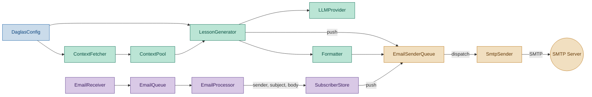
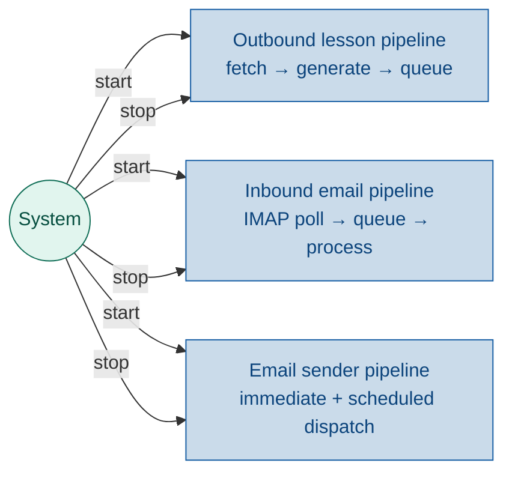

# Run Module — Pipeline Wiring

## 1. Purpose

`run.py` is the **pipeline assembly point** — it loads config, instantiates every module, wires their dependencies together, and provides the CLI entry point. It is the only file that knows about all modules at once.

No module imports another module's concrete classes except through their public interfaces. `run.py` is where the concrete wiring happens. It contains no business logic — no classification, no handler definitions, no subscription rules.

## 2. Architecture

Pipelines are color-coded by concern:

- **Inbound email pipeline** (purple) — receives and processes incoming emails
- **Outbound lesson pipeline** (teal) — fetches context and generates lessons
- **Email sender queue** (amber) — universal outbound dispatch with two poll loops
- **Config** (blue) — shared by all



### 2.1 Actor — who starts the pipelines



The `System` actor represents the daglas process itself (started by `run.py`)
which owns the lifecycle of all three pipelines — starting them at boot and
stopping them on shutdown.

### 2.3 Outbound pipeline

```
Config → ContextFetcher → ContextPool → LessonGenerator → LLM → Formatter
                                                                    │
                                                                    ▼ push
                                                              EmailSenderQueue
```

### 2.4 Inbound pipeline

```
Config → EmailReceiver → EmailQueue → EmailProcessor → SubscriberStore
                                                              │
                                                              ▼ push
                                                        EmailSenderQueue
```

Both pipelines push to the same `EmailSenderQueue` instance. The queue
dispatches on two schedules: immediate (20s poll) and scheduled (5min poll).
`SmtpSender` is an internal transport — no module imports it directly.

## 3. Responsibilities

- **Config loading**: call `load_config()` at startup and set `daglas.config.config`
- **Module assembly**: instantiate all modules and pass dependencies
- **Pipeline glue**: wire `EmailProcessor.add_listener(subscriber_store.handle_email)`
- **Lifecycle**: start `EmailSenderQueue` and `EmailReceiver`, run outbound pipeline once, then enter a persistent main loop that keeps the process alive. On exit: stop `EmailReceiver`, stop `EmailSenderQueue`.
- **Exit**: Ctrl+C or type `q` + Enter. No `--daemon` flag needed — persistent is the default.
- **CLI interface**: argparse, phase selection (`--fetch-only`, `--generate-only`, `--send`, `--dry-run`, `--html`), `--one-shot` for CI/testing (exit after pipeline instead of persisting), `--max-articles` to limit fetch count

Non-responsibilities: classification logic, subscription rules, handler functions, content inspection, SMTP dispatch.

## 4. Pipeline Wiring

### 4.1 Shared EmailSenderQueue

A single `EmailSenderQueue` is instantiated once in `main()` and shared
across all modules that need to send email:

```python
from daglas.email_sender_queue import EmailSenderQueue

sender_queue = EmailSenderQueue(sender=smtp_sender)
sender_queue.start()
# ... run pipeline ...
sender_queue.stop()
```

### 4.2 Inbound wiring

```python
def _wire_inbound_pipeline(cfg, sender_queue):
    from daglas.email_queue import EmailQueue
    from daglas.email_receiver import EmailReceiver
    from daglas.email_processor import EmailProcessor
    from daglas.subscriber_store import SubscriberStore

    queue = EmailQueue()
    processor = EmailProcessor(queue)
    store = SubscriberStore(sender_queue=sender_queue)
    processor.add_listener(store.handle_email)

    receiver = EmailReceiver(
        queue,
        imap_host=cfg.imap_host,
        imap_port=cfg.imap_port,
        imap_user=cfg.imap_user,
        imap_password=cfg.imap_password,
    )
    return receiver
```

No handler function. No classification logic. SubscriberStore provides its own `handle_email` method — it is a complete actor that knows how to interpret incoming emails. Confirmation emails are pushed to the shared `sender_queue` with `send_at="immediate"`.

### 4.3 Outbound wiring

Instantiate ContextPool, LLM provider, formatter. The generated lesson is
pushed as a `SendRequest` to the shared `sender_queue` with
`send_at=cfg.send_time` (scheduled for the configured daily send time).

### 4.4 Lifecycle — Persistent Loop

By default `python3 run.py` stays alive until explicitly told to exit:

```
┌───────────── start ───────────────────────────────────────────┐
│                                                                │
│  sender_queue = EmailSenderQueue()                             │
│  sender_queue.start()               ← daemon: 20s + 5min loops │
│                                                                │
│  if cfg.imap_host:                                             │
│      receiver = _wire_inbound_pipeline(cfg, sender_queue)      │
│      receiver.start()                ← daemon: continuous IMAP │
│                                                                │
│  # --- outbound pipeline (runs once at startup) ---            │
│  fetch_context() → generate_lesson() → format_email()          │
│  sender_queue.push(SendRequest(send_at=cfg.send_time))         │
│                                                                │
│  # --- main loop (keeps main thread alive) ---                 │
│  while not exit_requested:                                     │
│      try:                                                      │
│          line = input("press q+enter to quit: ")               │
│          if line.strip().lower() == "q":                       │
│              exit_requested = True                             │
│      except EOFError:                          ← Ctrl+D        │
│          exit_requested = True                                 │
│      except KeyboardInterrupt:                ← Ctrl+C         │
│          exit_requested = True                                 │
│                                                                │
│  receiver.stop()                                               │
│  sender_queue.stop()                                           │
└────────────────────────────────────────────────────────────────┘
```

The main thread stays alive in the keyboard loop, keeping the daemon threads
(`EmailReceiver` IMAP poll, `EmailSenderQueue` immediate/scheduled loops)
alive. Inbound emails are processed reactively as they arrive. Queued
emails are dispatched by the sender queue's polling loops.

**Exit methods:**

| Method | How |
|--------|-----|
| Ctrl+C | KeyboardInterrupt caught in main loop |
| `q`+Enter | Read from stdin in main loop |
| Ctrl+D | EOFError caught in main loop |

## 5. Use Cases

| UC | Description |
|---|---|
| UC1 | **Full pipeline + persist** — outbound runs once, then stays alive for inbound + queue dispatch |
| UC2 | **Inbound pipeline** — continuous IMAP polling → queue → processor → subscriber store |
| UC3 | **Dry run** — generate without calling LLM |
| UC4 | **Phase selection** — run only fetch, only generate, or only send |
| UC5 | **HTML output** — also save HTML version of lesson |
| UC6 | **Exit** — Ctrl+C or `q`+Enter stops receiver and queue, then exits |
| UC7 | **One-shot** — `--one-shot` flag runs the selected pipeline and exits (for CI/testing, or manual scheduled dispatch via cron/launchd) |

## 6. Interface

### Location: `run.py`

```python
def main() -> None:
    """Load config, parse args, run selected pipeline phases."""


def _wire_inbound_pipeline(cfg) -> EmailReceiver:
    """Create EmailQueue, EmailProcessor, EmailReceiver, SubscriberStore.
    Wire store.handle_email into the processor.
    Return the receiver so the caller can start/stop it.
    """
```

No `_subscriber_handler` function. That logic belongs on `SubscriberStore`.

## 7. Unit Test Strategy

run.py is intentionally thin — most logic lives in modules. Test via integration test patterns:

- Verify that `_wire_inbound_pipeline` returns an `EmailReceiver` with a wired pipeline.
- Verify that starting the receiver and pushing an email to IMAP results in `SubscriberStore` being updated (end-to-end with real IMAP or integration mock).

## 8. Acceptance Criteria

- `run.py --help` shows all flags.
- `python run.py --dry-run` runs the outbound pipeline without calling the LLM.
- `python run.py --fetch-only` runs only context fetch.
- `_wire_inbound_pipeline(cfg)` wires `SubscriberStore.handle_email` directly to `EmailProcessor`.
- `run.py` contains no classification or subscription logic.
- `python run.py` stays alive until Ctrl+C or `q`+Enter is pressed.
- `EmailReceiver` polls IMAP continuously while the process lives.
- `EmailSenderQueue` dispatches immediate and scheduled emails while the process lives.
- Ctrl+C and `q`+Enter stop `EmailReceiver` and `EmailSenderQueue` before exit.
- `--one-shot` runs the same pipeline but exits after queueing (no persistent loop).

## Discussion

### 2026-06-14 — Initial design

**What changed:**
- First version of this task doc created.
- Moved subscriber classification logic out of `email_processor.py` into the wiring layer.
- `_subscriber_handler` is a plain function in `run.py`, not a method on any class.
- The handler is registered via `EmailProcessor.add_listener()`.

**Impact on implementation plan:**
- New module: `tasks/run.md` for the wiring doc.
- `run.py` gains `_wire_inbound_pipeline()` and `_subscriber_handler()`.

**TODO actions:**
- [x] Implement `_wire_inbound_pipeline()` in `run.py`.
- [x] Implement `_subscriber_handler()` in `run.py`.
- [x] Wire start/stop lifecycle in `main()`.

### 2026-06-14 — Removed subscriber handler from run.py

**What changed:**
- Removed `_subscriber_handler` from the spec — `run.py` no longer defines classification logic.
- SubscriberStore is a complete actor: it provides its own `handle_email(sender, subject, body)` method and registers directly with `EmailProcessor`.
- `_wire_inbound_pipeline` now wires `processor.add_listener(store.handle_email)` instead of a local closure.
- Architecture diagram color-coded: inbound pipeline (purple), outbound pipeline (teal), email sender (amber), config (blue).
- Simplified responsibilities: `run.py` does assembly and lifecycle only — no business logic.

**Impact on implementation plan:**
- `SubscriberStore` needs a `handle_email` method (classification lives there).
- `run.py` should remove `_subscriber_handler` and call `processor.add_listener(store.handle_email)` instead.

**TODO actions:**
- [ ] Add `handle_email(sender, subject, body)` method to `SubscriberStore` (in `daglas/subscriber_store.py`).
- [ ] Remove `_subscriber_handler` from `daglas/run.py` and wire `store.handle_email` instead.
- [ ] Update `tests/test_subscriber_store.py` with tests for `handle_email`.

### 2026-06-14 — EmailSenderQueue replaces direct SmtpSender dispatch

**What changed:**
- Architecture diagram updated: `EmailSenderQueue` sits between all producers and `SmtpSender`.
- `_wire_inbound_pipeline` now takes `sender_queue` and passes it to `SubscriberStore`.
- `main()` instantiates a single `EmailSenderQueue` shared by inbound and outbound pipelines.
- Outbound pipeline pushes `SendRequest` with `send_at=cfg.send_time` to the queue instead of calling `SmtpSender.send()` directly.
- `run.py` is responsible for `sender_queue.start()` / `sender_queue.stop()` lifecycle.

**Impact on implementation plan:**
- New module: `daglas/email_sender_queue.py` and `tasks/email_sender_queue.md`.
- `run.py` wiring changed: create `EmailSenderQueue`, pass to both pipelines, start/stop lifecycle.

**TODO actions:**
- [ ] Create `daglas/email_sender_queue.py`.
- [ ] Update `run.py`:
  - Create `EmailSenderQueue` in `main()`.
  - Pass to `_wire_inbound_pipeline`.
  - Push lesson as `SendRequest` with `send_at=cfg.send_time`.
  - Call `start()` / `stop()` on the queue.
- [ ] Update `implementation_plan.md`.

### 2026-06-14 — Persistent loop replaces one-shot lifecycle

**What changed:**
- Previous design: `run.py` called `receiver.check_once()` once, ran outbound pipeline, then exited. `EmailSenderQueue` daemon threads were killed when `main()` returned.
- New design: `run.py` enters a persistent keyboard loop after running the outbound pipeline once. Ctrl+C or `q`+Enter exits cleanly.
- `EmailReceiver` now uses `start()` (daemon thread with continuous IMAP poll) instead of `check_once()`.
- Main thread stays alive via the keyboard loop, keeping all daemon threads (`EmailReceiver` IMAP poll, `EmailSenderQueue` immediate/scheduled loops) alive.

**Why:**
- One-shot design could never process inbound emails that arrived after the single `check_once()` call.
- `EmailSenderQueue` immediate and scheduled dispatches never fired because daemon threads were killed on exit.
- A persistent loop solves both: inbound IMAP polling continues, and queue dispatches happen organically.

**Impact on implementation plan:**
- `run.py` needs a main loop with keyboard input handling.
- `EmailReceiver.start()` must be used instead of `check_once()`.
- `run.py --one-shot` flag added for CI/testing (optional).

**TODO actions:**
- [ ] Update `run.py`:
  - Replace `receiver.check_once()` with `receiver.start()`.
  - Add keyboard loop (`input()` + Ctrl+C handler).
  - Call `receiver.stop()` on exit.
  - Add `--one-shot` flag.
- [ ] Update task docs for `email_receiver.md` if `check_once` usage changes.
- [ ] Update `implementation_plan.md`.

### 2026-06-14 — Scheduler cancelled; ContextFetcher stays timer-free; --one-shot confirmed

**What changed:**
- Decision: No separate Scheduler module will be created. The three pipelines manage their own timing internally (EmailReceiver polls IMAP, EmailSenderQueue polls immediate/scheduled, outbound pipeline runs once at startup). The persistent main loop in `run.py` keeps the daemon threads alive.
- Decision: ContextFetcher gets the same daemon pattern as EmailReceiver and EmailSenderQueue — `start()`/`stop()`/`_run()` with a daemon thread that sleeps until `fetch_time` and runs the fetch pipeline. This keeps the timing self-contained within the module rather than in `run.py`'s main loop.
- `--one-shot` flag confirmed and promoted from TODO to spec. It preserves the original one-shot behavior for CI/testing and cron/launchd usage.
- `--max-articles` flag added to limit fetch count.

**Why no Scheduler:**
- EmailReceiver already has its own daemon thread with configurable poll interval (`email_receiver_poll_interval`, default 300s).
- EmailSenderQueue already has two daemon threads (immediate at `email_sender_queue_immediate_interval` 20s, scheduled at `email_sender_queue_scheduled_interval` 300s).
- ContextFetcher now has its own daemon thread (sleeps until `fetch_time`, fetches, sleeps until next day). Lesson generation is triggered by `run.py` after the daemon's initial fetch (or on its own timer if needed later).
- A separate Scheduler would just wrap the same start/stop lifecycle that `run.py` already owns, adding complexity without benefit.

**Impact on implementation plan:**
- Scheduler module: status changed from `not_started` to `cancelled`. `tasks/scheduler.md` will not be created.
- `run.py`: status changed from `done` to `designing` — persistent loop + `--one-shot` + `receiver.start()` + `fetcher.start()` still need to be implemented.
- `ContextFetcher`: status changed from `done` to `designing` — daemon lifecycle needs to be built.

**TODO actions:**
- [x] Analyse existing timers (EmailReceiver has poll loop, EmailSenderQueue has two poll loops, ContextFetcher has none).
- [x] Decide not to create Scheduler module.
- [x] Decide to add daemon timer to ContextFetcher (follows same pattern).
- [x] Implement `run.py` changes:
  - Default behaviour: `_run_persistent()` starts all 3 daemons, enters keyboard loop, stops on exit.
  - `--one-shot` flag preserves original one-shot pipeline behaviour.
  - Phase flags (`--fetch-only`, `--generate-only`, `--send`, `--dry-run`) always run in one-shot mode.
  - `_run_persistent()` starts `sender_queue`, `receiver` (if imap_host configured), `OutboundPipeline`.
- [x] Update `implementation_plan.md`: mark Scheduler cancelled, mark run.py done.

### 2026-06-14 — OutboundPipeline daemon and persistent System actor implemented

**What changed:**
- Created `daglas/pipeline.py` with `OutboundPipeline` class — daemon thread wrapping fetch → generate → format → queue, matching the `start()`/`stop()`/`is_running`/`_run()` pattern.
- Refactored `run.py` into two entry points: `_run_one_shot(args)` (preserves the original behaviour for `--one-shot` and phase flags) and `_run_persistent()` (default — starts all 3 daemon pipelines, enters keyboard loop, shuts down cleanly).
- Added `--one-shot` flag to argparse.
- `run.py` is now the `System` actor from the architecture diagram — it owns start/stop for all three pipelines.

**Impact on implementation plan:**
- `run.py` status: `designing` → `done`.
- `OutboundPipeline` added as new module (`daglas/pipeline.py`, `tasks/pipeline.md`).
- `ContextFetcher` status: `designing` → `done`.

**TODO actions:**
- [ ] Add daemon lifecycle tests for `ContextFetcherDaemon` and `OutboundPipeline`.
