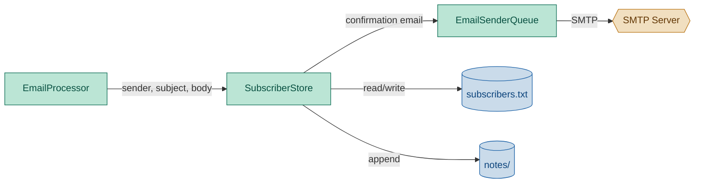

# SubscriberStore Module — Engineering Design & Implementation Task

## 1. Purpose

Manage the list of email recipients who receive the daily Swedish lesson,
archive user-submitted notes, and send immediate confirmation emails when
users subscribe or unsubscribe via email. Acts as a complete actor in the
emailReceiver pipeline.

## 2. Component Diagram



## 3. Scope (MVP)

- **Storage**: flat text file, one email address per line
- **Location**: configurable path, defaults to `data/subscribers.txt`
- **API**: list all, add one, remove one — deduplicated, idempotent
- **Email handling**: `handle_email(sender, subject, body)` classifies and delegates to add/remove — makes SubscriberStore a complete actor for the emailReceiver pipeline
- **User notes**: single per-user text file (`data/notes/<sanitized_email>.txt`) — `@` → `_`, `.` → `_` to avoid collisions (e.g. `alice@gmail.com` → `alice_gmail_com.txt`); each incoming email body is appended with a date-stamped header; this is the sole file recording all user information and requests
- **Confirmation emails**: immediate welcome/goodbye reply pushed to `EmailSenderQueue` when a user subscribes or unsubscribes
- **Templates**: built-in welcome and unsubscribe templates, configurable via constructor

Non-goals: database backend, IMAP polling, import/export, scheduled digests.

## 4. Use Cases

| UC | Description |
|---|---|
| UC1 | **List** — return all subscribers as `list[str]`; empty file returns `[]` |
| UC2 | **Add** — append a new email; duplicate silently ignored |
| UC3 | **Remove** — remove an email if it exists; no-op if absent |
| UC4 | **File missing** — `list()` returns `[]`, `add()` creates file, `remove()` no-ops |
| UC5 | **Handle email** — classify incoming email (subscribe/unsubscribe) and update store |
| UC6 | **Save user note** — append user's email body to `<sanitized_email>.txt` (`@` → `_`, `.` → `_`) with date, from, name, and separator header; this is the single recording file for all user info and requests |
| UC7 | **Welcome confirmation** — push immediate confirmation to EmailSenderQueue on subscribe |
| UC8 | **Unsubscribe confirmation** — push immediate confirmation to EmailSenderQueue on unsubscribe |

## 5. Templates

The SubscriberStore carries built-in templates for welcome and unsubscribe
confirmation emails. Both are `Email` dataclass instances with a `subject`,
`text_body`, and `html_body`.

The `{send_time}` placeholder is replaced with the configured daily send time
from `daglas/config.py:53` (`send_time`, default `07:00`).

The `{name}` placeholder is replaced with the user's extracted name (via LLM
on subscribe, or fallback to email username).

### Welcome template (default — bilingual, English first)

```
Subject: Welcome to Dagläsa! / Välkommen till Dagläsa!

Hi {name}!

Thank you for subscribing to Dagläsa — your daily Swedish reading practice.

You will receive your first lesson at {send_time} tomorrow.
Lessons arrive daily at {send_time}.

---

Hej {name}!

Tack för att du prenumererar på Dagläsa — din dagliga svenska lästräning.

Du får din första lektion klockan {send_time} i morgon.
Lektionerna kommer varje dag klockan {send_time}.

Hej då!
Dagläsateamet
```

### Unsubscribe template (default — bilingual, English first)

```
Subject: Unsubscribed from Dagläsa / Avprenumererad från Dagläsa

Hi {name}!

You have been successfully unsubscribed from Dagläsa.

You will no longer receive daily Swedish lessons.

If this was a mistake, simply reply with "subscribe" to rejoin.

---

Hej {name}!

Du har blivit avprenumererad från Dagläsa.

Du kommer inte längre att få dagliga svenska lektioner.

Om detta var ett misstag, svara bara med "subscribe" för att börja igen.

Hej då!
Dagläsateamet
```

### Template overrides

Both templates can be overridden via constructor parameters:

```python
store = SubscriberStore(
    welcome_template=Email(subject=..., text_body=..., html_body=...),
    unsubscribe_template=Email(subject=..., text_body=..., html_body=...),
)
```

## 6. Python Libraries

| Library | Why |
|---|---|
| Standard `pathlib` | File path resolution |

No new third-party dependencies.

## 7. Interface

### Location: `daglas/subscriber_store.py`

```python
import daglas.config
from daglas.email_sender_queue import EmailSenderQueue
from daglas.lesson.formatter import Email
from daglas.lesson.llm import LlmProvider


NAME_EXTRACTION_SYSTEM = "You extract names from email messages. Respond with ONLY the person's first name — nothing else, no punctuation, no explanation. If no name is found, respond with exactly: NONE"

NAME_EXTRACTION_USER = """Subject: {subject}
Body: {body}
From: {sender}

What is the sender's first name?"""

WELCOME_SUBJECT = "Welcome to Dagläsa! / Välkommen till Dagläsa!"
WELCOME_TEXT = """Hi {name}!

Thank you for subscribing to Dagläsa — your daily Swedish reading practice.

You will receive your first lesson at {send_time} tomorrow.
Lessons arrive daily at {send_time}.

---

Hej {name}!

Tack för att du prenumererar på Dagläsa — din dagliga svenska lästräning.

Du får din första lektion klockan {send_time} i morgon.
Lektionerna kommer varje dag klockan {send_time}.

Hej då!
Dagläsateamet"""

UNSUBSCRIBE_SUBJECT = "Unsubscribed from Dagläsa / Avprenumererad från Dagläsa"
UNSUBSCRIBE_TEXT = """Hi {name}!

You have been successfully unsubscribed from Dagläsa.

You will no longer receive daily Swedish lessons.

If this was a mistake, simply reply with "subscribe" to rejoin.

---

Hej {name}!

Du har blivit avprenumererad från Dagläsa.

Du kommer inte längre att få dagliga svenska lektioner.

Om detta var ett misstag, svara bara med "subscribe" för att börja igen.

Hej då!
Dagläsateamet"""


class SubscriberStore:
    def __init__(
        self,
        path: str | None = None,
        sender_queue: EmailSenderQueue | None = None,
        llm: LlmProvider | None = None,
        welcome_template: Email | None = None,
        unsubscribe_template: Email | None = None,
    ):
        """If path is given, use it; else default to <data_dir>/subscribers.txt.

        sender_queue is an optional EmailSenderQueue instance used for
        immediate confirmation emails. If None, no confirmation is sent.

        llm is an optional LlmProvider used to extract the user's name
        from their email on subscribe. If None, the email username (local
        part before @) is used as the display name.

        welcome_template and unsubscribe_template override the built-in
        defaults.
        """
        ...

    def list(self) -> list[str]:
        """Read all subscribers from the file. Returns [] if file doesn't exist."""

    def add(self, email: str) -> None:
        """Append email to file if not already present. Creates file if missing."""

    def remove(self, email: str) -> None:
        """Remove email from file. No-op if not found or file missing."""

    def handle_email(self, sender: str, subject: str, body: str) -> None:
        """Classify incoming email and update subscriber list.

        If the email matches "subscribe" or "unsubscribe":
        1. Update the subscriber list (add/remove).
        2. Save the user's note to data/notes/<sanitized_email>.txt.
        3. Extract the user's name (via LLM or fallback).
        4. Send an immediate confirmation via self._sender (if configured).

        Classification rules:
        - "unsubscribe" checked before "subscribe" — when both appear, unsubscribe wins.
        - Matching is case-insensitive substring on subject + body.
        - No match = no-op (no note saved, no confirmation sent).
        """

    @staticmethod
    def _email_to_filename(email: str) -> str:
        """Sanitize an email for use as a filename stem.
        Replace @ with _ and . with _.
        E.g. "alice@gmail.com" → "alice_gmail_com".
        """

    def _read_user_name(self, email: str) -> str | None:
        """Read the stored Name from the user's note file header.
        Returns None if the file doesn't exist or has no Name line.
        """

    def _extract_user_name(self, subject: str, body: str, sender: str) -> str:
        """Ask the LLM to extract the sender's first name from their email.

        Builds the NAME_EXTRACTION_USER prompt with subject, body, and sender.
        Calls self._llm.prompt(NAME_EXTRACTION_SYSTEM, prompt) if LLM is
        configured. If the LLM responds with "NONE" or if no LLM is configured,
        falls back to sender.split("@")[0].title().

        Returns the extracted name (title-cased, stripped).
        """

    def _save_user_note(self, email: str, body: str, user_name: str | None = None) -> None:
        """Append body text to data/notes/<sanitized_email>.txt.

        Prepends a header block:
            Email: user@example.com
            Name: Alice
            Date: 2026-06-14 10:30
            --------------------------------
            <body text>
            \\n

        The Email and Name lines are written once on file creation (subscribe).
        Subsequent entries append below with Date, separator, and body.
        Creates the notes directory and file if missing.
        """

    def _send_confirmation(self, email: str, action: str, user_name: str) -> None:
        """Send a welcome or unsubscribe confirmation via self._sender_queue.

        action is "subscribe" or "unsubscribe".
        Builds the Email from the matching template, substituting {send_time}
        and {name} with the configured value and user_name.
        Pushes to EmailSenderQueue with send_at="immediate".
        No-op if self._sender_queue is None.
        """
```

### File formats

**subscribers.txt** — one address per line:
```
alice@example.com
bob@example.com
```

One address per line. No trailing newline required at EOF. Blank lines are skipped. Addresses are stored and matched exactly (case-sensitive, trimmed).

**data/notes/<sanitized_email>.txt** — single per-user file for all information and requests.
Filename derives from the email: `@` → `_`, `.` → `_`. E.g. `alice@gmail.com` → `alice_gmail_com.txt`.
The first time a user subscribes, the file is created with metadata headers at the top.
Subsequent entries are appended below:

```
Email: alice@gmail.com
Name: Alice

Date: 2026-06-14 10:30
--------------------------------
Hello, I would like to subscribe to the daily Swedish lessons.

Date: 2026-06-14 11:15
--------------------------------
Please unsubscribe me from the mailing list.
```

The `Email:` header records the original email (ground truth for lookup — no reverse function needed).
The `Name:` header stores the LLM-extracted display name, written once on subscribe and read back
for personalizing confirmation emails on unsubscribe.

## 8. Implementation Plan

### Step 1 — Scaffold

Create `daglas/subscriber_store.py` with `SubscriberStore` class and module-level
template constants (`WELCOME_SUBJECT`, `WELCOME_TEXT`, `UNSUBSCRIBE_SUBJECT`,
`UNSUBSCRIBE_TEXT`).

### Step 2 — `__init__`

If `path` is given, store it. Otherwise read from `daglas.config.config.data_dir`
and append `"subscribers.txt"`. If config is None, use `"data/subscribers.txt"`.

If `sender` is given, store it for later confirmation sends. If None, store None.

If `welcome_template` is given, store it; else build one from the module-level
constants (substituting `send_time` from config if available). Same for
`unsubscribe_template`.

### Step 3 — `_read_all`

Read file, split lines, strip each, filter out empties. Return `[]` if file missing.

### Step 4 — `_write_all(lines)`

Rewrite the file with the given lines, one per line, trailing newline.

### Step 5 — `list()`

Return `_read_all()`.

### Step 6 — `add(email)`

Strip the email. If empty, return. Read current list. If already present, return.
Append email, write all.

### Step 7 — `remove(email)`

Strip the email. Read current list. Filter out matching entry. Write all. No-op
if file missing.

### Step 8 — `_email_to_filename(email)`

Replace `@` with `_` and `.` with `_` to produce a safe filename stem.
E.g. `"alice@gmail.com"` → `"alice_gmail_com"`.
Also replace any other filesystem-unsafe characters with underscores.

### Step 9 — `_extract_user_name(subject, body, sender)`

If `self._llm` is None, return `sender.split("@")[0].title()`.

Build the user prompt by formatting `NAME_EXTRACTION_USER` with `subject`,
`body`, and `sender`. Call `self._llm.prompt(NAME_EXTRACTION_SYSTEM, prompt)`.
Strip whitespace and title-case the result. If the result is empty or equals
`"NONE"` (case-insensitive), fall back to `sender.split("@")[0].title()`.

### Step 11 — `_save_user_note(email, body, user_name)`

Derive filename via `_email_to_filename(email)`. Build path:
`<data_dir>/notes/<stem>.txt`. Ensure parent directory exists.

If the file does not exist and `user_name` is provided, write a metadata
header first:
```
Email: {email}
Name: {user_name}

```
Then append an entry with current datetime and a separator line.
If the file already exists, just append the entry (the metadata headers persist
from creation).

### Step 12 — `_send_confirmation(email, action, user_name)`

If `self._sender_queue` is None, return. Select template based on action. Build the
email body by substituting `{send_time}` with the configured value (or default
`"07:00"`) and `{name}` with `user_name`. Push a `SendRequest` with
`send_at="immediate"` to `self._sender_queue`.

### Step 13 — `handle_email(sender, subject, body)`

Concatenate `subject + " " + body`, lower-case.

If "unsubscribe" is found:
  - `self.remove(sender)`
  - `user_name = self._read_user_name(sender) or self._extract_user_name(subject, body, sender)`
  - `self._save_user_note(sender, body, user_name)`
  - `self._send_confirmation(sender, "unsubscribe", user_name)`

Else if "subscribe" is found:
  - `self.add(sender)`
  - `user_name = self._extract_user_name(subject, body, sender)`
  - `self._save_user_note(sender, body, user_name)`  (writes Email/Name headers on creation)
  - `self._send_confirmation(sender, "subscribe", user_name)`

No match = no-op.

Key distinction between subscribe and unsubscribe:
- On **subscribe**: extract name via LLM, pass to `_save_user_note` which writes it as the `Name:` header on file creation.
- On **unsubscribe**: read the stored name from the file first; fall back to
  LLM extraction if the file doesn't exist yet (edge case).

Instantiation per call is fine — file operations are stateless.

### Step 13 — Template building (called by `_send_confirmation`)

Build an `Email` dataclass from the stored template, substituting `{send_time}`
and `{name}`. HTML body is derived by wrapping text paragraphs in `<p>` tags
within a minimal HTML shell.

## 9. Unit Test Strategy (`tests/test_subscriber_store.py`)

Use `pytest` with `tmp_path` for isolated filesystem.

| Category | Test | What it covers |
|---|---|---|---|
| Happy path | `test_list_empty` | File missing → `[]` |
| Happy path | `test_add_and_list` | Add one email → list returns it |
| Happy path | `test_remove` | Add then remove → list returns `[]` |
| Edge case | `test_add_duplicate` | Same email twice → only one entry |
| Edge case | `test_remove_nonexistent` | Remove absent email → no error |
| Edge case | `test_remove_missing_file` | Remove when file absent → no error |
| Edge case | `test_strips_whitespace` | Email with spaces → stripped on read/write |
| Happy path | `test_subscribe` | "subscribe" in subject → store.add(sender) |
| Happy path | `test_unsubscribe` | "unsubscribe" in body → store.remove(sender) |
| Critical logic | `test_unsubscribe_wins_over_subscribe` | Both present → unsubscribe wins |
| Edge case | `test_case_insensitive` | "SUBSCRIBE" → store.add(sender) |
| Edge case | `test_no_match_does_nothing` | No keyword → list unchanged |
| Edge case | `test_subject_or_body_match` | Keyword in body only → still matches |
| Happy path | `test_user_note_created` | Subscribe → notes/<sanitized>.txt exists with Name header and date entry |
| Happy path | `test_user_note_appended` | Two emails from same user → two entries in file |
| Happy path | `test_email_to_filename` | `alice@gmail.com` → `alice_gmail_com` |
| Edge case | `test_filename_domain_collision` | `alice@gmail.com` and `alice@me.com` → different filenames |
| Edge case | `test_no_sender_no_confirmation` | sender=None → no confirmation sent |
| Happy path | `test_confirmation_sent_on_subscribe` | sender=mock → sender.send called once |
| Happy path | `test_confirmation_sent_on_unsubscribe` | sender=mock → sender.send called with unsubscribe template |
| Edge case | `test_template_send_time_substitution` | `{send_time}` replaced in confirmation body |
| Edge case | `test_template_name_substitution` | `{name}` replaced with extracted user name |
| Happy path | `test_name_extraction_from_body` | LLM mock returns "Alice" → confirmation greets "Alice" |
| Edge case | `test_name_extraction_fallback` | LLM returns "NONE" → falls back to email local part |
| Edge case | `test_no_llm_uses_local_part` | llm=None → confirmation uses email local part |
| Happy path | `test_user_name_persisted_in_file` | Subscribe → note file has `Name: Alice` on first line |
| Happy path | `test_user_name_read_back` | Note file with `Name: Alice` → `_read_user_name` returns `"Alice"` |
| Happy path | `test_unsubscribe_reads_stored_name` | Existing file with `Name: Alice` → unsubscribe uses "Alice" without LLM |

## 10. Acceptance Criteria

- `pytest tests/test_subscriber_store.py` passes all tests.
- `ruff check daglas/` and `ruff format --check daglas/` pass.
- `SubscriberStore()` without arguments defaults to `<data_dir>/subscribers.txt` based on `daglas/config.py:47`.
- `store.handle_email(sender, subject, body)` classifies, calls add/remove, saves user note, and sends confirmation appropriately.
- User notes are stored in `data/notes/<sanitized_email>.txt` (`@` → `_`, `.` → `_`) with `Name:` header, date, from, and separator.
- `_email_to_filename(email)` produces a collision-free filename for users on different domains.
- `_filename_to_email(stem)` recovers the original email (best-effort; file header is ground truth).
- `subscriber_store.py` contains no imports of `EmailProcessor` or `EmailQueue`.
- Confirmation is only sent when an `EmailSenderQueue` instance is provided; no crash if None.
- Name extraction uses the LLM if provided, falls back to email local part if LLM returns `"NONE"` or no LLM is configured.
- On subscribe, the extracted name is persisted in the note file header (`Name: Alice`).
- On unsubscribe, the stored name is read from the file first, avoiding a redundant LLM call.
- Confirmation emails greet the user by their extracted/persisted name via the `{name}` placeholder.

## Discussion

### 2026-06-14 — Collision-safe filenames, persisted user name in note header

**What changed:**
- Notes filename changed from `<username>.txt` (local email part only) to `<sanitized_email>.txt` where `@` → `_` and `.` → `_`. This prevents collisions between users with the same local part on different domains (e.g. `alice@gmail.com` and `alice@me.com` → `alice_gmail_com.txt` vs `alice_me_com.txt`).
- Note file header now records the original email as `Email:` field — the filename is purely an identifier; the actual email is always read from inside the file. `_filename_to_email` removed as unnecessary.
- Note file header includes `Name:` metadata line, written once on subscribe and read back on unsubscribe. This avoids redundant LLM calls when unsubscribing.
- New methods: `_read_user_name(email)` for reading the stored display name.
- `_save_user_note` now takes an optional `user_name` param; creates the file with `Email:` and `Name:` headers on first write (no separate `_write_user_name` needed).
- `handle_email` flow split by action:
  - Subscribe: extract name via LLM → `_save_user_note` writes `Email:` + `Name:` headers → send confirmation.
  - Unsubscribe: read stored name via `_read_user_name` → fall back to LLM if missing → save note → send confirmation.
- 5 new tests added for filename collision safety, name persistence, name read-back, and stored-name-on-unsubscribe.

**Impact on implementation plan:**
- Method set changed: `_email_to_username` → `_email_to_filename` + `_filename_to_email` + `_read_user_name` + `_write_user_name`.
- `handle_email` now has distinct subscribe vs unsubscribe code paths regarding name handling.
- Note file format changed to include `Name:` header at top.

**TODO actions:**
- [ ] Update `daglas/subscriber_store.py`:
  - Replace `_email_to_username` with `_email_to_filename`
  - Add `_read_user_name(email) -> str | None`
  - Update `_save_user_note` to accept `user_name` and write `Email:` + `Name:` headers on file creation
  - Split `handle_email` subscribe vs unsubscribe name-handling logic
  - Update all inline references from username-based paths to sanitized-email paths
- [ ] Add 5 new tests to `tests/test_subscriber_store.py` (collision safety, name persistence, name read-back, stored-name-on-unsubscribe)
- [ ] Update `implementation_plan.md` Task 4a entry

### 2026-06-14 — Handle email now saves user notes and sends confirmations

**What changed:**
- Component diagram now shows SubscriberStore writing to both `subscribers.txt` and `notes/` directory, and sending confirmation emails via SmtpSender.
- Scope expanded: user notes per file, confirmation emails via SmtpSender, built-in templates.
- Use cases UC6–UC8 added for user notes and confirmation sending.
- New section "5. Templates" documenting the built-in welcome/unsubscribe templates with `{send_time}` substitution.
- Constructor gains `sender`, `welcome_template`, `unsubscribe_template` params.
- New methods: `_email_to_username`, `_save_user_note`, `_send_confirmation`, `_build_welcome_email`, `_build_unsubscribe_email`.
- `handle_email` now performs four steps on match: update list, save note, extract name, send confirmation.
- User notes stored in `data/notes/<sanitized_email>.txt` with date/from/separator header, appended on each incoming email.
- 6 new tests added for user notes and confirmation behavior.

**Impact on implementation plan:**
- `daglas/subscriber_store.py` must be updated with new constructor params, methods, and template constants.
- `daglas/email_sender.py` no changes needed — `SmtpSender.send()` already handles single-recipient immediate sends.
- `tests/test_subscriber_store.py` must be expanded with note and confirmation tests.
- Phase 4c entry in `implementation_plan.md` updated to reflect full SubscriberStore responsibilities.

**TODO actions:**
- [x] Add template constants + `sender`, `welcome_template`, `unsubscribe_template` to `__init__`
- [x] Add `_sanitize_email(email) -> str`
- [x] Add `_save_user_note(email, body)`
- [x] Add `_send_confirmation(email, action)`
- [x] Add template constants at module level
- [x] Update `handle_email` to call save + confirm on match
- [x] Add 6 new tests for user notes and confirmation behavior

### 2026-06-14 — Swedish templates, username files, LLM name extraction

**What changed:**
- User notes filename changed from `<sanitized_email>.txt` to `<username>.txt` (local email part before `@`). This is the single file recording all user information and requests.
- Built-in templates changed from English to Swedish for both welcome and unsubscribe emails.
- Templates now include `{name}` placeholder for personalized greeting.
- Constructor gains `llm: LlmProvider | None` parameter for name extraction.
- New method `_email_to_username(email)` replaces `_sanitize_email` — extracts local email part instead of full sanitization.
- New method `_extract_user_name(subject, body, sender)` calls LLM with a focused name-extraction prompt (`NAME_EXTRACTION_SYSTEM` + `NAME_EXTRACTION_USER`). LLM responds with a single word (name or "NONE"), keeping inference cheap and parseable.
- `_send_confirmation` now takes `user_name` for template substitution.
- `handle_email` now performs four steps on match: update list, save note, extract name, send confirmation with personalized greeting.
- 6 new tests added for name extraction, username derivation, and `{name}` substitution.

**Name extraction prompt design:**
- System prompt: "Respond with ONLY the person's first name — nothing else. If no name is found, respond with exactly: NONE"
- User prompt: pass subject, body, and sender email; ask "What is the sender's first name?"
- This keeps the LLM response to 1 token (name or `"NONE"`), making the call fast and trivial to parse.
- Fallback: if LLM is None or returns `"NONE"`, use `_email_to_username(sender)`.

**Impact on implementation plan:**
- `daglas/subscriber_store.py` method set changed: remove `_sanitize_email`, add `_email_to_username` and `_extract_user_name`.
- `daglas/config.py` no change needed (send_time already available).
- No changes to `email_sender.py` or `lesson/llm.py`.
- `run.py` wiring: pass `llm` to SubscriberStore constructor when available.

**TODO actions:**
- [ ] Update `daglas/subscriber_store.py`:
  - Replace `_sanitize_email` with `_email_to_username(email) -> str`
  - Add `_extract_user_name(subject, body, sender) -> str`
  - Add `llm` parameter to `__init__`
  - Add `NAME_EXTRACTION_SYSTEM` and `NAME_EXTRACTION_USER` constants
  - Update templates to Swedish with `{name}` placeholder
  - Update `_send_confirmation` signature to accept `user_name`
  - Update `handle_email` to extract name and pass to confirmation
  - Derive notes filename from username, not sanitized email
- [ ] Add 6 new tests to `tests/test_subscriber_store.py` (username derivation, name extraction, name fallback, no-llm-uses-username, `{name}` substitution)
- [ ] Update `implementation_plan.md` to reflect the new SubscriberStore design

### 2026-06-14 — Added handle_email as complete actor

**What changed:**
- Added `handle_email(sender, subject, body)` method that classifies incoming emails and delegates to `add`/`remove`.
- SubscriberStore is now a complete actor — it registers directly with `EmailProcessor` via `add_listener(store.handle_email)`, with no intermediate handler in `run.py`.
- Classification rules: "unsubscribe" checked before "subscribe", case-insensitive substring match.
- Component diagram updated to show `EmailProcessor` → `SubscriberStore` direct flow.
- Added 6 new tests for `handle_email` (subscribe, unsubscribe, unsubscribe-wins, case-insensitive, no-match, subject-or-body).

**Impact on implementation plan:**
- Phase 4c: SubscriberStore is no longer a passive data layer — it owns the classification logic.
- `run.py` no longer defines `_subscriber_handler` — it just wires `processor.add_listener(store.handle_email)`.

**TODO actions:**
- [x] Add `handle_email` to `daglas/subscriber_store.py`.
- [x] Remove `_subscriber_handler` from `daglas/run.py`.
- [x] Add `handle_email` tests to `tests/test_subscriber_store.py`.

### 2026-06-14 — EmailSenderQueue replaces direct SmtpSender dependency

**What changed:**
- Constructor param `sender: SmtpSender | None` → `sender_queue: EmailSenderQueue | None`.
- `_send_confirmation` now pushes `SendRequest` with `send_at="immediate"` instead of calling `SmtpSender.send()` directly.
- Imports change: `from daglas.email_sender import SmtpSender` → `from daglas.email_sender_queue import EmailSenderQueue`.

**Impact on implementation plan:**
- `daglas/email_sender_queue.py` is a new module.
- `daglas/subscriber_store.py` signature change.
- `run.py` wiring: instantiate `EmailSenderQueue` once, pass to SubscriberStore.

**TODO actions:**
- [ ] Update `daglas/subscriber_store.py`: rename `sender` → `sender_queue`, change type to `EmailSenderQueue`, update `_send_confirmation` to push instead of send.
- [ ] Update `run.py`: create `EmailSenderQueue` instance, pass to `SubscriberStore` and `LessonGenerator`.
